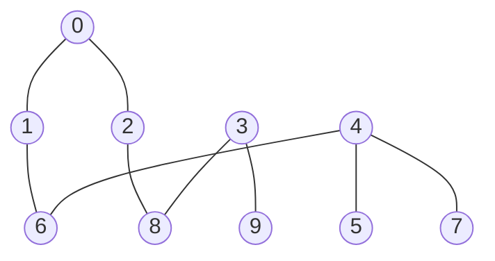
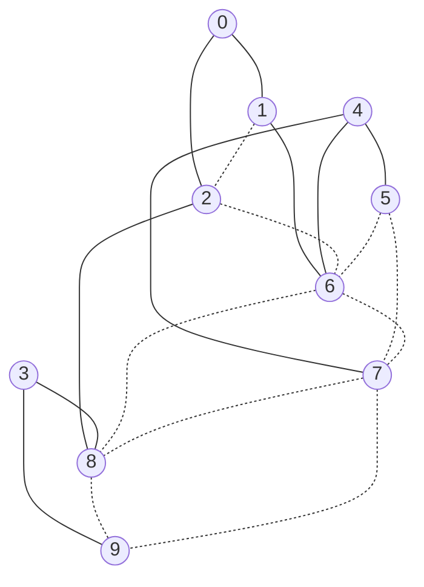

# The problem, explained from scratch

_This is the "no background needed" walkthrough of the SpOC-3 Torso
Decompositions problem.  If you have never heard of treewidth,
chordal completion, or hypervolume, this is the document for you.
Read it linearly — every concept is introduced in plain language with
a picture or a worked example before it is used in the next section._

---

## 1. What is a graph?

A **graph** is just a bunch of dots, with some lines connecting some
pairs of dots.

```
    A───B
    │   │
    C───D───E
```

The dots are called **vertices**.  The lines are called **edges**.
That's it.  Real-world examples:

- **Cities and roads.**  Dot = city, line = a direct road between two cities.
- **Friends and friendships.**  Dot = person, line = "these two know each other".
- **Web pages and links.**  Dot = page, line = a hyperlink between them.

Throughout this document we will use a small example graph with **10
dots**, labelled `0` through `9`, and **9 lines**:



That's our graph.  In the edge list it looks like this:

```
0—1   0—2   1—6   2—8   3—8
3—9   4—5   4—6   4—7
```

A vertex's **degree** is how many lines touch it.  Vertex 4 has
degree 3 (touches 5, 6, 7).  Vertex 9 has degree 1 (touches only 3).
Vertex 0 has degree 2 (touches 1 and 2).

That's all you need to know about graphs to read this document.

---

## 2. The problem in one paragraph

You are given a graph (like the one above, but much bigger — up to
2 400 dots, with hundreds of thousands of lines).  Your job is to:

1. **Pick an order** in which to "peel away" the vertices, one by one.
2. **Pick a stopping point** at which to stop peeling.

The dots you peeled away are the **off-torso** (head).  The dots
that are still there when you stop are the **torso**.

You want **two things at the same time**, but they fight each other:

- You want the torso to be **big** (don't stop too early).
- You want the torso to be **clean** (no peeled-away dot caused too many tangled connections in the torso).

The whole problem is finding peel-orders and stopping points that
balance "big torso" against "clean torso".

---

## 3. What does "peeling away a vertex" actually do?

This is the one piece of mechanics you really need to understand.
Let me show it on our 10-vertex graph.

When you peel away a vertex `v`, two things happen:

1. **`v` is removed from the graph** along with every line touching it.
2. **Every pair of `v`'s remaining neighbours gets a new line connecting them**, if they didn't already.

That second step is the tricky one.  It is called **fill-in**.

### A tiny example

Suppose we peel away vertex `4`.  Vertex `4` is connected to `5`,
`6`, and `7`:

```
        5
        │
    6───4───7
```

When `4` goes away, we have to "connect every pair of `4`'s
neighbours".  Those neighbours are `{5, 6, 7}` — three pairs:
`(5, 6)`, `(5, 7)`, `(6, 7)`.  We add a line for each pair:

```
        5
       ╱ ╲
    6═══7      (the double-lines are new fill-in)
```

(`5` was only connected to `4` before — now `5` is connected to both
`6` and `7`.  And `6` and `7`, which weren't connected, now are.)

So **peeling vertex `4` introduced 3 new lines** in the graph
("fill-in edges").  Those new lines stick around for the rest of
the peeling.

> **The propagation rule (read once, remember forever).** Every
> fill-in line that gets added when you peel a vertex stays on the
> graph for the rest of the procedure.  When you later peel some
> other vertex `v`, the question "what are `v`'s remaining
> neighbours?" looks at the *current* graph — original edges plus
> every fill-in edge added so far.  Most of the surprise in the
> worked examples below comes from this single rule.

### Why this matters

The number of pairs you have to connect when you peel vertex `v` is
`(d × (d − 1)) / 2`, where `d` is `v`'s current number of
neighbours.  If `v` has 10 neighbours, that is `45 new lines`.  If
`v` has 100 neighbours, that's `4 950 new lines`.

So peeling **high-degree vertices** causes huge fill-in cascades.
Peeling **low-degree vertices** is cheap.  Most of the cleverness in
this problem is about picking an order that keeps the fill-in
manageable.

---

## 4. The torso, in pictures

Suppose we picked this peel order on our 10-vertex graph:

```
order   = 0, 1, 2, 4, 5, 3, 6, 8, 9, 7
position 0  1  2  3  4  5  6  7  8  9
```

We will peel them left-to-right.  Now we also pick a **stopping
point** — let's say we stop after peeling position 5 (i.e. we peel
the first six vertices and leave the rest alone):

```
order:    0  1  2  4  5  3 │ 6  8  9  7
position: 0  1  2  3  4  5 │ 6  7  8  9
                            ↑
                       stopping point = 6
```

The vertices to the LEFT of the stopping point — `{0, 1, 2, 4, 5, 3}`
— are the **off-torso** (head).  We peel these away.

The vertices to the RIGHT — `{6, 8, 9, 7}` — are the **torso**.  We
do NOT peel these.  They stay in the graph, along with all the
original lines among them **plus any fill-in lines** that the
peeling of the head introduced.

The stopping point is called `t`.  In the example above, `t = 6`.
The torso has `n − t = 10 − 6 = 4` vertices.

```
┌────────────────────────────┬──────────────┐
│   OFF-TORSO  (head)         │    TORSO      │
│   peeled away, in order:    │   left alone: │
│      0, 1, 2, 4, 5, 3       │   6, 8, 9, 7  │
│   ←──── peel this side ───→ │               │
└────────────────────────────┴──────────────┘
                              ↑
                         stopping point  t = 6
```

The "decision vector" you submit to the contest is exactly this:
**the peel order plus the stopping point**.  Above we have
`[0, 1, 2, 4, 5, 3, 6, 8, 9, 7, 6]` — ten vertices in order, plus the
single integer 6 at the end.

---

## 5. The two scores ("the objectives")

After peeling, the torso has two important numbers:

### 5.1  Score 1: torso **size**

The torso has `n − t` vertices.  Big torso = small `t`.

In our example, `t = 6` and `n = 10`, so the torso has `10 − 6 = 4`
vertices.  **You want this to be BIG.**

For the contest's scoring system, "big size" means "small `t`", so
the score uses `t` directly: smaller is better.

### 5.2  Score 2: torso **width**

When we peeled the off-torso vertices, we added fill-in lines.  Some
of those new lines land inside the torso.

After all peeling is done, look at every vertex inside the torso and
count its connections in the *final* graph (original + fill-in).  The
**width** is the largest of those counts.

Concretely: when we peel vertex `v`, we count its remaining-degree
right at the moment of peeling.  If `v` is in the torso, that count
contributes to the width.  The width is the maximum of those counts
across all torso vertices.

**You want the width to be SMALL.**

A small width means the torso is "almost a tree" — there is no
super-tangled vertex in it.  A small width is what makes the torso
useful to downstream algorithms (more on that in § 10).

### 5.3  Why the two scores fight each other

Imagine pushing the stopping point `t` all the way to the LEFT
(`t = 0`).  Then the torso is the WHOLE graph and nothing was peeled
away.  Torso size is maximal (= n), torso width is just the max
degree of the original graph.

Now push the stopping point all the way to the RIGHT (`t = n - 1`).
Then the torso is a single vertex, no peeling cascade has had time
to reach it, torso width is 0.

So small `t` (big torso) tends to give you HIGH width.  Large `t`
(small torso) tends to give you LOW width.  The two objectives are
in tension, and the whole problem is about finding the trade-off.

```
   tiny torso, low width                big torso, high width
   ←─────────────────────────────────────────────────────────→
   t  near n - 1                                  t near 0
```

---

## 6. What "good" looks like: a worked example

Here is our 10-vertex graph again, with peel order
`[0, 1, 2, 4, 5, 3, 6, 8, 9, 7]` and `t = 6`.


Let me do the peeling step by step, tracking the new fill-in lines.

| step | peel | its neighbours at this moment | how many | new fill-in lines | in torso? |
|---:|:---:|---|---:|---|:---:|
| 0 | `0` | `{1, 2}` | 2 | `(1, 2)` | no |
| 1 | `1` | `{2, 6}` | 2 | `(2, 6)` | no |
| 2 | `2` | `{6, 8}` | 2 | `(6, 8)` | no |
| 3 | `4` | `{5, 6, 7}` | 3 | `(5, 6), (5, 7), (6, 7)` | no |
| 4 | `5` | `{6, 7}` | 2 | — *(already a line)* | no |
| 5 | `3` | `{8, 9}` | 2 | `(8, 9)` | no |
| 6 | `6` | `{7, 8}` | 2 | `(7, 8)` | **YES** ← first torso step |
| 7 | `8` | `{7, 9}` | 2 | `(7, 9)` | YES |
| 8 | `9` | `{7}` | 1 | — | YES |
| 9 | `7` | `{}` | 0 | — | YES |

Step 6 was the first **torso step** (the first step where the
torso's vertices get "exposed").  The largest neighbour-count among
the torso steps is **2** (steps 6, 7, 8 all had count 2; step 9 had
count 0).

So:

- **Torso width** = 2
- **t** = 6, so **torso size** = 4
- **Fitness vector** = `(width = 2, t = 6)`

Both numbers are small.  This is a good solution.

After all peeling, the final graph (original lines plus fill-in)
looks like this:



(Solid lines = original.  Dashed lines = fill-in we added.)

Now look only at the four torso vertices `{6, 7, 8, 9}` and count
how many connections each has in this *final* graph:

- `6`: connected to {1, 2, 4, 5, 7, 8} — but counting only at peel time, it had {7, 8}, so 2.
- `8`: at its peel time had {7, 9} — so 2.
- `9`: at its peel time had {7} — so 1.
- `7`: at its peel time had {} — so 0.

Width = `max(2, 2, 1, 0) = 2`.  Matches the table above.

---

## 7. A BAD solution, for contrast

Now let me show a solution to the same graph that is **bad**.

Suppose we use the peel order `[3, 8, 0, 9, 1, 6, 2, 4, 5, 7]` with
`t = 1`.  That means we peel only `3`, then everything from position 1
onwards is torso.

Step 0: peel `3`.  Its neighbours are `{8, 9}` — both in torso.
That step's count is 2.  Step is `i = 0 < t = 1`, so it does NOT
count toward width.

Step 1: peel `8`.  Its neighbours are `{0, 2, 9, ...}` (after `3`
was peeled, `8` and `9` became connected via fill-in).  Counts of
8's neighbours: original `{2, 3}` minus the gone `3` is `{2}`, plus
fill-in from `3`'s peeling.  Hmm, this is getting messy.  Point is —
when `t = 1`, almost every peel step is a torso step.  Several of
those steps see a vertex with many remaining-neighbours, so the
width climbs to 4 or 5.

So this solution might give `(width = 5, t = 1)` — width is bigger
than before (worse), `t` is smaller (better).  The contest can't
just pick one objective; it cares about **both at the same time**.
The hypervolume rule below makes them comparable.

---

## 8. How is a submission scored?

You can submit up to **20** peel-order-plus-stopping-point pairs.
Each pair gives you a point `(width, t)` in a 2-D plane.

```
     width  →
   0   1   2   3   4   5   6   ...   500   501
 0 ┌───┬───┬───┬───┬───┬───┬───┬───────┬─────────
 1 │
 2 │      ●  ← your point (2, 6)
 3 │
 4 │
 5 │
 6 │
 7 │
 8 │
 9 │
   │
 t │
 ↓
```

Now each point you submit **dominates a rectangle** stretching from
that point to the bottom-right corner of the plane.  The
"bottom-right corner" is `(n, n)` — that's called the **reference
point**.

Our point `(width = 2, t = 6)` dominates the rectangle from
`(2, 6)` to `(n, n) = (10, 10)`:

```
   width →   0   1   2   3   4   5   6   7   8   9  10
  t = 0    ┌───┬───┬───┬───┬───┬───┬───┬───┬───┬───┬───
  t = 1    │
  t = 2    │
  t = 3    │
  t = 4    │
  t = 5    │
  t = 6    │                  ●▒▒▒▒▒▒▒▒▒▒▒▒▒▒▒▒▒▒▒▒▒│
  t = 7    │                  ▒▒▒▒▒▒▒▒▒▒▒▒▒▒▒▒▒▒▒▒▒▒│
  t = 8    │                  ▒▒▒▒▒▒▒▒▒▒▒▒▒▒▒▒▒▒▒▒▒▒│
  t = 9    │                  ▒▒▒▒▒▒▒▒▒▒▒▒▒▒▒▒▒▒▒▒▒▒│
  t = 10   └──────────────────────────────────────── (reference (10, 10))
```

The **area** of that dominated rectangle is:

```
area = (n − width) × (n − t) = (10 − 2) × (10 − 6) = 8 × 4 = 32
```

This area is called the **hypervolume** (HV) of the submission.

Your contest score is `−HV`.  **More negative is better.**  So our
example scored `−32`.

### What if you submit two points?

The two rectangles **overlap**, and you only count the **union**
once (not the area twice).

Suppose you submit two points: `(2, 6)` and `(0, 9)`.

```
   width →   0   1   2   3   4   5   6   7   8   9  10
  t = 0    ┌───┬───┬───┬───┬───┬───┬───┬───┬───┬───┬───
  t = 1    │
  ...
  t = 6    │                  ▒▒▒▒▒▒▒▒▒▒▒▒▒▒▒▒▒▒▒▒▒▒│  ← (2, 6)'s rect
  t = 7    │                  ▒▒▒▒▒▒▒▒▒▒▒▒▒▒▒▒▒▒▒▒▒▒│
  t = 8    │                  ▒▒▒▒▒▒▒▒▒▒▒▒▒▒▒▒▒▒▒▒▒▒│
  t = 9    │ ███████████████▒▒▒▒▒▒▒▒▒▒▒▒▒▒▒▒▒▒▒▒▒▒▒▒│  ← (0, 9)'s rect
  t = 10   └──────────────────────────────────────── ref (10, 10)
              ↑
            (0, 9) is here
```

The shaded ▒ region is the part of `(2, 6)`'s rectangle that is NOT
covered by `(0, 9)`.  The shaded █ region is the bit `(0, 9)` adds
on the left side.  Their total area is

```
HV(both) = 32 + (10 − 0) × (10 − 9) − overlap
         = 32 + 10 × 1 − 8 × 1
         = 32 + 10 − 8
         = 34
```

So the two-point submission scores `−34`.  Adding the `(0, 9)`
point bought us 2 extra HV.

That is **the entire scoring rule**.  Pick up to 20 (peel order,
stopping point) pairs, plot them as points, your score is minus the
area of the union of their bottom-right rectangles against the
reference `(n, n)`.

---

## 9. The constraint: the 500-width limit

There is one annoying rule that bites on big dense graphs.

**During the peeling, if any vertex's count of remaining-neighbours
exceeds 500, the scoring engine gives up and marks your solution as
"over-width".**  Specifically, it sets `width = 501` regardless of
what would have happened later.

What does "over-width" look like in practice?

- Your `width` is forced to `501`.
- Your rectangle is `(n − 501) × (n − t)`.  On the small graph
  `(n = 10)` this is *negative* — i.e. the rectangle has no area at
  all and your point contributes zero HV.
- On the big graph `(n = 2 426)` an over-width point still has a
  small rectangle `(2 426 − 501) × (2 426 − t)`, but its area is
  much smaller than a "real" solution would give.

This limit is what makes the **dense graphs hard**:

- On the official **large-graph** (2 426 vertices, ~254 000 lines)
  there is already a vertex with 538 lines coming out of it.  Any
  peel order that touches that vertex too early — and it has to be
  touched at some point — gets flagged over-width.
- The classical heuristics (min-degree, min-fill, MCS-M, LEX-M) are
  carefully designed to peel low-degree vertices first, so the cascade
  stays manageable.
- A random peel order on a dense graph almost always triggers the
  500-width limit on step 1 or 2.

---

## 10. Why does anyone care about this?

The torso isn't just abstract maths.  In computer science, "the
chordal completion of a graph with low maximum fill-in degree" is
the **central data structure used by every fast graph-decomposition
solver**:

- **Constraint solvers** (Sudoku solvers, scheduling engines,
  travel-itinerary planners): if your problem's *constraint graph*
  has a low-width torso, the solver can run in time exponential in
  the width, not exponential in the size of the problem.  Going from
  width 50 to width 10 can convert "this will run for 10 years" into
  "this will run in 10 minutes".
- **Bayesian networks / probabilistic graphical models**: belief
  propagation, the algorithm Google et al. use to combine evidence,
  has cost exponential in the treewidth (the optimal width over all
  peel orders).  Finding a low-width peel order is what unlocks
  efficient inference.
- **Database join planning** and **register allocation in compilers**
  reduce to the same problem.

This is why ESA's space optimisation challenge platform cares: many
real space-mission planning problems have an underlying graph
structure, and a good torso-decomposition is the first thing a
solver does.

You can read this whole document, and the contest, as "the maths
behind why your computer solves some hard problems fast and not
others".

---

## 11. The three real instances

The contest gives you three graphs:

| name | vertices | lines | avg lines per vertex | max lines per vertex | character |
|---|---:|---:|---:|---:|---|
| `small-graph` | 1 357 | 2 280 | 3.36 | 7 | sparse |
| `medium-graph` | 1 399 | 13 799 | 19.73 | 92 | medium density |
| `large-graph` | 2 426 | 253 895 | 209.3 | 538 | dense |

On `small-graph` every vertex has just a handful of connections.
Peeling rarely cascades very far.  Heuristics like min-degree get
close to the theoretical best.

On `large-graph` there are vertices with hundreds of connections.
Peel a wrong vertex and you instantly violate the 500-width limit.
Almost the entire algorithmic challenge is *which order to peel
first* so the cascade stays under control.

---

## 12. What we're trying to do — and why it's hard

The space of possible solutions is **all possible peel orders ×
all stopping points**.  For a graph with `n` vertices that is
`n! × n` possibilities.  For `small-graph`'s `n = 1357` this is
about `10^3 711`, which is a number so big it has no meaningful name
in physics — there aren't that many atoms in the observable
universe.  Exhaustive search is not on the table.

We use **local search**: start from a candidate, twiddle it
slightly, accept if the score improved, repeat.

This repository implements four chapters of search: **15 Hill
Climbing variants** (`hc1`–`hc15`), a **metaheuristics chapter** —
**Simulated Annealing**, **GRASP**, and **VNS** — an **Ant Colony
Optimization bridge chapter** (a tested dead end, below), and a
**population chapter** — **NSGA-II** and **SMS-EMOA** (the first real win
over our long-standing benchmark, below) — all built on the same operators,
archive, and acceptance rule so they can be compared head to head.  They
differ in:

1. **Where they start** (random?  Min-degree-peel?  Some clever
   custom initialisation?).
2. **What "twiddle" means** (swap two positions?  Reverse a stretch?
   Move a problematic vertex to the head?).
3. **How they decide what to keep** (better than current?  Better
   than 100 steps ago?  Better in hypervolume?).
4. **What they remember** (the last best?  A whole Pareto archive?
   A tabu list?).
5. **Their overall control strategy** — plain hill climbing, or one of
   the metaheuristics: cool a "temperature" and sometimes accept worse
   moves (Simulated Annealing), restart from fresh greedy-random
   constructions (GRASP), or shake harder and harder when stuck
   (VNS).  GRASP comes out ahead on all three official instances.

Each metaheuristic also has a **stronger variant** that lifts its main
weakness: SA can judge moves by how much they are *dominated* by the best
solutions found so far instead of one combined score (AMOSA); GRASP can
*blend* two good orderings and remember which randomness level works best
(path-relinking + reactive-α); and VNS can refine each shake with a
disciplined, ordered local search instead of a random one (true VND).  All
four families are then raced head-to-head over eleven random seeds and
compared with a proper statistical test (Friedman + Nemenyi), so a winner
is declared only when the difference is real, not luck.  The honest result:
**none of the three "stronger" variants actually beats its plain version**
at our time budget — two are measurably worse and one is a tie — so we keep
the simple textbook versions and report the fancier ones as a tested dead
end.  Plain GRASP remains the best of everything, reaching about 99 % / 93 %
/ 91 % of the competition-leading score on the three instances.

A third, smaller chapter then asks a pointed question: every method so far
*starts* from a decent ordering and improves it — what if we instead **build**
orderings from scratch, the way ants find a path by laying down "pheromone"
trails that bias later choices? That is **Ant Colony Optimization** (ACO), and
we tried it (plain "Ant System", the stronger "MAX–MIN" version, and a hybrid
that polishes each ant's ordering with the same local search the other methods
use). The honest answer: **it does not work here.** On the big dense graph the
ants are so slow to build one ordering that only ~16 finish in the time limit,
and none of them land a legal solution at all — the method scores nothing.
Where it does produce answers, it finishes dead last of every method we have,
by a margin the statistics confirm is real, not luck. The reason is simple:
building an ordering from scratch is expensive, and there is no time for the
"pheromone" to learn anything before the clock runs out, so the ants are really
just doing a slow, noisy version of the greedy start that GRASP already does
better and cheaper. We keep ACO in the project as a fully-measured **dead end**
— a useful result, because it shows the "build from scratch" idea is the wrong
fit for this problem.

A fourth chapter takes the opposite tack from ACO: instead of one ordering at a
time, evolve a **whole population** of orderings together, the way nature breeds
a generation, keeps the best, and **blends two good parents** into a child. The
two classic versions of this idea are **NSGA-II** and **SMS-EMOA**, and on the
*sparse* graph they finally do something no earlier method managed: **SMS-EMOA
significantly beats `hc9`** — the hill-climbing variant that had been our
yardstick all along — and the four population variants take the top four spots
there. The key ingredient is the "blend two parents" move (order crossover);
none of the earlier methods could combine two good orderings, and on the sparse
graph that is exactly what pays. The catch: on the two *dense* graphs the
trade-off the population is built to explore collapses to a thin staircase, so
there is little to spread across, and GRASP's greedy restarts win again. We also
tried bolting the local-search polish onto the population — and here it
*backfires* (the opposite of ACO), because the population is already legal and
the polishing just eats the time it needs to breed more generations. So the
lesson is "more generations beat a bigger population," and the population idea is
the right tool for sparse problems, the wrong tool for dense ones.

The exhaustive comparison is in [ALGORITHMS.md](ALGORITHMS.md);
the score-board is in [RESULTS.md](RESULTS.md); the failure
modes the comparison surfaced are in [FUTURE.md](FUTURE.md).

---

## 13. A 60-second recap

If you remember only one thing from this document, remember this:

> The SpOC-3 problem asks for an **order in which to peel away
> vertices** of a graph, and a **stopping point**.  Peeling a
> vertex adds lines among its remaining neighbours.  The
> **torso** is whatever is left after the stopping point.  You
> want the torso **big** (small stopping point) and **clean** (no
> torso vertex acquired too many new lines).  Up to 20 solutions
> can be submitted; the score is the **negative area of the union
> of the bottom-right rectangles** they collectively cover, against
> a reference at `(n, n)`.  Peeling a vertex that already has 500+
> remaining connections is illegal — your solution becomes
> "over-width" and most of its area disappears.

---

## 14. Where to go next

| If you want to … | Read |
|---|---|
| See the formal problem statement and the hand-computed toy walkthrough | [PROBLEM.md](PROBLEM.md) |
| Understand the 15 HC variants + the SA / GRASP / VNS metaheuristics + the ACO bridge chapter + the NSGA-II / SMS-EMOA population chapter | [ALGORITHMS.md](ALGORITHMS.md) |
| See the actual scores (HC + metaheuristics + ACO + population) | [RESULTS.md](RESULTS.md) |
| Know what comes next (ML, CUDA, exact methods) | [FUTURE.md](FUTURE.md) |
| Re-verify every number in this repo from scratch | run `make test` |

---

## How it turned out (the short version)

I attacked this problem in two very different ways, and the contrast is the
whole story.

**First way — search the orderings directly.** I built a large family of
methods that all do the same basic thing: start from a sensible peel order and
keep nudging it (swap two vertices, move one, reverse a stretch) to see if the
score improves. Hill climbing, simulated annealing, GRASP, and several others.
I tuned them exhaustively. They worked well — but they all hit the same wall, at
roughly 92–99% of the best scores on the public leaderboard. When I looked at
*why*, the tuning told the story: every method's best settings were the ones
that switched its clever machinery *off* and just did the greedy thing. The
problem simply doesn't reward the cleverness; the orderings-search approach was
genuinely maxed out.

**Second way — don't search orderings at all.** The actual top solutions on the
leaderboard do something I had dismissed. Instead of shuffling orderings, they
describe each vertex by its "shape" in the graph (how connected it is, and a few
mathematical fingerprints called *spectral features*), and then *learn a recipe*
— a set of weights — that scores every vertex. Sorting the vertices by that
score gives the peel order. So the thing being optimised is no longer an
ordering; it's a short list of weights, and a good old continuous optimiser
(CMA-ES) can tune them.

I rebuilt that idea on an ordinary laptop CPU. It beat my entire first approach
in *seconds*, and after a few hours of runs it reached **99.9% / 97.9% / 98.0%**
of the leaderboard top on the three instances — closing most of the remaining
gap.


The one piece still missing is raw speed: the very top solution does about a
hundred million peel-evaluations on a graphics card; my laptop did about ten
thousand. No cleverness closes a gap that big — only running the same method on
a GPU would. That's the single, well-understood thing left to try.

If you want the formal version of this story, with the maths, the figures, and
the proofs that the scoring is correct, read [THESIS.md](THESIS.md).
