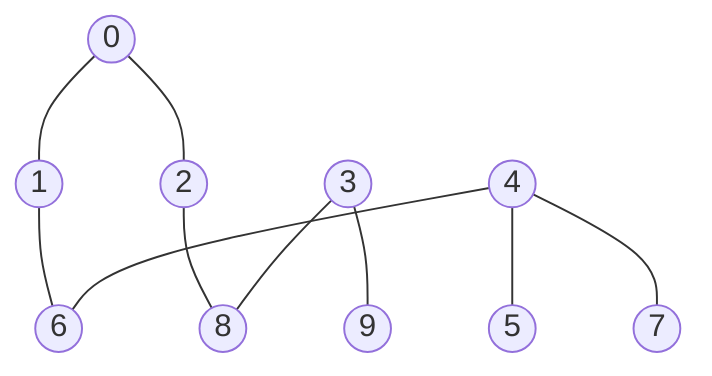
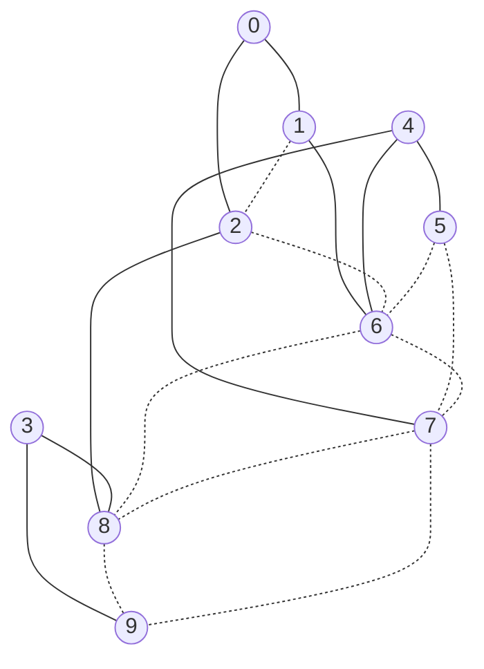

# Problem statement

_The formal statement of the SpOC-3 torso decomposition problem: the decision
(elimination ordering π and threshold t), the two minimised objectives (torso
width and t), the width cap, and the hypervolume scoring against the reference
(n, n). This is the formal companion to the plain-language
[EXPLAINER.md](EXPLAINER.md) and the foundation for the methods in
[ALGORITHMS.md](ALGORITHMS.md) and the results in [THESIS.md](THESIS.md)._

> **Two reading paths.**
> - **You know HC / metaheuristics but not torso decomposition** →
>   read § 0 (primer below) then § 1 onwards.  ~5 minutes total.
> - **You have never seen treewidth, chordal completion, or
>   hypervolume scoring** → read [EXPLAINER.md](EXPLAINER.md) first
>   for a from-scratch buildup with pictures, then come back here.

---

## 0. Primer for reviewers fluent in metaheuristics

This section defines the problem precisely in standard graph-theory
vocabulary, anchors it to canonical references, and explains in one
paragraph why anyone in optimisation cares.  Skip if § 1 below is
already familiar.

**Object of study.** Given an undirected graph `G = (V, E)` with
`|V| = n`, an **elimination ordering** is a permutation
`π : [n] → V`.  Walking π left-to-right and processing each vertex
`u = π[i]` by **(i) connecting every pair of u's *currently
existing* neighbours that come later in π with a new edge — the
"fill-in" edges — and (ii) removing u from the graph** is the
classical algorithm of Parter (1961) / Rose (1972) for **chordal
completion**.  Its key invariant: *fill-in edges are permanent for
the rest of the elimination* — they become real edges that subsequent
peel steps see.  The **fill-in width** of vertex u at step i is the
number of u's later-than-i neighbours at the moment u is eliminated;
the **width of an elimination ordering** is the max over all i, and
the **treewidth** `tw(G)` is the min over all π of that maximum
(Bodlaender 1994, Robertson & Seymour 1986).  Computing `tw(G)` is
NP-hard.

**The torso decomposition variant (this problem).**  Add a second
decision variable: a **threshold** `t ∈ {0, …, n−1}`.  The suffix
`π[t..n−1]` is called the **torso**; the prefix is the
**off-torso head**.  The two objectives are jointly minimised:

  - **`max_degree` (= torso width)** = the max fill-in width over
    *only* the torso steps `i ≥ t`.  Head steps do not contribute.
  - **`t`** (smaller t ⇒ larger torso of size `n − t`).

**Hard constraint.**  At *any* elimination step (head or torso), if
the current vertex's fill-in width exceeds `MAX_TW = 500` the
solution is flagged **over-width** and the evaluator returns
`max_degree = 501`.  This is the ESA scoring contract and is what
makes the dense official instance ("large-graph", max original degree
538) non-trivial: random initialisation is over-width on step 1.

**Scoring.**  A submission is up to **20 decision vectors**, each
yielding one fitness point `(max_degree, t)`.  The score is
`−HV(front, ref = (n, n))` where HV is the union-of-rectangles 2-D
hypervolume against reference `(n, n)`.  More negative is better.

**Why anyone cares.**  Treewidth bounds the runtime of dynamic-
programming solvers for many NP-hard graph problems (independent
set, dominating set, CSPs, Bayesian-network inference, SAT) via
the Courcelle–Bodlaender meta-theorem.  Exact treewidth is NP-hard
but *heuristic* elimination orderings — min-degree (Markowitz
1957 in sparse-matrix form; surveyed graph-theoretically by George
& Liu 1989), min-fill, MCS-M (Berry et al. 2004), LEX-M (Rose et al.
1976) — are workhorses in real solvers.  The torso variant relaxes
the problem to *partial* elimination, exposing a Pareto trade-off
between the size of the simplified head and the quality of the
remaining structure — a setting where multi-objective metaheuristics
become natural and (we argue) productive.

**Standard handles for HC reviewers.**

  - Search space: `n! × n`.  Permutations of vertices × threshold.
  - Distance: any of swap / insert / reverse / block-move on
    permutations is a standard neighbourhood operator.
  - Local optima: the min-degree elimination order is a classical
    *strong* local optimum under swap; escaping it requires
    structurally aware moves (see hc7's K-vertex bottleneck-relocate
    in ALGORITHMS.md § 6.5).
  - Constraint handling: the 500-width limit is a hard feasibility
    constraint.  Variants hc1/hc2 (no warm start) operate in the
    over-width feasible region; hc3+ avoid it by construction via a
    min-degree warm start.

That is enough to read the algorithm chapter.  The formal restatement
below (§ 1) is identical to the official UDP semantics with no
shortcuts.

---

## 1. What we are solving

You are given an **undirected graph** G with `n` vertices and some
edges. Your job is to pick:

1. An **elimination order** π — a permutation of all `n` vertices, so
   π = [π₀, π₁, …, π_{n−1}]. It tells you in what order to "peel"
   vertices off the graph.
2. A **threshold** t between 0 and n−1.

That pair (π, t) is a **decision vector**. The first `t` vertices in
π are the "off-torso head", and the rest — π[t..n−1] — are the
**torso**. The whole point of the search is to find a (π, t) so that
the torso is *big* and *low-width* at the same time.

### What is width?

When you eliminate a vertex `u` you connect every pair of `u`'s
remaining neighbours with a new edge. That's called **chordal
fill-in**. Some vertices grow lots of extra edges, some don't. The
**width** of the torso is the largest fill-in degree of any vertex
inside the torso. A small width means the torso is "almost a tree" —
which is exactly what makes a graph easy for downstream algorithms
(constraint solvers, message passing, etc.). That is why ESA cares.

### Two objectives, both minimised

| Objective | Meaning | Symbol |
|---|---|---|
| `max_degree` | torso width — biggest fill-in degree of any torso vertex | f₁ |
| `t` | threshold — smaller t means larger torso (size = n − t) | f₂ |

Both are minimised. There is a natural trade-off: shrinking t
(bigger torso) tends to grow `max_degree`, and lowering `max_degree`
tends to require a larger t.

### How is a submission scored?

You can submit up to **20 decision vectors**. Each one gives a
fitness point `(max_degree, t)`. The score is

> **Score = − HV(front, ref = (n, n))**

where HV is the 2-D hypervolume of the non-dominated front against
the reference point `(n, n)`. More negative is better. Section 2.5
walks through a hand-computation.

### Constraints

A decision vector is valid if and only if:

- π is a permutation of `{0, 1, …, n−1}` — every vertex appears once.
- `t` is an integer in `[0, n−1]`.
- During elimination, no vertex's current degree exceeds **500**. If
  any step has degree > 500 the evaluator marks the solution as
  **over-width** (`max_degree = 501`) and the resulting HV rectangle
  becomes nearly worthless. This **500-width limit** is what makes
  the dense graph (large-graph) hard: it has a vertex
  with original degree 538, so any order that hits that vertex first
  is dead on arrival.

That is the whole specification. Everything else in this folder is
about *how* we search the space of (π, t) pairs.

### A note on instance naming

The conference paper and this project label the three official ESA
instances **small / medium / large**.  The ESA Optimise platform
itself labels them **easy / medium / hard**.  They are the same
three graphs, with identical `n` and identical edges, so all scores
are directly comparable:

| Our label   | ESA platform label | File             | n     |
|---          |---                 |---               |---:   |
| small       | easy               | `easy.gr`        | 1357  |
| medium      | medium             | `medium.gr`      | 1399  |
| large       | hard               | `hard.gr`        | 2426  |

Throughout this project we keep the size-based labels because they
align with how the paper reads as a structural-difficulty story
(sparse → mid-density → dense).  When cross-referencing the public
SpOC-3 leaderboard, substitute easy/medium/hard for small/medium/large.

---


## 3. Toy walkthrough (10-vertex example, end-to-end)

A 10-vertex graph from the original spec. We will (a) describe the
graph, (b) pick a permutation and threshold, (c) run the elimination
by hand, (d) read off the fitness, (e) compute its hypervolume,
(f) compute the score.

### 3.1 The graph

Nine edges over ten vertices `V = {0, 1, 2, 3, 4, 5, 6, 7, 8, 9}`:

```
0 1
0 2
1 6
2 8
3 8
3 9
4 5
4 6
4 7
```



It splits visually into three loose pieces (vertices 0/1/2/6/8 form
the upper bit, 4/5/7 the right cluster, 3/9 a tail).

### 3.2 The decision vector

Take exactly the example from the original README:

```
x = [0, 1, 2, 4, 5, 3, 6, 8, 9, 7,   6]
    └────────── permutation ──────┘   └─ t
```

So:

- **π = [0, 1, 2, 4, 5, 3, 6, 8, 9, 7]** — the elimination order.
- **t = 6** — anything from position 6 onwards is the torso.
- **Torso = π[6..9] = {6, 8, 9, 7}** — size n − t = 4.

### 3.3 Step-by-step elimination

For each step `i = 0, 1, …, n−1` we look at vertex `u = π[i]`,
collect its currently-existing neighbours that come *later* in π
("successors"), connect every pair of them with a new edge
("fill-in"), then mark `u` as eliminated. When `i ≥ t` we also
record `deg` (= number of successors) as a candidate for max-width.

> **Fill-in propagation rule (read this once).** Every fill-in edge
> added at step *i* is **permanent for steps i+1, …, n−1**.  When a
> subsequent step asks "what are u's later-than-i neighbours?" it
> sees both the original edges of G *and* every fill-in edge added
> by earlier steps.  This is what makes the example below tractable
> by hand: as you walk the table top-to-bottom, every new fill-in
> edge you write down stays on the graph for every row below.

Running it on this example:

| i | u | Successors at this step | deg | i ≥ t? | Fill-in edges added | Notes |
|---:|---:|---|---:|:---:|---|---|
| 0 | 0 | {1, 2} | 2 | no | (1, 2) | edge between 0's neighbours |
| 1 | 1 | {2, 6} | 2 | no | (2, 6) | uses the new (1, 2) fill-in: 2 is now also a neighbour of 1 |
| 2 | 2 | {6, 8} | 2 | no | (6, 8) | now 2 also connects to 6 |
| 3 | 4 | {5, 6, 7} | 3 | no | (5, 6), (5, 7), (6, 7) | three pairs |
| 4 | 5 | {6, 7} | 2 | no | (already exists) | |
| 5 | 3 | {8, 9} | 2 | no | (8, 9) | |
| 6 | 6 | {7, 8} | 2 | **yes** | (7, 8) | first torso vertex, max_w = **2** |
| 7 | 8 | {7, 9} | 2 | yes | (7, 9) | max_w stays 2 |
| 8 | 9 | {7} | 1 | yes | — | |
| 9 | 7 | {} | 0 | yes | — | |

The maximum out-degree observed *for any vertex inside the torso*
(the i ≥ t rows) is **2**.

The graph after fill-in (original = solid, fill-in = dashed):



### 3.4 Reading off the fitness

The official UDP returns **`fitness = [max_degree, t]`** (both
minimised). For our example:

- max_degree = **2**
- t = **6**

So the fitness vector is **(2, 6)**. The torso has size 4 and width
2 — exactly what the original spec quotes.

### 3.5 Computing the hypervolume

ESA scores submissions by the 2-D hypervolume of the Pareto front
against reference point **(n, n) = (10, 10)** (both axes minimised),
then negates it. A single point (w, t) dominates the rectangle
`[w … n] × [t … n]` whose area is `(n − w) × (n − t)`.

**Single-point submission.** Submit one decision vector x with
fitness (2, 6). The dominated region is the orange box below:

```
                  t  →
        0   1   2   3   4   5   6   7   8   9   10
       ┌───┬───┬───┬───┬───┬───┬───┬───┬───┬───┬─── 0
       │                               ⬛  ⬛  ⬛  ⬛│  width
       │                               ⬛  ⬛  ⬛  ⬛│  ↓
       │                               ⬛  ⬛  ⬛  ⬛│
       │                               ⬛  ⬛  ⬛  ⬛│
       │                               ⬛  ⬛  ⬛  ⬛│
       │                               ⬛  ⬛  ⬛  ⬛│
       │                               ⬛  ⬛  ⬛  ⬛│
       │                              (2,6)        │
       └───────────────────────────────────────────10
                                                    ref
```

Area = (n − w) × (n − t) = (10 − 2) × (10 − 6) = **8 × 4 = 32**.
Score = **−HV = −32**.

**Multi-point submission** (illustrating the union-of-rectangles HV).
Submit *two* decision vectors with fitnesses **(2, 6)** and **(0, 9)**
(the second is the trivial torso of size 1 with width 0). Both are
non-dominated, so both contribute.

| point | strip width × strip height | contribution |
|---|---|---:|
| (0, 9) → next x = 2 | (2 − 0) × (10 − 9) = 2 × 1 | 2 |
| (2, 6) → next x = n = 10 | (10 − 2) × (10 − 6) = 8 × 4 | 32 |

HV = 2 + 32 = **34**, so score = **−34** — a 2-point gain over the
single-point version, exactly the tiny rectangle the trivial corner
adds. This is the same calculation `core.hypervolume_2d` does for
the real problems, with up to 20 front points instead of two.

### 3.6 Reproduce the toy result

```bash
python3 -c "
from core import build_adj_bitsets, evaluate, hypervolume_2d
n = 10
adj = [set() for _ in range(n)]
for u, v in [(0,1),(0,2),(1,6),(2,8),(3,8),(3,9),(4,5),(4,6),(4,7)]:
    adj[u].add(v); adj[v].add(u)
ab = build_adj_bitsets(n, adj)
print(evaluate([0,1,2,4,5,3,6,8,9,7], 6, ab, n))           # (2, 6)
print(hypervolume_2d([(2, 6)], n))                          # 32
print(hypervolume_2d([(2, 6), (0, 9)], n))                  # 34
"
```

---


## See also

- [EXPLAINER.md](EXPLAINER.md) — the same problem in plain language, with pictures
- [ALGORITHMS.md](ALGORITHMS.md) — the 15 Hill Climbing variants **and the metaheuristics chapter** (SA, GRASP, VNS, plus their AMOSA / path-relinking / VND enhancements), all on this same evaluator
- [RESULTS.md](RESULTS.md) — the scoreboard on official + 20 synthetic instances, including the four-family head-to-head
- [FUTURE.md](FUTURE.md) — NSGA-II, SMS-EMOA and the open failure modes
