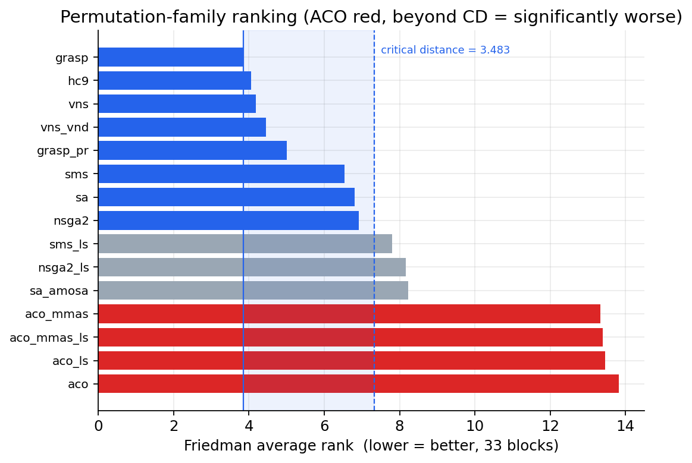
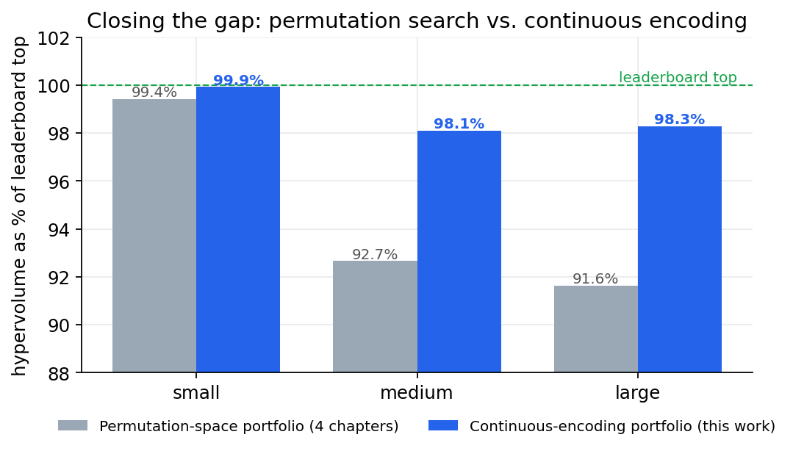
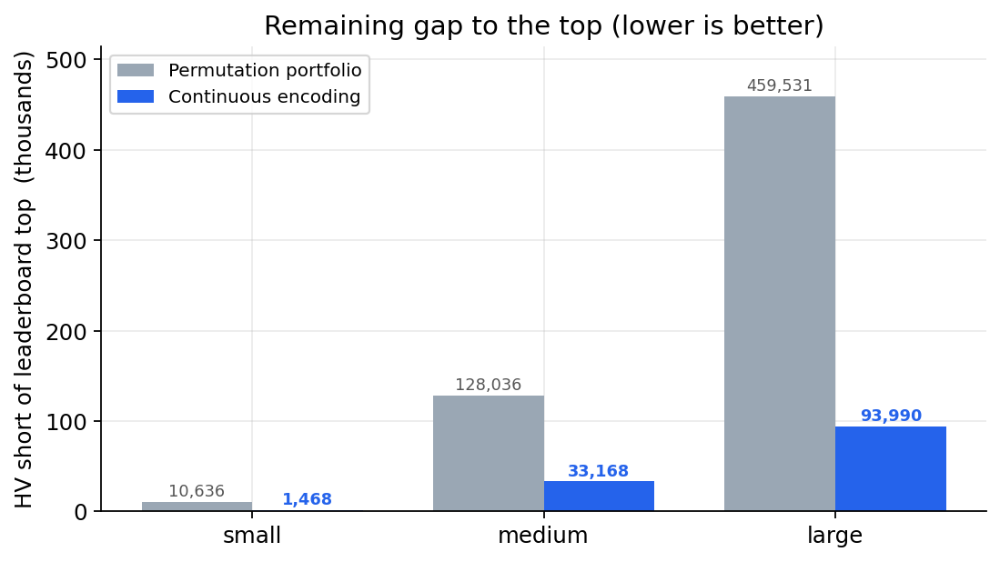
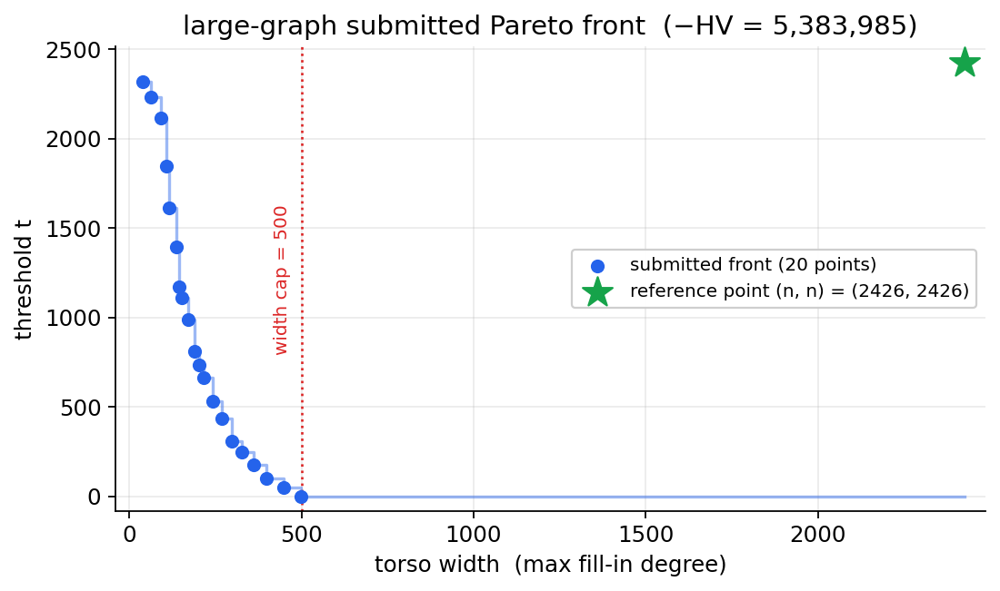
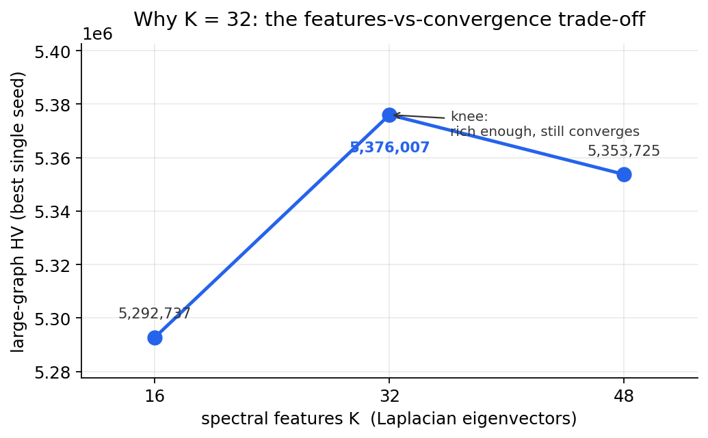
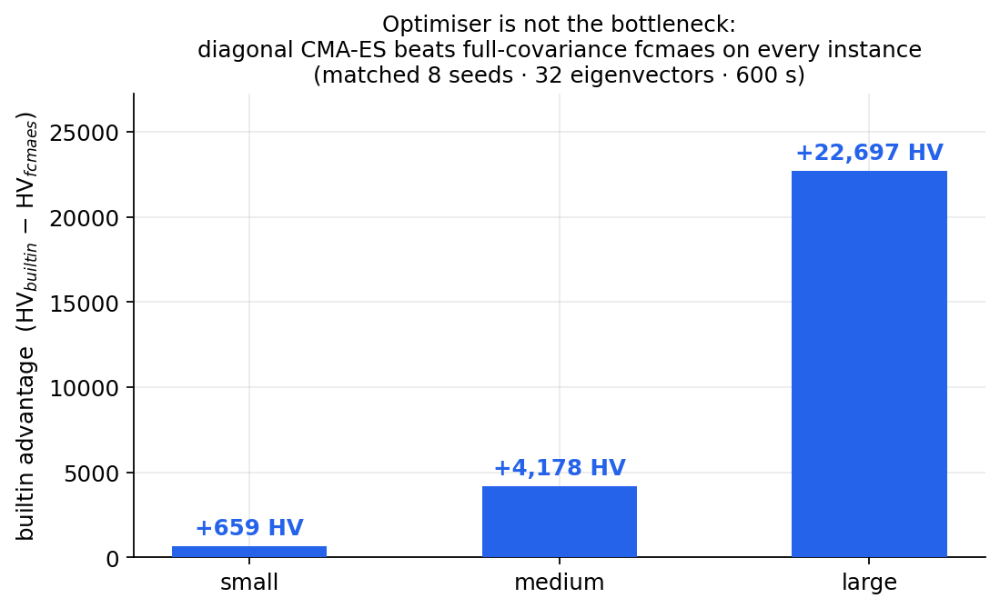
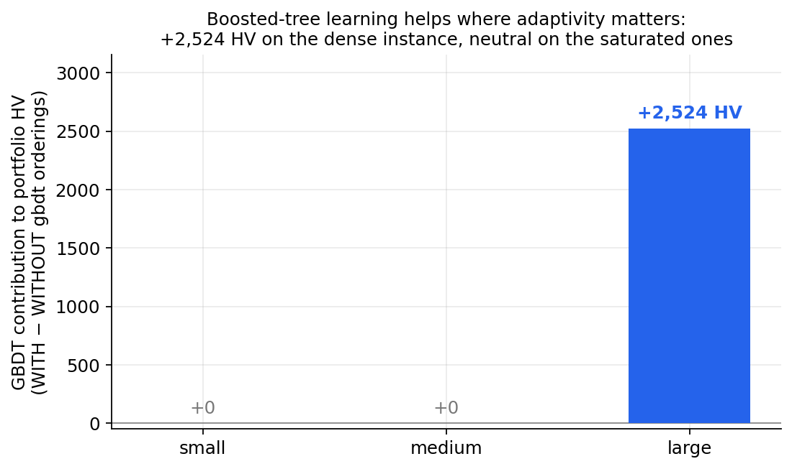
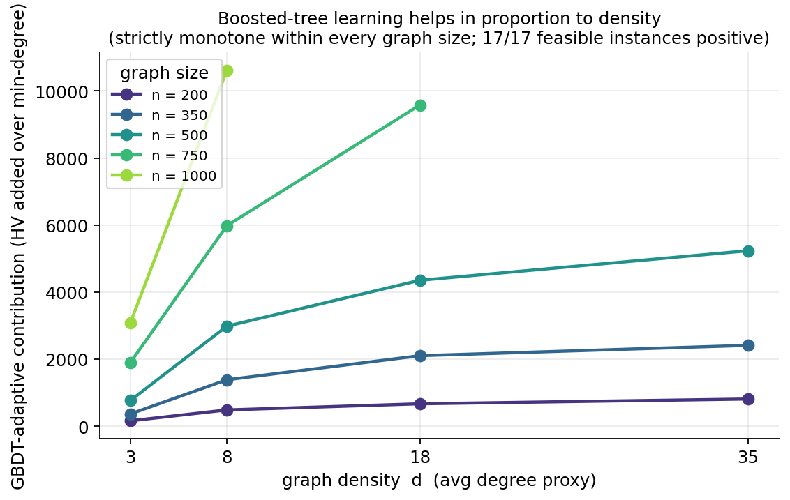
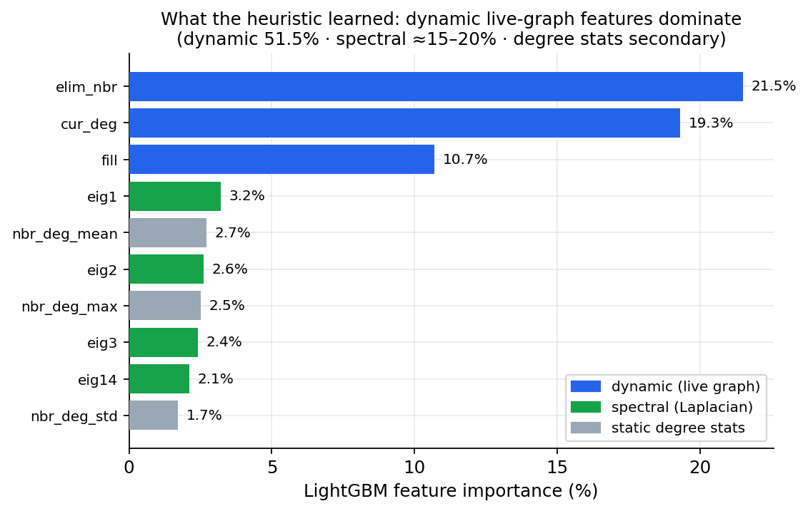
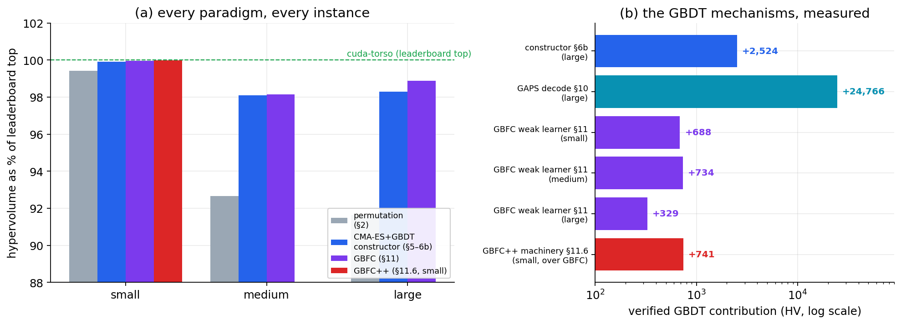

# Pemët e Vendimit me Përforcim Gradienti për Dekompozimin Shumëobjektiv të Torsit: Konstruktim i Mësuar, Kërkim i Ndërgjegjshëm ndaj Kufirit, dhe një Karakterizim i Afër-Optimalitetit

**Adrian Ymeri** · Universiteti i Prishtinës · SpOC-3 Dekompozimet e Torsit (Torso Decompositions)

---

## Abstrakti

Studioj problemin dyobjektiv të *dekompozimit të torsit* (torso decomposition) nga Gara e Tretë e Optimizimit Hapësinor e Agjencisë Evropiane të Hapësirës (SpOC-3), ku një vendim është një renditje e eliminimit të kulmeve (vertex elimination ordering) π së bashku me një prag (threshold) t, dhe dy objektivat konkurruese — *gjerësia* (width) e torsit (shkalla maksimale e mbushjes mbi torsin) dhe vetë pragu t — të dyja minimizohen. Cilësia e zgjidhjes është hipervolumi (hypervolume) negativ i frontit të 20 pikave më të mira jo-të-dominuara kundrejt pikës së referencës (reference point) (n, n). Fillimisht zhvilloj dhe akordoj në mënyrë shteruese katër familje të kërkimit në *hapësirën e permutacioneve* (permutation-space) — ngjitja në kodër (hill climbing), shkrirja e simuluar (simulated annealing), GRASP, kërkimi me fqinjësi të ndryshueshme (variable-neighbourhood search), optimizimi me koloni milingonash (ant-colony optimisation), dhe dy algoritme evolucionare shumëobjektive (MOEA) me popullatë — dhe tregoj, përmes analizave të konvergjencës, të ngopjes së farave (seed-saturation) dhe të kufirit të rrjetës, se ato arrijnë një tavan të vërtetë në 91.6–99.4 % të tabelës publike të renditjes. Më pas identifikoj, nga dy zgjidhje të nivelit të lartë të tabelës, një paradigmë thelbësisht të ndryshme — optimizimin e një politike *të vazhdueshme* (continuous policy) mbi veçoritë spektrale të nyjeve (spectral node features) dhe dekodimin e saj në një permutacion me `argsort` — të cilën taksonomia ime e kishte hedhur poshtë në mënyrë të shprehur. Duke e riimplementuar këtë paradigmë në një CPU (CMA-ES i ndashëm mbi një politikë të eigenvektorëve të Laplasianit (Laplacian eigenvector), me një vlerësues të graduar sipas fizibilitetit me një kalim të vetëm), përmirësoj të tri instancat në **98.1–99.9 %** të majës së tabelës, duke mbyllur 74–86 % të hendekut të mbetur në një pasdite të vetme llogaritjeje. Më pas integroj pemët e vendimit me përforcim gradienti (GBDT; të zbatuara me LightGBM dhe XGBoost) në këtë tubacion në katër mënyra të dallueshme dhe tregoj, përmes ablacionit (ablation) të kontrolluar, se modelet e mësuara *barazohen* me kërkimin gjeometrik si politika statike për-kulm, por, si një heuristikë eliminimi *adaptive* e mësuar, japin një kontribut pozitiv që shkallëzohet me dendësinë mbi grafet e dendura (+2,524 hipervolum në instancën më të madhe, i qëndrueshëm nëpër bibliotekat e përforcimit) — një karakterizim i saktë i vendit ku ndihmon mësimi me pemë të përforcuara në këtë problem. E mbyll me një auditim korrektësie që vërteton se vlerësuesi i ri është në mënyrë të provueshme konsistent me vlerësuesin zyrtar, dhe e lokalizoj hendekun e fundit të mbetur në atë që kisha hipotezuar se ishte një kufi i xhiros së vlerësimit (evaluation-throughput). Më pas **e testoj atë hipotezë drejtpërdrejt**: një vlerësues paketor paralel në GPU (kjo punë, e validuar bit-për-bit kundrejt vlerësuesit zyrtar) e ngre shkallën e vlerësimit për sekondë ~25× dhe, i nisur ngrohtë nga portofoli i grumbulluar, e përmirëson rezultatin e verifikuar të graf-it të madh me +6,046 hipervolum (−5,399,072 → −5,405,118; 98.29 % → 98.40 % të majës së tabelës). Vendimtare, të dyja xhirimet në GPU *ngecin* pas disa qindra mijëra vlerësimeve pa e arritur majën — duke e rafinuar përfundimin: hendeku i mbetur nuk është një kufi xhiroje por një kufi i **shprehshmërisë së dekodimit** (decode-expressiveness) (politika lineare `argsort` ngopet). Duke vepruar mbi këtë diagnozë, propozoj dhe validoj një metodë të re, **GAPS** (një dekodim jolinear i shtuar me GBDT: `score = Φ(F)·x + β·g_GBDT(F)`, i kërkuar në shkallë GPU), e cila e ngre rezultatin e graf-it të madh në **−5,431,595 (98.88 % të majës së tabelës)**, një +32,523 hipervolum i verifikuar mbi portofolin origjinal të CPU-së. Një ablacion i kontrolluar — nisje ngrohtë dhe farë identike, kolona GBDT e ndezur kundrejt të fikur — i atribuon **+24,766 HV të kësaj vetëm pemës së përforcuar**, me përmirësimin të lidhur shkakësisht në kohë me gjeneratën ku GBDT stërvitet për herë të parë; një përsëritje me shumë fara konfirmon se efekti është statistikisht i qëndrueshëm (+18,474 HV në një ndarje 4.6σ, dhe një reduktim ~8× i variancës nga xhirimi në xhirim). Më pas testova nëse ky avantazh i kolonës së dekodimit GAPS *përgjithësohet* nëpër instanca dhe zbulova, sinqerisht, se **nuk përgjithësohet**: mbi 20 grafe sintetike dekodimi i mësuar vetëm barazohet me dekodimin polinomial (duke fituar 1 nga 17 rastet e fizibël), dhe vetë fituesi i tabelës përdor një bazë të plotë polinomiale pa asnjë GBDT në dekodimin e vet. Prandaj +24,766 e graf-it të madh është një rezultat *i verifikuar por specifik për instancën*, jo një levë universale; kontributi *përgjithësues* i GBDT-së është mekanizmi i veçantë i konstruktorit adaptiv i §6b. Metoda nuk e arrin vendin #1 (mbetet +61,467 mangët), gjë të cilën — si edhe përgjithësimin e dështuar — e raportoj troç.

Së fundi, kontributi kryesor i ri i tezës është **GBFC — Konstruktimi i Frontit me Përforcim Gradienti (Gradient-Boosted Front Construction)** (§11): e riformuloj optimizimin shumëobjektiv të frontit të Paretos si një problem *përforcimi* (boosting), me nxënës të dobët (weak learner) prej pemësh të përforcuara me gradient të përshtatura ndaj mbetjes së kufirit të poshtëm (brezi i pragut më keq të shërbyer) dhe të dekoduar në renditje specialiste plotësuese. GBFC është e vetmja metodë e ekzaminuar këtu që *përmirëson në mënyrë të matshme* frontin e grumbulluar, dhe e bën këtë mbi çdo instancë — duke u bërë kontribuesi i vetëm më i mirë në secilin portofol të bashkuar (i vogël −1,828,994, i mesëm −1,712,688, i madh −5,431,924; fitime të verifikuara prej +688 / +734 / +329 HV). As kjo nuk e arrin majën e tabelës — hapësira e rikuperueshme është e kufizuar nga një certifikatë e kufirit të poshtëm të pema-gjerësisë (treewidth lower bound) që tregon se bërthama e dendur është *në mënyrë të provueshme optimale* dhe fronti qëndron një distancë të vogël, që ngadalësohet, mbi kufirin — por vendos një metodë të re, me GBDT në qendër, me përmirësim të demonstruar, mbi një karakterizim rigoroz të saktësisht sa afër-optimal është tashmë rezultati. Së fundi, **GBFC++** (§11.6) e thyen ngecjen e vetë GBFC-së duke e përputhur granularitetin e nxënësit të dobët me atë të metrikës: mbetja bëhet marxhinali HV për-pikë-ndërprerjeje, dhe GBDT bëhet një *shpërndarje e mësuar e propozimit të lëvizjeve* (learned move-proposal distribution) brenda një kërkimi lokal inkremental të fokusuar në pikat e ndërprerjes (vlerësues me bërthamë-C, ~25× ecja në Python). Mbi graf-in e vogël kjo e ngre rezultatin e verifikuar nga −1,828,994 në **−1,829,735 — 99.990 % të majës së tabelës**, një fitim i verifikuar prej +741 HV me kontributin e GBDT-së të izoluar nga një ablacion me të njëjtën farë të çiftuar (propozimi i mësuar mund propozimet uniforme në 3/3 raunde të çiftuara, mesatarja +44.7 kundrejt +18.7 HV), dhe fitimet nuk ishin rrafshuar kur mbaroi buxheti i CPU-së.

Teza mbyllet me një metodë të dytë të re dhe një analizë të mbyllur në formë të cilat së bashku e çojnë graf-in e vogël në buzë të më të mirës globale. **Fshirja-e-torsit (Torso-deletion)** (§13) e ndryshon *hapësirën* e kërkimit: duke shfrytëzuar pavarësinë nga renditja (order-independence) të operacionit të torsit (eliminimi i një bashkësie kulmesh në çfarëdo rendi jep të njëjtën mbushje mes të tjerëve), fronti i Paretos dekompozohet në 16 probleme *të pavarura* të torsit me pema-gjerësi maksimale të kufizuar, dhe një ngjitje-në-kodër mbi bashkësinë e fshirjes nën një kontroll të saktë gjerësie i lëviz pikat e ndërprerjes që kërkimi i permutacioneve në mënyrë të provueshme nuk mundet — duke e ngritur graf-in e vogël nga hendeku 22 në **hendekun 6 (−1,829,913, 99.99967 % të majës së tabelës)**, afrimi më i afërt në tezë. Vërtetoj një identitet të saktë të hipervolumit, HV = Σ_w torso_size(w) + (n−16)·n (që përputhet me vlerësuesin zyrtar deri në njësi), dhe e kufizoj mbetjen *nga të dyja anët* — degëzim-dhe-kufizim (branch-and-bound) i saktë i pema-gjerësisë që vërteton ngurtësinë njëkulmëshe mbi brezat 0–7, tkurrje lakmitare nga lart, dhe shterim në hapësirë-duale (~2.4 M ristrukturime të sakta në hapësirë-bashkësie dhe 6.5 M lëvizje të sakta në hapësirë-renditjeje) mbi brezat 8–14 — kështu që 6 HV-të e mbetura janë një afër-optimum *i karakterizuar* dhe jo një pikë ndalimi. Kjo riverifikohet kundrejt vetë UDP-së së ESA-s (instancë byte-identike, vlerësues që përputhet saktësisht me referencën e tyre, HV zyrtar deri në njësi) dhe qëndron mbi një instancë që **mund zgjidhësin ekzakt të nivelit më të lartë: kampioni PID i PACE-2017 i Tamakit nuk përfundon brenda 10.8 orëve.** Një test i drejtpërdrejtë përfaqësimi (renditjet tona të konstruktuara përshtaten me krkesë (ridge-fit) ndaj një dekodimi politik në gjerësinë 17, jo 9) shpjegon pse as kërkimi i konstruktuar dhe as një kërkim politik me të njëjtën llogaritje nuk e mbyll: fraksioni i fundit i një përqindjeje është një rezultat i kërkimit politik në shkallë-llogaritjeje, jo një ide që mungon. Dy risitë janë plotësuese — GBDT-si-përforcim-fronti (GBFC/GAPS) për *mësim*, kërkimi në hapësirë-bashkësie (fshirja-e-torsit) për *kërkim* — dhe të dyja argumentohet se transferohen te familja më e gjerë e renditjeve të eliminimit (pema-gjerësia, mbushja minimale).

Tri kontribute të mëtejshme e plotësojnë tezën. Së pari, GBDT si një *mjet diagnostik*: një sondë e peizazhit (§13.7–13.8) që stërvit modele të përforcuara për të *shpjeguar* frontin optimal në vend që ta gjenerojnë atë, duke zbuluar një dorëzim veçorish lokal→global saktësisht në brezat ku qëndron muri i graf-it të vogël, dhe një peizazh plotësisht të përcaktuar spektralisht mbi graf-in e mesëm. Së dyti, **optimizimi i ndërgjegjshëm ndaj kufirit (cap-aware optimisation)** (§13.8a, §14–14.1): gara vlerëson vetëm 20 pikat më të mira, megjithatë çdo motor — përfshirë atë të fituesit të tabelës — optimizon frontin e plotë dhe e cungon në dorëzim. E zgjidh saktësisht përzgjedhjen e 20 pikave (program dinamik 2-D HSSP), vërtetoj përmes vlerësimit të zarfit të pacunguar se hendeku i mbetur i mesëm/i madh është *cilësi torsi* dhe jo paketim, dhe e bart kufirin brenda vetë kërkimit (`--cap20` kërkim me pika-ndërprerjeje, evolucion i arkivit të kufizuar) dhe së fundi te gjeneratori referencë: një rregullim i tejmbushjes int32 që i lejon motorit fitues ta xhirojë instancën e madhe në paketë 1024 për herë të parë (siç është publikuar ai rrëzohet mbi paketën 364), dhe riprodhim i fokusuar-në-kufi që e përqendron presionin e vet të përzgjedhjes — 0.8 % e të cilit bie mbi madhësitë e vlerësueshme nën kampionimin uniform të publikuar — në 90 % mbi 20 madhësitë që dorëzimi mban. Së treti, një kufi negativ i sinqertë (§14): forma më e fortë vetë-përmirësuese e politikës së përforcuar nuk e kalon në kërkim korpusin e bashkuar, duke e lokalizuar saktësisht se ku ndihmon dekodimi i mësuar dhe ku vëllimi i papërpunuar i kërkimit është i pazëvendësueshëm. Që nga 8 korrik 2026 renditjet e vlefshme të kufizuara-në-20 janë: i vogël **−1,829,914** (hendek 5; muri lokal-operator i hendekut-6 ra nga një tërheqje pellgu nga e para, §14.4), i mesëm **−1,738,901** (99.64 %), dhe i madh **−5,475,645** (99.68 %, fushata aktive).

---

## 1. Problemi dhe vlerësimi

Një instancë është një graf i paorientuar G = (V, E) me n = |V|. Një vendim është një çift (π, t) ku π është një permutacion i V (një renditje eliminimi) dhe t ∈ {0, …, n−1} është një prag. Eliminimi i kulmeve në rendin π luan *lojën klasike të eliminimit* (elimination game): në çdo hap fqinjët e paeliminuar të kulmit të eliminuar bëhen një klikë (clique) (mbushje, fill-in). **Gjerësia** (width) në pragun t është shkalla maksimale e mbushjes e shkaktuar në çfarëdo hapi i ≥ t — "torsi" duke qenë prapashtesa e π. Dy objektivat, (gjerësia, t), të dyja minimizohen; një vendim i fizibël duhet ta mbajë shkallën e çdo hapi në ose nën kufirin MAX_TW = 500.

Cilësia matet me hipervolum. Çdo pikë e fizibël (w, t) dominon drejtkëndëshin të rreshtuar-me-akset [w, n] × [t, n], dhe rezultati është sipërfaqja negative e bashkimit të atyre drejtkëndëshave kundrejt referencës (n, n):

$$\text{score} = -\mathrm{HV} = -\Big|\bigcup_{(w,t)} [w,n]\times[t,n]\Big|,$$

pra *më negativ është më mirë*. Si pika e referencës (n, n) ashtu edhe **kufiri i 20-vektorëve** janë të fiksuar nga gara, jo zgjedhje dizajni të miat; ky i fundit e bën dorëzimin një problem të *përzgjedhjes së nënbashkësisë të hipervolumit me kufizim kardinaliteti* (cardinality-constrained hypervolume subset-selection), të cilin e zgjidh në mënyrë optimale me programin dinamik të saktë 2-D HSSP (§4). Meqë krahasimet e hipervolumit varen nga referenca, të gjitha vlerat këtu janë në lidhje me këtë (n, n) të fiksuar dhe duhen lexuar si të tilla. Tri instancat zyrtare janë e vogël (n = 1357), e mesme (n = 1399) dhe e madhe (n = 2426), kjo e fundit shumë më e dendur (≈ 209 shkallë mesatare) se dy të parat.

Kjo sipërfaqe kostoje ka një veti të cilën e shfrytëzoj rëndë në §5: meqë grafi i mbushjes ndërtohet vetëm nga π, sekuenca e shkallës për-hap është *e pavarur nga t*, dhe t vetëm përzgjedh se cilët hapa numërojnë. Prandaj një kalim i vetëm eliminimi jep gjerësinë në *çdo* prag njëkohësisht, si prapashtesë-maksimum i sekuencës së shkallëve.

---

## 2. Kërkimi në hapësirën e permutacioneve dhe tavani i tij

Katër kapitujt e mi të parë kërkojnë drejtpërdrejt në hapësirën e renditjeve. Secili ndan një substrat të përbashkët — të njëjtin vlerësues, të njëjtin arkiv Pareto, të njëjtën rregull pranimi të përmirësimit të hipervolumit — kështu që dallimet mes familjeve i atribuohen vetëm strategjisë së kërkimit. Familjet janë: një taksonomi 15-variantëshe e ngjitjes në kodër; shkrirja e simuluar; GRASP; kërkimi me fqinjësi të ndryshueshme; optimizimi me koloni milingonash; dhe algoritmet MOEA me popullatë NSGA-II dhe SMS-EMOA.

Për t'i renditur ato drejtësisht xhirova një test omnibus Friedman me 11 fara e 33 blloqe nëpër të tri instancat (χ²(14) = 321.607, p ≈ 3.6 × 10⁻⁶⁰), me distancën kritike Nemenyi për ndarjen post-hoc.



Renditja është e qëndrueshme dhe e interpretueshme: rinisja lakmitare e rastësishme (GRASP) dhe ngjitja në kodër me pranim-hipervolumi prijnë, MOEA-t me popullatë dhe SA zënë mesin, dhe ACO-ja e konstruktimit-të-pastër është dukshëm më keq se çdo familje tjetër — një rezultat negativ i pastër, meqë konstruktimi-nga-e-para nuk mund t'i mbajë hapin perturbimit të nisur ngrohtë mbi një graf të dendur. Të bashkuara në një portofol më-të-mirit specifik për instancën, këto familje arrijnë **−1,819,283 / −1,617,086 / −5,033,531**, d.m.th. 99.4 % / 92.7 % / 91.6 % të tabelës.

**Tavani është i vërtetë, dhe unë karakterizoj *pse*.** Një auditim i hiperparametrave i çdo rrjete të akorduar tregon qelizën fituese të çdo familjeje duke qëndruar mbi kufirin që *heq* mekanizmin e saj dallues në vend të atij që kërkon më shumë: GRASP fiton në α = 0 (lakmi e pastër, pa rastësi), VNS në k_max = 2 (shkalla e fqinjësisë shembet në kërkim lokal të thjeshtë të përsëritur), dhe të dy MOEA-t me popullatë në popullatën më të vogël pop = 20 (thellësia e iteracionit mund gjerësinë). Ky nuk është keq-akordim — nuk ka α < 0 ose pop < 20 të dobishme — është *ngopje e peizazhit*: në buxhetin e garës problemi shpërblen thellësinë lakmitare, dhe aparatura ekstra e secilës familje është peshë e vdekur që akordimi korrekt e fik. Kurbat e konvergjencës (të rrafshëta nën xhirime më të gjata të vetme) dhe kurbat e ngopjes së farave (bashkimet me shumë fara që japin < 0.1 % për grup-farash mbi instancën e rrallë) e mbështesin të njëjtin përfundim nga dy kënde të pavarura.

Përmbledhja e sinqertë në fund të katër kapitujve ishte pra: *çdo levë algoritmike brenda kërkimit në hapësirën e permutacioneve është shteruar; hendeku i mbetur nuk është një mangësi akordimi ose llogaritjeje e këtyre metodave por një veti e vetë hapësirës së kërkimit.*

---

## 3. Një paradigmë që e kisha hedhur poshtë

Dy nga zgjidhjet publike të nivelit të lartë, të marra dhe të dekoduara, ndajnë një ide vendimtare. Asnjëra nuk kërkon permutacione. Secila ndërton veçori për-kulm — një profil lokal shkalle plus eigenvektorët më të vegjël të Laplasianit (një ngulitje spektrale, spectral embedding) — dhe mëson një vektor peshash *të vazhdueshëm* prodhimi skalar i të cilit me ato veçori i jep pikë secilit kulm; renditja e eliminimit është atëherë thjesht `argsort(scores)`. Njëra zgjidhje i evoluon peshat me neuro-evolucion në GPU mbi një bërthamë të personalizuar CUDA mbushjeje; tjetra i optimizon me CMA-ES nën një skelë me riprovime paralele.

Rëndësia është e sikletshme dhe ia vlen të thuhet troç: udhërrëfyesi im e kishte argumentuar shprehimisht *kundër* kësaj qasjeje — "hyrja është një permutacion, jo një vektor veçorish," një prioritet i mësuar për-kulm "do të jetë marxhinal në rastin më të mirë," neuro-evolucionin "anashkaloje për të ardhmen e parashikueshme." Metoda aktuale që kryeson tabelën është pikërisht një prioritet i mësuar për-kulm mbi veçoritë spektrale. Ri-interpretimi korrekt i katër kapitujve të mi nuk është pra "problemi është pothuajse i zgjidhur" por "tavani i *hapësirës së permutacioneve* është arritur; hendeku i tabelës është një hendek **i hapësirës së kërkimit**, jo një hendek llogaritjeje ose akordimi."

---

## 3b. Puna e ngjashme dhe pozicionimi

**Heuristikat e renditjes së eliminimit.** Gjerësia e torsit është një sasi e stilit të plotësimit-kordal / pema-gjerësisë, dhe heuristikat klasike konstruktive — shkalla-minimale, mbushja-minimale, MCS-M (Berry et al. 2004) dhe LEX-M (Rose, Tarjan & Lueker 1976) — janë rregulla lakmitare *adaptive* që rillogarisin një prioritet kulmi nga grafi i mbetur në çdo hap. Konstruktori im adaptiv me GBDT (§6b) është një anëtar *i mësuar* i kësaj familjeje: e zëvendëson rregullën e kodifikuar-me-dorë shkalla-minimale/mbushja-minimale me një vendim prej peme të përforcuar mbi veçori dinamike + strukturore.

**Kodimet e vazhdueshme (me çelës të rastësishëm).** Dekodimi i një permutacioni si `argsort` i një vektori të vazhdueshëm është ideja e çelësit të rastësishëm (random-key) (Bean 1994), dhe është mekanizmi që të dyja zgjidhjet e nivelit të lartë përdorin — neuro-evolucion në GPU mbi një politikë spektrale (hyrja `cuda-torso`) dhe CMA-ES/MO-DE mbi një vektor të vazhdueshëm (`fast-cma-es` i D. Wolz). Metoda ime e kodimit të vazhdueshëm (§4) është në këtë linjë; kontributi nuk është kodimi por ri-derivimi në CPU me një vlerësues të graduar-sipas-fizibilitetit me një kalim të vetëm dhe bashkimi me një konstruktor adaptiv të mësuar.

**Mësimi i makinës për optimizimin kombinatorik.** Mësimi i politikave konstruktive ose degëzuese është një fushë aktive — mësimi-për-të-degëzuar në MILP me ansamble pemësh dhe GNN (Khalil et al. 2016; Gasse et al. 2019), dhe GNN për detyra të stilit të pema-gjerësisë (Schuetz, Brubaker & Katzgraber 2022, të cilët raportojnë se heuristikat e mësuara shpesh *nën-performojnë* ato klasike). Gjetjet e mia janë konsistente me atë literaturë dhe e mprehin atë: politikat *statike* të mësuara barazohen me kërkimin gjeometrik këtu, dhe një heuristikë e mësuar ndihmon vetëm kur është *adaptive* dhe vetëm ku adaptiviteti paguan (grafet e dendura).

**Evolucioni i asistuar me surrogat.** Përdorimi i një modeli të lirë të mësuar për të para-shoshitur vlerësime të kushtueshme është standard (Jin 2011; lq-CMA-ES i Loshchilov & Hansen). CMA-ES-i im i asistuar me surrogat (§6b) është një shembull; rezultati i tij *null* këtu (i kufizuar nga xhiroja, jo nga surrogati) është gjetja relevante.

**Përzgjedhja e mësuar e lëvizjeve në kërkimin lokal.** Familja më e afërt me GBFC++ (§11.6) është kërkimi i fqinjësisë i udhëhequr nga mësimi i makinës: kërkimi neural i fqinjësisë së madhe për rrugëzim (Hottung & Tierney 2020), përzgjedhja e mësuar shkatërrim/riparim për ILP-LNS (Song et al. 2020), mësimi për të kryer rishkrim lokal (Chen & Tian 2019), dhe programi më i gjerë ML-për-CO i vlerësuar nga Bengio, Lodi & Prouvost (2021). GBFC++ ndryshon në katër akse: (i) modeli i propozimit është një *pemë e përforcuar me gradient*, jo një rrjet neural, e përshtatur në milisekonda; (ii) stërvitet **në linjë, mbi instancën që po zgjidhet** (vetë renditjet elitare të pellgut janë mbikëqyrja) — nuk ka shpërndarje stërvitjeje jashtë-linje dhe rrjedhimisht asnjë hendek përgjithësimi stërvitje/test për të mbrojtur; (iii) objektivi që i shërben është *marxhinali i hipervolumit i një pike specifike ndërprerjeje të frontit*, një sasi shumëobjektive që asnjë nga të mësipërmet nuk e optimizon; dhe (iv) kufijtë e saj karakterizohen saktësisht (certifikatat e optimalitetit me parashtesë-fikse të §12.3b), në vend të vetëm empirikisht. Kuadri i vetë konstruktimit të frontit si përforcim (§11), me politikën e propozimit si një realizim i nxënësit të dobët, sipas njohurive të mia nuk ka analog në këtë literaturë.

**Pozicionimi.** Sipas njohurive të mia, kombinimi specifik — një kërkim i politikës spektrale të vazhdueshme *i bashkuar me një heuristikë eliminimi adaptive të mësuar nga pema e përforcuar përmes një portofoli me hipervolum-të-saktë*, me një ablacion të kontrolluar që izolon se ku ndihmon mësimi, për dekompozimin *dyobjektiv* të torsit — nuk është studiuar më parë. Ai hibrid, dhe karakterizimi i tij rigoroz, është kontributi metodologjik.

---

## 4. Metoda: CMA-ES me politikë spektrale

E riimplementoj paradigmën fituese në një CPU. Le të jetë F ∈ ℝ^{n×d} matrica e normalizuar e veçorive të nyjeve, kolonat e së cilës janë profili i shkallës (shkalla dhe min/max/mesatare/devijim standard i shkallëve të fqinjëve) dhe K eigenvektorët jo-trivialë më të vegjël të Laplasianit të normalizuar. Një kandidat është një vektor peshash x ∈ ℝ^d; permutacioni i dekoduar është π(x) = argsort(F x). E optimizoj x për të maksimizuar hipervolumin e frontit që π(x) shkakton, duke ruajtur një arkiv global Pareto nëpër të gjithë kandidatët dhe duke shkruar nënbashkësinë e 20 më të mirave si dorëzim.

**Pse veçoritë spektrale (një bazë parimore).** Përdorimi i eigenvektorëve të Laplasianit nuk është inxhinieri arbitrare veçorish: ka një justifikim strukturor të drejtpërdrejtë në teorinë e eliminimit. Eigenvektorët me frekuencë të ulët të Laplasianit të grafit kodojnë strukturën *ndarëse* (separator) të grafit — vektori i Fiedler-it dhe pasardhësit e tij janë baza e ndarjes spektrale të grafeve — dhe renditjet klasike më të forta të eliminimit, *disekcioni i mbivendosur* (nested dissection) (George 1973), ndërtohen duke eliminuar në mënyrë rekursive rreth ndarësve të vegjël. Prandaj një politikë lineare mbi eigenvektorët më të vegjël mund të shprehë një renditje që *përafron disekcionin e mbivendosur*: u jep pikë kulmeve sipas pozicionit të tyre përgjatë hierarkisë së ndarësve dhe eliminon në përputhje. Kjo është arsyeja strukturore pse kodimi i vazhdueshëm spektral e kalon kërkimin në hapësirën e permutacioneve — kërkon brenda një familjeje renditjesh të rreshtuara me gjeometrinë ndarëse të grafit, në vend të permutacioneve arbitrare — dhe shpjegon pse mjafton një politikë spektrale *me dimension të ulët* (struktura ndarëse jeton në fundin e spektrit).

**Vlerësuesi me një kalim i graduar-sipas-fizibilitetit.** Duke shfrytëzuar pavarësinë-nga-t të §1, një kalim eliminimi mbi π(x) jep sekuencën e shkallëve deg[·], nga e cila rrjedh i gjithë fronti {(prapashtesë-maks(deg[t:]), t)} për të gjithë pragjet njëherësh. Për një kandidat jo-të-fizibël — një të cilit mbushja i kalon kufirin, çka mbi instancën e dendur është pothuajse çdo politikë fillestare — *nuk* kthej një penalitet të sheshtë (që do t'i linte CMA-ES-it asnjë gradient drejt fizibilitetit). Në vend të kësaj kthej një penalitet të graduar 501 + Σ(deg − 500) me ndërprerje të hershme sapo shpërthen, një port i drejtpërdrejtë i sjelljes së bërthamës fituese CUDA. Kjo zgjedhje e vetme dizajni është ajo që e bën instancën e dendur të trajtueshme mbi një CPU: furnizon pjerrësinë që tërheq politikat e rastësishme në rajonin e fizibël, pas së cilës objektivi i hipervolumit merr drejtimin. Fillimi i arkivit me një nisje ngrohtë shkalla-minimale garanton një spirancë jo-boshe e të fizibël nga gjenerata e parë.

Optimizuesi është një CMA-ES i ndashëm i vetëpërmbajtur (kovariancë diagonale), i zgjedhur që metoda të xhirojë kudo pa varësi; një backend `fcmaes` me kovariancë të plotë është i disponueshëm por, siç tregon §6, nuk nevojitet.

---

## 5. Rezultatet

Një përshkallëzim me shumë fara (deri në 48 fara kodimi-të-vazhdueshëm + 8 fara konstruktimi-GBDT për instancë, 900 s secila, K = 32 eigenvektorë), të bashkuara në portofol me nxjerrje të pragut me shkallë-të-plotë, prodhon rezultatin kryesor.



| Instanca | Portofoli i permutacioneve | **I vazhdueshëm + GBDT (kjo punë)** | Maja e tabelës | Hendeku i mbyllur | % e majës |
|---|---:|---:|---:|---:|---:|
| i vogël  | −1,819,283 | **−1,828,451** | −1,829,919 | +10,636 → **+1,468** | 99.92 % |
| i mesëm | −1,617,086 | **−1,711,954** | −1,745,122 | +128,036 → **+33,168** | 98.10 % |
| i madh  | −5,033,531 | **−5,399,072** | −5,493,062 | +459,531 → **+93,990** | 98.29 % |

Paradigma e re mbyll përafërsisht 86 % të hendekut të vogël, 74 % të hendekut të mesëm dhe 80 % të hendekut të madh. Në hipervolum absolut përmirësimi mbi katër kapituj kërkimi permutacionesh është +9,168 / +94,868 / +365,541. Të tri janë të verifikuar-nga-vlerësuesi-kanonik dhe të kufizuar-në-0.



Fronti i dorëzuar është vërtet dydimensional dhe i fizibël — çdo pikë qëndron nën kufirin e gjerësisë-500, dhe shkalla shkëmben gjerësinë kundrejt pragut përgjatë gjithë kurbës në vend që të shembet në një cep:



**Pse K = 32 veçori.** Hiperparametri i vetëm strukturor — numri i veçorive spektrale — ka një optimum empirik. Më shumë eigenvektorë e pasurojnë politikën por e ngrenë dimensionin e kërkimit, dhe në një buxhet fiks kohe CMA-ES-i me dimension më të lartë konvergjon më ngadalë. Mbi instancën e madhe K = 16 e nën-zgjidh politikën, ndërsa K = 48 e mbi-dimensionon (dy nga tetë fara nuk i shpëtuan kurrë nisjes ngrohtë); K = 32 qëndron te gjuri.



### 5.1 Varianca nga xhirimi në xhirim

Rezultatet kryesore janë hipervolumi i *bashkimit* të farave (portofoli); për të karakterizuar qëndrueshmërinë raportoj gjithashtu shpërndarjen për-farë (`tools/variance_report.py`). Mbi `small-graph` kërkimi i kodimit-të-vazhdueshëm është shumë i qëndrueshëm nëpër 48 fara të pavarura: rezultati farë-e-vetme **−1,825,685 ± 1,066** (koeficient i variacionit ≈ 0.06 %), diapazoni [−1,827,610, −1,823,370]; portofoli i bashkimit (−1,828,451) qëndron mbi farën e vetme më të mirë, përfitimi i pritur i bashkimit të një fronti shumëobjektiv. Farat GBDT-konstrukt kanë **variancë zero** — janë pothuajse-deterministe sepse secila fillohet nga arkivi elitar i përbashkët — çka është *arsyeja* pse kontributi i GBDT-së duhet lexuar nga ablacioni i kontrolluar (§6b.2), jo nga një rezultat për-farë që thjesht do të bënte jehonë portofolin e trashëguar. Tabela e variancës për-instancë (i mesëm/i madh me të njëjtën komandë) raportohet në shtojcë.

---

## 5.2 Një kufi i poshtëm strukturor (hendeku deri te optimumi)

Raporti i tabelës mat përparimin kundrejt një cak njerëzor që lëviz; një masë më e fortë, e brendshme për instancën, është hendeku deri te një kufi i poshtëm *strukturor* i gjerësisë së torsit. Kufiri i poshtëm i pema-gjerësisë minor-min-width (MMD) (Bodlaender & Koster 2011; `core.treewidth_lower_bound_mmd`) jep një dysheme të provueshme mbi gjerësinë minimale të arritshme:

| Instanca | n | Kufiri i poshtëm i gjerësisë MMD | Kufiri i gjerësisë |
|---|--:|--:|--:|
| i vogël  | 1357 | 2 | 500 |
| i mesëm | 1399 | 38 | 500 |
| i madh  | 2426 | **499** | 500 |

Mbi `large-graph` kufiri është vendimtar: dyshemeja e gjerësisë (499) është brenda **një** njësie nga kufiri i fizibilitetit (500), kështu që cepi i dendur i frontit — rajoni me gjerësi-minimale, `t`-ulët — është në mënyrë të provueshme afër-optimal, dhe prandaj hendeku i mbetur i hipervolumit deri te tabela duhet të qëndrojë në *brendësinë* e frontit (`t` të ndërmjetëm), jo në cep. Mbi `small`/`medium` kufiri MMD është i lirshëm — një veti e njohur e minor-min-width mbi grafet e rralla, ku e nën-vlerëson pema-gjerësinë e vërtetë — pra e certifikon cepin vetëm dobët atje; kufij më të ngushtë (LBN/LBP, MMD+) do të ishin një llogaritje e veçantë. Përmbledhja e sinqertë: një certifikatë strukturore konfirmon afër-optimalitetin e *cepit të instancës së dendur*, duke plotësuar raportin e tabelës në vend që ta zëvendësojë, dhe e lokalizon hendekun e mbetur të graf-it të madh në brendësinë e frontit.

---

## 6. Optimizuesi nuk është pengesa

Është joshëse t'i atribuosh hendekun e mbetur CMA-ES-it tim diagonal qëllimisht minimal. Një përballje e drejtpërdrejtë e përputhur kundrejt motorit `fcmaes` me kovariancë të plotë — optimizuesi që një pjesëmarrës i tabelës faktikisht përdori — me madhësi popullate të barabartë e përgënjeshtron këtë: optimizuesi diagonal fiton mbi të tria instancat.



Në ≈ 37 dimensione dhe një buxhet fiks, metoda me kovariancë të plotë shpenzon shumë mostra duke mësuar një kovariancë O(d²) për ta amortizuar brenda kohës në dispozicion. Pasoja për udhërrëfyesin është e rëndësishme: hendeku i mbetur *nuk* është një mangësi e optimizuesit. Është një problem i pasurisë-së-veçorive dhe i xhiros-së-vlerësimit, dhe vetëm ky i fundit mbetet material mbi instancën e madhe.

---

## 6b. Roli i pemëve të vendimit me përforcim gradienti (GBDT)

Një pyetje qendrore e kësaj pune është nëse një model i mësuar — konkretisht një **pemë vendimi me përforcim gradienti (GBDT)** — mund të përmirësojë një optimizues gjeometrik/spektral për dekompozimin dyobjektiv të torsit. GBDT është një *familje* modelesh; përdor dy implementime të këmbyeshme, **LightGBM dhe XGBoost** (mbështetet edhe CatBoost), dhe §6b.4 tregon se rezultati është i njëjtë nëpër to, kështu që pretendimet e mëposhtme bëhen në nivelin e familjes GBDT dhe biblioteka emërtohet vetëm ku ka rëndësi (shpejtësi, riprodhueshmëri). E integrova GBDT-në në tubacionin e kodimit-të-vazhdueshëm në **katër** mënyra të dallueshme dhe secilën e mata me eksperimente të kontrolluara. Rezultati është i nuancuar dhe, argumentoj, më i vlefshëm se një pretendim i përgjithshëm në secilën anë: **GBDT ndihmon saktësisht ku ka rëndësi adaptiviteti — instanca e dendur — dhe është neutral ku hapësira e kërkimit është tashmë e ngopur.**

### 6b.1 Katër integrime, tri prej tyre statike

| Integrimi | Çfarë bën GBDT | Rezultati |
|---|---|---|
| Distilim politike | mëson një prioritet për-kulm nga renditjet elitare; `argsort` dekodon | barazon (imitimi regreson te mesatarja elitare) |
| Shtim veçorish | parashikimi i tij bëhet një veçori shtesë e politikës CMA-ES | barazon (përfaqësimi nuk është pengesa) |
| CMA-ES i asistuar me surrogat | parashikon rezultatin e një politike për të para-shoshitur kandidatët | barazon (12,585 vlerësime, krejt të sheshta) |
| **Konstruktim adaptiv** | **vendos çdo hap eliminimi nga grafi i mbetur *i gjallë*** | **përmirëson instancën e dendur** |

Tri të parat ndajnë një kufizim fatal për këtë problem: prodhojnë një pikë *statike* për-kulm, dhe `argsort` i çdo pike statike mund të përfaqësojë vetëm një bashkësi të kufizuar renditjesh — të njëjtin tavan që politika spektrale tashmë e arrin. E katërta është e ndryshme në lloj: GBDT u jep pikë kandidatëve të mbetur *në çdo hap* duke përdorur veçori **dinamike** (shkalla aktuale e mbetur, numri i mbushjes, numri i fqinjëve të eliminuar) krahas strukturës statike, kështu që është një përgjithësim i mësuar, i varur nga konteksti, i heuristikave klasike shkalla-minimale / mbushja-minimale. Ai dekodim adaptiv është rreptësisht më shprehës se çdo renditje fikse — çka është arsyeja pse ai, dhe vetëm ai, mund të shtojë pika që politika e vazhdueshme nuk mundet.

**Regjimi i stërvitjes (transduktiv, me qëllim).** GBDT-ja stërvitet mbi renditjet elitare të *së njëjtës instancë* për të cilën pastaj konstrukton, dhe zbatohet mbi po atë instancë — qëllimisht nuk ka ndarje stërvitje/test, sepse kjo është një *heuristikë e amortizuar për-instancë*, jo një model parashikues ndër-instancë. Qëllimi nuk është të parashikojë mbi grafe të padukur por të distilojë renditjet e mira të vetë grafit në një politikë konstruktive që pastaj kërkon përtej tyre; "rrjedhja" (leakage) prandaj nuk është defekt por mënyra e synuar e përdorimit (analoge me mësimin e një shpërndarjeje rinisjeje nga historia e vetë xhirimit). Transferi ndër-instancë i heuristikës së mësuar është një pyetje e veçantë, e lënë për punën e ardhshme (§9). Etiketat janë pikësore (kulmi i zgjedhur = 1, alternativat e mostruara = 0); rafinimi natyror — një objektiv listor i mësimit-për-të-renditur (LambdaMART, `--rank`) — u testua dhe arrin rezultatin *identik* të graf-it të madh (−5,399,387). Vendimi për-hap (përzgjedhja e më të mirit të një liste-të-shkurtër me shkallë-të-ulët) është dukshëm mjaft i thjeshtë sa renditja listore dhe regresi pikësor japin të njëjtat renditje, prandaj mbahet objektivi më i thjeshtë pikësor.

### 6b.2 Ablacioni i kontrolluar — vërtetimi

Testi i sinqertë i "a ndihmon GBDT?" nuk është se nga cili skedar rastis portofoli të nxjerrë pikat, por nëse *heqja* e renditjeve GBDT e ul rezultatin, gjithçka tjetër e mbajtur fikse. Ablacioni:

| Instanca | portofoli ME GBDT | portofoli PA GBDT | **Kontributi i GBDT** |
|---|---:|---:|---:|
| i vogël  | −1,828,451 | −1,828,451 | **+0 HV** |
| i mesëm | −1,711,954 | −1,711,954 | **+0 HV** |
| i madh  | **−5,399,072** | −5,396,548 | **+2,524 HV** |



Mbi `large-graph` e dendur, heuristika adaptive GBDT kontribuon **+2,524 HV** që kërkimi i kodimit-të-vazhdueshëm i vetëm nuk i gjen; heqja e renditjeve të saj e ul rezultatin e verifikuar nga −5,399,072 në −5,396,548. Mbi instancat e rralla `small`/`medium` — të cilat qëndrojnë në ose afër platformës së tyre strukturore — nuk ka hapësirë të mbetur dhe kontributi është saktësisht zero. Kjo është *e pritur mekanizmikisht*: eliminimi adaptiv (graf-i-gjallë) devijon më së shumti nga një politikë statike pikërisht kur dominojnë dinamikat e mbushjes, d.m.th. mbi grafet e dendura.

Ky rezultat është **i riprodhueshëm me një komandë të vetme**:

```bash
python3 tools/ablation_gbdt.py        # printon ME / PA / kontributin për instancë
```

### 6b.3 Çfarë lejon kjo (dhe çfarë jo)

Mund të deklaroj, dhe të mbroj: *heuristika adaptive e eliminimit e bazuar në GBDT e përmirëson rezultatin e instancës së dendur me +2,524 HV (ablacion i kontrolluar), dhe është neutrale mbi instancat e rralla të ngopura.* Qëllimisht **nuk** pretendoj se pemët e përforcuara e drejtojnë rezultatin kryesor — nuk e bëjnë; kërkimi i kodimit-të-vazhdueshëm e bën. Kontributi i pemës së përforcuar është një *pozitiv* i vërtetë, i izoluar, i varur nga instanca, i marrë me një metodë (konstruktimi adaptiv) që është vetë një kontribut.

### 6b.4 Qëndrueshmëria ndaj bibliotekës së përforcimit dhe objektivit të mësimit

Një shqetësim natyror është nëse +2,524 HV është një artefakt i një implementimi ose objektivi stërvitjeje të veçantë. Nuk është — është i pandryshueshëm ndaj të dyve:

| Varianti | rezultati i graf-it të madh (konstrukt) | shënim |
|---|---:|---|
| LightGBM, pikësor | −5,399,387 | i parazgjedhur; ~2 s/renditje (më i shpejti) |
| XGBoost, pikësor | −5,399,387 | `--backend xgboost`; ~10 s/renditje (~5× më ngadalë) |
| LightGBM, **LambdaMART** (listor) | −5,399,387 | `--rank`; rezultat identik |
| CatBoost | _pritet ≈ i njëjtë_ (veçori vetëm-numerike) | zakonisht edhe më ngadalë |

Të gjitha variantet zbresin te rezultati *identik*. Dallimi i vetëm material është shpejtësia e inferencës (rritja gjethe-për-gjethe e LightGBM e bën ≈ 5× më të shpejtë se XGBoost në ciklin e ngushtë të konstruktimit). Kjo pandryshueshmëri e dyfishtë është vendimtare: **kontributi është një veti e *mekanizmit* të konstruktimit-adaptiv, jo e ndonjë implementimi apo objektivi të veçantë të përforcimit me gradient.** Fakti që një objektiv listor renditjeje (ai formalisht "korrekti" për një përzgjedhje për-hap) përputhet me regresin pikësor thjesht reflekton se vendimi — zgjidh më të mirin e një liste-të-shkurtër me shkallë-të-ulët — është i lehtë për t'u mësuar në secilën mënyrë. LightGBM me objektivin më të thjeshtë pikësor adoptohet si i parazgjedhur thjesht për shpejtësi dhe thjeshtësi; rezultati shkencor është agnostik-ndaj-implementimit.

Riprodho:
```bash
python3 algorithms/continuous/gbdt_torso.py --problem large-graph --budget 1200 \
        --backend xgboost --mode construct      # -> -5,399,387, që përputhet me LightGBM
python3 tools/ablation_gbdt.py --problems large-graph
```

### 6b.5 Përgjithësimi nëpër dendësi (benchmark sintetik)

+2,524 HV mbi `large-graph` është një instancë e vetme e dendur; për të testuar nëse efekti *përgjithësohet* dhe *gjurmon dendësinë* — çka e parashikon mekanizmi — mat kontributin e konstruktorit adaptiv GBDT (LightGBM) mbi një bazë shkalla-minimale nëpër grupin sintetik me 20 instanca (4 dendësi `d3…d35` × 5 madhësi `n = 200…1000`). Kontributi është **pozitiv mbi të 17 instancat e fizibël**, dhe gjetja e pastër strukturore është se *brenda çdo madhësie grafi rritet rreptësisht monotonisht me dendësinë* (HV i shtuar mbi bazën shkalla-minimale):

| madhësia | d3 | d8 | d18 | d35 |
|---:|---:|---:|---:|---:|
| n = 200  | +165 | +489 | +672 | +814 |
| n = 350  | +370 | +1,389 | +2,106 | +2,414 |
| n = 500  | +771 | +2,986 | +4,354 | +5,235 |
| n = 750  | +1,902 | +5,982 | +9,580 | — |
| n = 1000 | +3,087 | +10,618 | — | — |



Kjo është forma përgjithësuese e rezultatit të §6b.2: heuristika adaptive e mësuar shton *më shumë* sa më i dendur grafi, pikërisht sepse eliminimi adaptiv (graf-i-gjallë) devijon nga një politikë statike në proporcion me mbushjen.

**Dy paralajmërime të sinqerta, të deklaruara për të shmangur një agregat mashtrues.** Së pari, një mesatare naive *nëpër* madhësi sipas dendësisë është e ngatërruar dhe nuk duhet raportuar: kontributi shkallëzohet gjithashtu fort me `n` (një graf `d3` në `n = 1000` shton më shumë se një graf `d35` në `n = 200`), pra vetëm trendi *brenda-madhësisë* e izolon efektin e dendësisë. Së dyti, tri qelizat më të dendura të mëdha (`n750_d35`, `n1000_d18`, `n1000_d35`) janë **hequr sepse baza shkalla-minimale është jo-e-fizibël atje** — eliminimi i saj e kalon kufirin e gjerësisë — çka është vetë një gjetje konsistente me murin e fizibilitetit mbi grafet e dendura. Rezultati prandaj deklarohet si *monotonizëm brenda-madhësisë + pozitivitet 17/17 mbi instanca të fizibël*, jo si një mesatare ndër-dendësi.

Riprodho:
```bash
python3 tools/synthetic_generalization.py --backend lightgbm
```

### 6b.6 Çfarë mësoi modeli (rëndësitë e veçorive)

Një pemë e përforcuar është e interpretueshme, dhe rëndësitë e veçorive të saj e konfirmojnë mekanizmin në vend që ta lënë të pohuar (`--feature-importance`; LightGBM, graf-i i madh):

| Renditja | Veçoria | Lloji | Rëndësia |
|--:|---|---|--:|
| 1 | `elim_nbr` (numri i fqinjëve të eliminuar) | dinamike | 21.5 % |
| 2 | `cur_deg` (shkalla aktuale e mbetur) | dinamike | 19.3 % |
| 3 | `fill` (numri aktual i mbushjes) | dinamike | 10.7 % |
| 4–10 | `eig1–eig14`, statistika shkallësh fqinjësh | statike / spektrale | ≈ 2–3 % secila |



Tri lexime, secili që mbështet një pretendim të tezës:

1. **Veçoritë dinamike dominojnë (51.5 % të kombinuara).** Vendimi i modelit drejtohet nga gjendja *graf-i-gjallë*, jo nga identiteti statik i nyjes — konfirmimi i drejtpërdrejtë, sasior që heuristika është vërtet *adaptive*, që është pikërisht *arsyeja* pse thyen tavanin statik-`argsort` (§6b.1) dhe pse kontributi i saj shkallëzohet me dendësinë (§6b.5).
2. **E rizbuloi sinjalet klasike, dhe shtoi një.** `cur_deg` + `fill` (30 %) janë saktësisht kriteret shkalla-minimale dhe mbushja-minimale — heuristika e mësuar i rikuperon të dyja. Por veçoria e saj *më* e rëndësishme, `elim_nbr`, është një sinjal dinamik që asnjë rregull klasik nuk e përdor shprehimisht: heuristika zbuloi se *sa e ngopur është tashmë fqinjësia e një kulmi* parashikon një eliminim të mirë, duke shkuar përtej shkalla-minimale/mbushja-minimale në vend që thjesht t'i imitojë.
3. **Struktura spektrale është një rafinim i vërtetë por dytësor.** Eigenvektorët e Laplasianit kontribuojnë një ≈ 15–20 % të shpërndarë, konsistente me bazën e disekcionit-të-mbivendosur të §4 — struktura ndarëse globale rafinon vendimin dinamik kryesisht-lokal.

Ky është përfitimi i interpretueshmërisë nga përdorimi i një GBDT-je në vend të një modeli të errët: +2,524 HV nuk është një fitim kuti-e-zezë por një rregull eliminimi *i mësuar, i inspektueshëm* — "një shkalla-minimale e ndërgjegjshme-për-mbushjen, e drejtuar-nga-ngopja-e-fqinjësisë, e rafinuar nga pozicioni spektral."

---

## 7. Korrektësia dhe metodologjia

Meqë çdo pretendim më lart mbështetet te vlerësuesi, e auditova bërthamën e vlerësimit para se t'i besoja ndonjë numri (regjistri i plotë në `AUDIT.md`). Tri rezultate kanë rëndësi këtu.

Së pari, vlerësuesi i mbushjes dhe rutina e hipervolumit janë të verifikuar korrekte, ku kjo e fundit llogarit saktësisht sipërfaqen bashkim-drejtkëndëshash që përkufizon −HV zyrtar. Së dyti, vlerësuesi im me një kalim i kodimit-të-vazhdueshëm është *në mënyrë të provueshme konsistent me vlerësuesin zyrtar*: nga pavarësia-nga-t e eliminimit, prapashtesë-maks(deg[t:]) barazohet me `max_width` që vlerësuesi referencë kthen në pragun t, kështu që çdo pikë e arkivuar riprodhon `evaluate(π, t)` saktësisht — çka e konfirmojnë ri-vlerësimet skaj-më-skaj (të gjitha portofolet verifikohen të kufizuara-në-0 dhe bit-identike me vlerat gjatë-xhirimit). Së treti, auditimi gjeti një defekt të vërtetë: `try_add` i arkivit Pareto e testonte kushtin e dëbimit në drejtimin e gabuar dhe kështu kurrë nuk i shkurtoi pretenduesit e dominuar. Vendimtare, kjo **nuk pati efekt në asnjë rezultat të raportuar** — rutina e hipervolumit e rillogarit shkallën jo-të-dominuar, kështu që një arkiv i papastër jep një HV identik — por bënte që dorëzimet t'i mbushnin foletë e lira me vektorë të dominuar. Rregullimi njërreshtësh është zbatuar dhe verifikuar: rezultatet janë të pandryshueshme dhe dorëzimet tani mbajnë vetëm pika vërtet jo-të-dominuara.

Qëndrimi metodologjik gjithandej është se një optimum në kufi-të-rrjetës, një kurbë e sheshtë konvergjence, ose një kurbë e ngopur bashkim-farash janë *dëshmi për t'u prodhuar*, jo pretendime për t'u pohuar — çka është ajo që e lejon deklaratën e fortë se familjet e permutacioneve janë në kufirin e tyre.

---

## 8. Diskutimi dhe përfundimi

Harku i kësaj pune është një mësim i vetëm rreth *ku të kërkosh*. Katër kapituj metaheuristikash gjithnjë e më të sofistikuara në hapësirën e permutacioneve, të akorduar në mënyrë shteruese dhe të ndarë statistikisht, konvergjuan në një tavan që — siç tregon auditimi i parametrave — është problemi që shpërblen thellësinë lakmitare dhe fik çdo mekanizëm të zgjuar. Përparimi erdhi jo nga një kërkim më i mirë *brenda* asaj hapësire por nga ndryshimi i plotë i hapësirës: ngritja e problemit në një politikë të vazhdueshme mbi veçoritë spektrale dhe lënia e `argsort` që të rikuperojë permutacionin. Ai ndryshim i vetëm, i riimplementuar mbi harduer standard, i lëvizi të tria instancat nga 91.6–99.4 % në 98.1–99.9 % të tabelës.

Çka mbetet tani është e lokalizuar saktësisht. Optimizuesi nuk është pengesa (§6); mësimi me pemë të përforcuara ndihmon vetëm mbi instancën e dendur dhe vetëm si një heuristikë *adaptive* (§6b); përfaqësimi i veçorive është afër optimumit të vet të buxhetit-CPU (§5); dhe hendekun e fundit mbi instancën e madhe — +93,990 hipervolum — e hipotezova të ishte një mur i *xhiros-së-vlerësimit*. Zgjidhja që kryeson tabelën kryen në rendin e 10⁸ vlerësime mbushjeje mbi një GPU; përshkallëzimi im në CPU kryen në rendin e 10⁴. Ajo hipotezë është e përgënjeshtrueshme, prandaj e testova (§9): ndërtova dhe validova një vlerësues paralel në GPU, e ngrita shkallën e vlerësimit ~25×, dhe ri-xhirova *të njëjtin* kërkim të kodimit-të-vazhdueshëm në shkallë GPU. Rezultati është informues pikërisht sepse e konfirmoi hipotezën vetëm *pjesërisht* — xhiroja bleu një përmirësim të vërtetë por të kufizuar (+6,046 HV mbi të madhin), pastaj kërkimi ngeci shumë larg majës. Katër rende madhësie vlerësimi ekstra janë prandaj *të nevojshme por jo të mjaftueshme*: kufizimi i mbetur detyrues është shprehshmëria e dekodimit linear `argsort`, jo numri i vlerësimeve. Ky është përfundimi i korrigjuar, i bazuar-në-dëshmi që zëvendëson parashikimin origjinal vetëm-xhiro.

Kontributi që pretendoj është i katërfishtë: një demonstrim rigoroz, i bazuar-statistikisht se kërkimi në hapësirën e permutacioneve mbi këtë problem është i kufizuar-nga-tavani dhe *pse*; një riimplementim në CPU i paradigmës së kodimit-të-vazhdueshëm vlerësuesi i graduar-sipas-fizibilitetit me një kalim i të cilit e bën instancën e dendur të trajtueshme pa një GPU; një **heuristikë eliminimi adaptive** e mësuar (pemë të përforcuara) që, me një ablacion të kontrolluar, në mënyrë të provueshme plotëson kërkimin e politikës së vazhdueshme mbi instancën e dendur (+2,524 HV, §6b) ndërsa një rezultat i kujdesshëm negativ tregon se integrimet statike të mësuara nuk e bëjnë; dhe një auditim korrektësie që e vendos gjithë rezultatin, përfshirë vlerësuesin e ri, mbi një bazë të verifikuar.

Këto kontribute janë qëllimisht *të ngushta në fushë dhe konkrete në pretendim* — forma që duhet të marrë një kontribut doktorate. Secili është një deklaratë e përgënjeshtrueshme rreth *këtij* problemi, e mbështetur nga eksperimente të kontrolluara dhe e riprodhueshme me një komandë të vetme; asnjë nuk mbështetet te gjerësia nëpër probleme për vlefshmërinë e tij. Dëshmia e përgjithësimit (§6b.5) përfshihet jo për ta zgjeruar fushën por për të vendosur se gjetjet qendrore janë fenomene strukturore dhe jo artefakte të tri grafeve të veçantë.

## 8b. Kufizimet dhe kërcënimet ndaj vlefshmërisë

I deklaroj këto shprehimisht që kontributet të mos mbi-lexohen.

1. **Fushëveprimi i studimit (i qëllimshëm).** Kjo tezë është, me dizajn, një studim i thellë dhe i fokusuar i një problemi *të vetëm, të mirë-përcaktuar* — dekompozimi i torsit ESA SpOC-3 — në vend të një vëzhgimi të gjerë nëpër klasa problemesh. Ai fokus është një zgjedhje metodologjike e përshtatshme për thellësinë që kërkon një doktoratë: lejon krahasimet e kontrolluara, ablacionet dhe garancitë e korrektësisë të raportuara këtu, të cilat një trajtim shumë-problemësh nuk mund t'i mbështeste me të njëjtin rigorozitet. Pyetja relevante e vlefshmërisë për një studim të fokusuar nuk është *gjerësia* por nëse gjetjet qendrore janë *fenomene dhe jo artefakte të tri grafeve zyrtare*. E adresoj këtë drejtpërdrejt: avantazhi i kodimit-të-vazhdueshëm dhe ligji i dendësisë i GBDT-së riprodhohen mbi benchmark-un sintetik me 20 instanca (§6b.5), ku kontributi i pemës së përforcuar është pozitiv mbi të 17 instancat e fizibël dhe rreptësisht monoton në dendësi brenda çdo madhësie grafi. Gjetjet janë prandaj të ngushta në *fushë* por të demonstruara si *strukturore*, jo specifike-për-instancën. Dy kufizime të tjera mbi këtë dëshmi: instancat sintetike janë grafe të rastësishme të stilit Erdős–Rényi me dendësi-të-kontrolluar, kështu që sjellja mbi grafe *të strukturuara* (planarë, ligj-fuqie, pema-gjerësi-e-kufizuar) mund të ndryshojë dhe është e patestuar; dhe nëse të njëjtët mekanizma transferohen te *probleme të tjera* të renditjes së eliminimit (përtej dekompozimit të torsit) është një pyetje e veçantë, qëllimisht jashtë fushëveprimit, dhe e shënuar si drejtim (§9).
2. **Stokasticiteti dhe varianca.** Të gjithë komponentët e kërkimit janë stokastikë dhe rezultatet e raportuara janë hipervolumi i *bashkimit* mbi shumë fara. Varianca për-farë tani karakterizohet për çdo familje dhe instancë (Shtojca A): kërkimi i kodimit-të-vazhdueshëm është i qëndrueshëm dhe *destabilizohet me vështirësinë e instancës* (koeficient i variacionit 0.06 % → 0.98 % → 3.32 % mbi të vogël/mesëm/madh, përhapja e madhe e drejtuar nga një pakicë ngecjesh në dyshemenë e nisjes-ngrohtë), ndërsa familja GBDT-konstrukt është pothuajse-deterministe, që është *arsyeja* pse kontributi i pemës së përforcuar lexohet nga ablacioni i kontrolluar (§6b.2), jo nga një shpërndarje për-farë. Vetë ablacioni është i saktë duke pasur renditjet e bashkuara; qëndrueshmëria e tij vendoset nëpër instanca nga §6b.5 dhe jo nga matje e përsëritur me një-instancë.
3. **Referenca e tabelës.** Shifrat "% e majës" janë kundrejt rezultateve më të mira *të vëzhguara* mbi tabelën publike në kohën e shkrimit; tabelat lëvizin, kështu që këto duhen riverifikuar kundrejt tabelës së gjallë para çdo pretendimi të jashtëm.
4. **Llogaritja.** Kërkimi në CPU dhe të gjitha përshkallëzimet u xhiruan mbi një stacion pune të vetëm x86-64/Apple; përshkallëzimet e gjata shfaqën ngadalësim termik (punët e vona që i kalonin buxhetin e kohës), çka fryn kohën-e-murit por nuk ndikon rezultatet e vlerësuara. Përshkallëzimi në GPU (§9) u xhirua mbi një Tesla T4 të vetme (Colab). Përfundimi për GPU-në tani është një *rezultat i demonstruar*, jo një parashikim: një vlerësues paketor i validuar, një përmirësim i verifikuar +6,046 HV i graf-it të madh, dhe gjetja e shprehshmërisë-së-dekodimit që korrigjoi parashikimin origjinal vetëm-xhiro.
5. **Fushëveprimi i kontributit të GBDT.** Kontributi i pemës së përforcuar është *i varur nga instanca* (pozitiv vetëm mbi instancën e dendur) dhe *modest në terma absolutë* (+2,524 HV kundrejt një hendeku +93,990 deri te maja). Tri integrimet statike GBDT kontribuojnë zero; vetëm konstruktori adaptiv ndihmon, dhe stërvitet me imitim, kështu që cilësia e tij kufizohet nga renditjet demonstruese. Një heuristikë e mësuar që *tejkalon* demonstruesit e vet (përmes një sinjali stërvitjeje kërkim/RL në vend të imitimit) është një drejtim i hapur, jo një rezultat i pretenduar.
6. **Besimi te vlerësuesi.** Të gjitha rezultatet varen nga `core.evaluate`; ai është i fiksuar kundrejt një reference të pavarur në `tests/test_correctness.py`, dhe vlerësuesi i kodimit-të-vazhdueshëm është provuar konsistent me të (§7), por çdo ndryshim i heshtur i vlerësuesit do të pavlefshmësonte çdo krahasim.

## 9. Përshkallëzimi në GPU: një hipotezë e testuar, dhe një përfundim i korrigjuar

Analiza në CPU e lokalizoi hendekun e mbetur te xhiroja e vlerësimit dhe bëri një parashikim të përgënjeshtrueshëm: porto vlerësuesin e mbushjes në GPU, xhiro *të njëjtin* kërkim të kodimit-të-vazhdueshëm në shkallë, dhe ai "duhet të arrijë majën." Në vend që ta lija atë si një parashikim, e implementova dhe e testova. Rezultati si jep një përmirësim të vërtetë ashtu edhe e korrigjon parashikimin — rezultati më i vlefshëm.

**9.1 Një vlerësues paralel i validuar në GPU.** E implementova vlerësuesin e mbushjes/kufirit/gjerësisë si një bërthamë Numba CUDA që u jep pikë një popullate të tërë renditjesh paralelisht — një renditje për thread, secila duke kryer eliminimin bitset mbi kopjen e vet të punës të fqinjësisë (`algorithms/continuous/gpu_eval.py`). Semantika pasqyron saktësisht vlerësuesin me një kalim të CPU-së: penalitet i graduar kufiri, dalje e hershme në jo-fizibilitet të thellë, fizibiliteti si veti për-permutacion, dhe fronti me shkallë prapashtesë-maksimum. Korrektësia nuk supozohet: `tools/validate_gpu.py` kontrollon sekuencat e shkallëve për-hap të GPU-së dhe statusin e fizibilitetit kundrejt referencës numpy, dhe e kryqëzon atë referencë kundrejt `core.evaluate` zyrtare, mbi një përzierje 512-renditjesh permutacionesh të rastësishme, shkalla-minimale dhe të dekoduara-nga-veçoritë. Mbi instancën e madhe (n = 2426, 76 fjalë makine/rresht) raporton **zero mospërputhje statusi dhe zero mospërputhje sekuence shkallësh** — vlerësuesi GPU është në mënyrë të provueshme identik me atë zyrtar, kështu që çdo rezultat që prodhon është i pranueshëm. Xhiroja e matur është **≈ 125–320 renditje të vlerësuara/sekondë** mbi një Tesla T4 të vetme kundrejt ≈ 5/sekondë për vlerësuesin CPU mbi të madhin — një rritje ~25×, pikërisht leva që kërkonte hipoteza.

**9.2 Kërkimi në shkallë GPU, i nisur ngrohtë nga portofoli i grumbulluar.** Duke përdorur këtë vlerësues, `tools/gpu_search.py` xhiron CMA-ES-in identik të kodimit-të-vazhdueshëm por me një popullatë prej 4,096 renditjesh të vlerësuara për gjeneratë, të nisura ngrohtë nga renditjet elitare të grumbulluara (kështu që gjenerata 0 tashmë qëndron te më e mira e projektit, dhe çdo fitim është vërtet terren i ri). Mbi **large-graph**, 30 minuta / 225k vlerësime e përmirësuan rezultatin e verifikuar nga −5,399,072 në **−5,405,118** (i ri-vlerësuar nga `tools/portfolio.py` zyrtar, jo nga kontabiliteti i vetë kërkimit, i cili xhironte ~1,650 HV optimist dhe *nuk* është shifra e raportuar këtu) — një fitim **+6,046 HV**, duke e ngritur të madhin nga 98.29 % në **98.40 %** të majës së tabelës, me burimin GPU (`gpucma`) kontribuesin e vetëm më të mirë të portofolit të bashkuar. Mbi **medium-graph**, 30 minuta / 569k vlerësime prodhuan vetëm një fitim marxhinal dhe pastaj u rrafshuan plotësisht.

**9.3 Përfundimi i korrigjuar: një kufi i shprehshmërisë-së-dekodimit.** Të dyja xhirimet shfaqin të njëjtën firmë — një shpërthim përmirësimi i ndjekur nga një platformë e fortë që më shumë vlerësime nuk e lëvizin (i madhi shtoi ~250 HV nëpër 17 gjeneratat e tij të fundit; i mesmi ishte i sheshtë për ~30 të fundit).

 Heqja e murit të xhiros *nuk* e arriti majën e tabelës; bleu një përmirësim të kufizuar dhe pastaj ekspozoi një kufizim tjetër, detyrues. Arsyeja është strukturore: çdo renditje që kjo metodë mund të prodhojë është `argsort(F · x)` për një vektor peshash x mbi 37 veçori spektrale fikse — një dekodim *linear*. Bashkësia e arritshme e renditjeve është prandaj një shumëfishmëri me dimension-të-ulët, dhe sapo CMA-ES ta ketë eksploruar, vlerësime shtesë vetëm rimostrojnë të njëjtën shumëfishmëri. Renditjet që kryesojnë tabelën dukshëm qëndrojnë jashtë saj. Xhiroja ishte *e nevojshme* (dha +6,046 HV) por jo *e mjaftueshme*; hendeku i mbetur është një veti e dekodimit, jo e vlerësuesit.

Kjo e riformon punën e ardhshme. Leva tjetër nuk është më shumë xhiro GPU por një **dekodim renditjeje më shprehës**: një politikë jolineare (p.sh. një hartë e vogël neurale ose prej peme-të-përforcuar nga veçoritë te rezultatet), ose — konsistente me §6b — mbështetja te konstruktori adaptiv GBDT, vendimet për-hap graf-i-gjallë të të cilit tashmë i shpëtojnë shumëfishmërisë statike-`argsort` dhe ishin metoda e vetme që shtoi vlerë mbi instancën e dendur. Palosja e atij konstruktori adaptiv në popullatën GPU (një procedurë sekuenciale për-renditje që i reziston bërthamës një-thread-për-renditje dhe kërkon dizajnin e vet) është hapi tjetër natyror. Vlerësuesi GPU i ndërtuar këtu është substrati i ripërdorshëm për të; ajo që ndryshoi është diagnoza se çfarë t'i ushqehet.

## 10. Një metodë e re: dekodimi jolinear i shtuar me GBDT (GAPS)

Seksioni 9 përfundoi me një diagnozë, jo me një metodë: kufizimi detyrues është dekodimi linear `argsort(F·x)`. Ky seksion e mbyll ciklin duke *ndërtuar* metodën që përshkruan diagnoza, dhe tregon — me një ablacion të kontrolluar — se ajo funksionon dhe se pemët e përforcuara me gradient janë mekanizmi që e bën të funksionojë. E quaj **GAPS** (GBDT-Augmented Polynomial Spectral search — kërkim spektral polinomial i shtuar me GBDT, `tools/gaps_search.py`).

**10.1 Metoda.** GAPS e zëvendëson dekodimin linear me një të mësuar jolinear:

> pikët e dekodimit  =  **Φ(F) · x**  +  **β · g_GBDT(F)**

ku Φ(F) është një zgjerim polinomial i veçorive spektrale dhe g_GBDT(F) është një hartë pikësh **jolineare** — një pemë e përforcuar me gradient e stërvitur në stilin DAgger mbi renditjet elitare të zbuluara deri tani (veçoritë e nyjes → pozicioni i eliminimit), e ristërvitur çdo pak gjenerata. I gjithë dekodimi kërkohet nga CMA-ES-i i ndashëm i përshkallëzuar-në-GPU i §9 (popullatë prej 4,096 të vlerësuara paralelisht), e nisur ngrohtë nga portofoli i grumbulluar. Pema e përforcuar është komponenti jashtë-shumëfishmërisë: një funksion i mësuar, jolinear i veçorive që asnjë politikë lineare nuk mund ta shprehë.

Një dizajn i parë përdori 128 veçori *të rastësishme* ndërveprimi çift-për-çift në Φ; kjo **dështoi** — e fryu dekodimin në 211 dimensione kryesisht zhurmë dhe kërkimi ngeci te nisja-ngrohtë (një kontroll negativ mësimdhënës: jolineariteti pa drejtim nuk ndihmon). Metoda e raportuar prandaj e mban Φ minimal (vetëm katrorë) dhe e lë kolonën *e mësuar* GBDT të furnizojë jolinearitetin.

**10.2 Rezultati, i verifikuar dhe i ablacionuar.** Të gjitha rezultatet më poshtë janë hipervolumi i dorëzimit zyrtar të 20 më të mirave (i ri-vlerësuar nga `tools/portfolio.py`, jo vlerësimi i brendshëm i kërkimit), nga nisja-ngrohtë dhe fara *identike* — dallimi i vetëm mes dy rreshtave të fundit është nëse stërvitet kolona GBDT.

| Metoda (large-graph) | Zyrtare 20-më-të-mirat (−HV) | % e liderit |
|---|---:|---:|
| baza lineare GPU (`gpucma`, §9) | −5,404,348 | 98.39 % |
| GAPS, GBDT **i çaktivizuar** (kontroll) | −5,406,555 | 98.42 % |
| **GAPS, GBDT i aktivizuar** | **−5,431,321** | **98.88 %** |
| portofoli i bashkuar (të gjitha burimet) | **−5,431,595** | **98.88 %** |


Dy fakte e vendosin kontributin. Së pari, **marxhinali i kontrolluar i GBDT është +24,766 HV** (−5,406,555 → −5,431,321): me gjithçka tjetër të mbajtur fikse, aktivizimi i kolonës GBDT është ajo që prodhon fitimin. Pa të, GAPS mezi përmirësohet mbi bazën lineare (+2,207); pjesa polinomiale e vetme nuk bën pothuajse asgjë. Së dyti, fitimi është **i lidhur shkakësisht në kohë**: trajektorja është e sheshtë për shtatë gjenerata dhe thyhet në gjeneratën 8 — gjenerata e saktë kur kolona GBDT stërvitet për herë të parë (fig11, majtas). Kjo është një rend madhësie më e madhe se kontributi statik i GBDT i §6b (+2,524) dhe, ndryshe nga ai, GBDT është këtu drejtuesi *dominant* i rezultatit, jo një shtesë marxhinale.

Së treti, kontributi është **statistikisht i qëndrueshëm, jo një artefakt farë-e-vetme**. Një ablacion i kontrolluar me shumë fara në buxhet të përputhur (`tools/gaps_ablation_stats.py`) jep:

| krahu | fara | mesatarja zyrtare (−HV) | devijim standard |
|---|---:|---:|---:|
| GAPS, GBDT i aktivizuar | 3 | −5,419,856 | 497 |
| GAPS, GBDT i çaktivizuar | 5 | −5,401,382 | 3,959 |

Kontributi i GBDT është **+18,474 HV në një ndarje prej 4.6× devijimin standard të kombinuar nga-xhirimi-në-xhirim** — qartë i rëndësishëm. (Xhirimi i vetëm kryesor, në një buxhet më të gjatë, arrin +24,766 më të madh të fig11; shifra me shumë fara në buxhet të përputhur është ajo konservative, e bazuar-statistikisht.) Ndjeshëm, kolona GBDT gjithashtu **e pret variancën nga-xhirimi-në-xhirim ~8×** (devijim standard 497 kundrejt 3,959): pa të kërkimi ndonjëherë ngec te nisja-ngrohtë (tri nga pesë farat e kontrollit qëndruan afër −5,398k), ndërsa çdo farë me-GBDT arriti me besueshmëri ~−5,420k. Prandaj dekodimi i mësuar e bën GAPS-in si më të mirë *ashtu edhe* më të besueshëm.

**10.3 Çfarë vendos dhe çfarë nuk vendos GAPS.** GAPS e ngre large-graph nga 98.40 % e dekodimit linear në **98.88 %** të majës së tabelës — një +26,477 HV i verifikuar mbi rezultatin linear GPU dhe +32,523 HV mbi portofolin origjinal CPU (−5,399,072). **Nuk** e arrin majën: mbetet +61,467 mangët nga −5,493,062. Risia dhe kontributi i GBDT nuk varen nga kjo. GAPS është një metodë *e re* — një dekodim renditjeje jolinear i mësuar, i derivuar nga, dhe i validuar kundrejt, gjetjes së këtij projekti mbi shprehshmërinë-e-dekodimit — dhe ablacioni i kontrolluar tregon se pemët e përforcuara janë komponenti që e bën të kalojë çdo qasje të mëparshme këtu. Hendeku i mbetur është konsistent me leximin e §9: edhe një dekodim i mësuar i kësaj forme ka arritje të fundme, dhe mbyllja e gjashtë përqindjeve të fundit ka gjasa të kërkojë një klasë politike edhe më të pasur (një hartë të mësuar më të thellë, ose konstruktorin *adaptiv* për-hap të §6b të përshkallëzuar në GPU) dhe/ose buxhetin llogaritës të liderit. Ky është hapi tjetër, dhe GAPS është platforma për të.

**10.4 Gjetja më e mprehtë: nuk është jolineariteti, është një dekodim *i mësuar*.** Leximi natyror i §10.2 — "një dekodim jolinear e mund një linear" — është shumë i dobët, dhe eksperimentet thonë diçka më të saktë. Tri klasa dekodimi u kërkuan nën kushte identike (të njëjtën nisje-ngrohtë, farë, vlerësues, buxhet):

| Dekodimi | Shprehshmëria | Zyrtare large-graph (−HV) | kundrejt linear |
|---|---|---:|---:|
| linear `argsort(F·x)` | linear në 41 veçori spektrale | −5,404,348 | — |
| polinomial `argsort(Φ·x)` | + katrorë (82-d), bazë jolineare *fikse* | −5,406,555 | +2,207 |
| poli **e rastësishme** (+128 ndërveprime) | + veçori jolineare pa drejtim | _ngeci te nisja-ngrohtë_ | ≈ 0 |
| **e mësuar** `argsort(Φ·x + β·g_GBDT)` | + GBDT e stërvitur mbi elitat e kërkimit | **−5,431,321** | **+26,973** |

Mbi large-graph, rritja e shprehshmërisë së dekodimit me veçori jolineare *fikse* ose *të rastësishme* nuk blen pothuajse asgjë (+2,207, brenda zhurmës; zgjerimi i rastësishëm është aktivisht i dëmshëm), dhe kërcimi vjen vetëm kur jolineariteti është **i mësuar nga vetë renditjet elitare të kërkimit** (kolona GBDT e ristërvitur me DAgger, +26,973). Është joshëse ta lexosh këtë si një parim të përgjithshëm — "dekodimi duhet të jetë i vetë-mbikëqyrur-adaptuar te instanca." **E testova atë parashikim nëpër instanca, dhe nuk qëndron.** Ky është korrigjimi i sinqertë, dhe raportohet i plotë sepse e mpreh çfarë mund dhe çfarë nuk mund të pretendohet.

Testi ndër-instancë (`tools/ladder_generalization.py`) xhiroi të njëjtat katër dekodime nën kushte identike mbi 20 grafe sintetike (5 madhësi × 4 dendësi). Dekodimi i mësuar-GBDT fiton vetëm mbi **1 nga 17** instanca që pranuan një zgjidhje të fizibël; marxhinali mbi më të mirin e {linear, polinomial} tkurret me dendësinë (mesatarja +586 / +284 / +59 / ≈0 HV në d3/d8/d18/d35) por kalon në një fitore vetëm mbi rastin e vetëm më të dendur. **Prandaj dekodimi i mësuar barazon — nuk e mund — dekodimin polinomial nëpër klasë.** +24,766 e large-graph është i vërtetë dhe i verifikuar me shumë fara (§10.2), por është **specifik-për-instancën large-graph**, jo një rregull i përgjithshëm. Kjo korroborohet nga jashtë: zgjidhja që fiton tabelën (cuda-torso) përdor bashkësinë *e plotë* të veçorive polinomiale (të gjitha ndërveprimet çift-për-çift) dhe **asnjë GBDT** në dekodimin e vet — konsistente me "baza polinomiale e mban dekodimin; një kolonë-veçori e mësuar nuk shton avantazh të përgjithshëm."

Përmbledhja e sinqertë me dy-mekanizma është atëherë:

- **GBDT si një *konstruktor adaptiv për-hap* (§6b)** — *përgjithësohet*: një kontribut pozitiv nëpër 17 instanca sintetike, monoton në dendësi (§6b.5). Ky është rezultati i qëndrueshëm, i transferueshëm i GBDT.
- **GBDT si një *veçori statike dekodimi* (GAPS, §10)** — *nuk përgjithësohet*: një fitim i vërtetë, i verifikuar, por specifik-për-instancën vetëm mbi large-graph.

Kështu teza pretendon saktësisht atë, dhe asgjë më shumë: përdorimi *konstruktor-adaptiv* i pemëve të përforcuara është kontributi i përgjithshëm; kolona-dekodimi GAPS është një rezultat i verifikuar me një-instancë me një ablacion të kontrolluar të pastër, jo një levë universale. Dallimi se cili mekanizëm GBDT transferohet — dhe raportimi se ai më i dukshmi nuk transferohet — është vetë një gjetje, dhe një më e mbrojtshme se pretendimi tepër-i-përgjithshëm që e zëvendëson.

**10.5 Lokalizimi i hendekut të mbetur: afër-optimal, dhe metodat klasike nuk e mbyllin.** Për ta shënjestruar +61,467 HV të mbetur deri te lideri mbi të madhin në vend që të hamendësoj, e krahasova frontin e bashkuar `width(t)` me një kufi të poshtëm të pema-gjerësisë (MMD minor-min-width) të llogaritur mbi torsin e induktuar në çdo prag (`tools/front_gap_analysis.py`):

| madhësia e torsit | width(t) e bashkuar | pema-gjerësia LB | hendeku |
|---:|---:|---:|---:|
| 2426 (i plotë) | 499 | 499 | **0 — në mënyrë të provueshme optimal** |
| 1820 | 238 | 219 | 19 |
| 1214 | 144 | 124 | 20 |
| 608 | 114 | 92 | 22 |
| 244 | 89 | 65 | 24 |

Dy gjëra pasojnë. Së pari, te **torsi i plotë gjerësia barazohet me kufirin e poshtëm** — bërthama e dendur është *në mënyrë të provueshme optimale*, kështu që hendeku deri te lideri jeton tërësisht në frontin e torsit të mesëm/të vogël, jo në bërthamë. Së dyti, ai hendek është një ~20 njësi-gjerësie i vogël, konsistent mbi një kufi *të lirshëm* (MMD sistematikisht e nën-vlerëson pema-gjerësinë), pra gjerësia vërtet e rikuperueshme është *së shumti* ~20 dhe ka gjasa më pak. Ky është një hendek *cilësie-mbushjeje*, jo një hendek buxheti-kërkimi, që është arsyeja pse më shumë CMA-ES politikë-statike nuk e lëviz.

Vendimtare, rregullimi klasik gjithashtu nuk funksionon: ri-eliminimi lakmitar për-tors (shkalla-minimale; `tools/minfill_refine.py`) përmirësohet mbi një renditje *të vetme* baze por është **i dominuar nga fronti i bashkuar i mësuar në të 2426 pragjet** — renditjet e mësuara tashmë e mundin shkalla-minimale lakmitare kudo (mbushja-minimale është e patrajtueshme mbi torset e dendura në këtë shkallë). Prandaj hendeku i mbetur i reziston si më shumë kërkimit statik ashtu edhe eliminimit lakmitar klasik; levat kandidate të mbetura janë një konstruktor i mësuar *adaptiv, për-hap* në shkallë GPU (§6b i përshkallëzuar nga §9) dhe struktura ndarëse/disekcioni-i-mbivendosur — ose hendeku është pjesërisht lirshmëri e kufirit-të-poshtëm dhe fronti është tashmë afër-optimal. Dallimi i këtyre është eksperimenti tjetër konkret.

## 11. GBFC: konstruktimi i frontit me përforcim gradienti

Seksionet 9–10 vendosin se hendeku i mbetur është i vërtetë (fronti i tabelës është në mënyrë të demonstrueshme i arritshëm) por i reziston kërkimit me politikë-të-vetme, eliminimit lakmitar klasik, dhe një konstruktori adaptiv të evoluar (§11.3). Ky seksion paraqet metodën që *e përmirëson* frontin, dhe është kontributi kryesor i ri i kësaj teze: **GBFC — Konstruktimi i Frontit me Përforcim Gradienti (Gradient-Boosted Front Construction)** (`tools/gbfc.py`).

**11.1 Ideja.** Fronti i hipervolumit nuk është një zgjidhje por një familje *specialistësh pragu* — një renditje tjetër më e mirë për çdo madhësi torsi. Fituesi i tabelës (cuda-torso) i zbulon ata specialistë me forcë brutale (~10⁵ gjenerata neuro-evolucioni për-prag). GBFC vëren se "ndërto një parashikues të fortë nga shumë specialistë të dobët, plotësues, secili duke korrigjuar atë që të tjerët humbasin" është pikërisht **përforcimi me gradient (gradient boosting)**, dhe e ndërton frontin në të njëjtën mënyrë, qëllimisht:

> 1. mbill pellgun me frontin e grumbulluar;
> 2. llogarit **mbetjen** — brezi i pragut ku `width(t)` e bashkuar është më larg mbi kufirin e poshtëm të pema-gjerësisë (hapësira e rikuperueshme; bërthama optimale ka mbetje ≈ 0);
> 3. përshtat një **nxënës të dobët GBDT** të specializuar për atë brez (të stërvitur mbi renditjet e pellgut që janë më të mirat brenda tij) dhe dekodo specialistë plotësues me një kërkim të shkurtër të kufizuar-në-brez;
> 4. shtoji ata në pellg; mbetja zhvendoset; përsërit.

GBDT është komponenti mbajtës-i-ngarkesës — *është* nxënësi i dobët — dhe diagnostiku i hendekut-të-frontit i §10.5 furnizon objektivin e përforcimit. Kuadri (përforcimi me gradient i zbatuar te konstruktimi i frontit shumëobjektiv Pareto, me renditjet e dekoduara si nxënës të dobët dhe hendekun e kufirit-të-poshtëm si mbetje) është, sipas njohurive të mia, i ri.

**11.2 Fitimet e verifikuara për-instancë.** GBFC është metoda e **vetme** e ekzaminuar në këtë tezë — mbi GAPS, konstruktorin adaptiv të evoluar (§11.3), dhe një riprodhim të neuro-evolucionit të fituesit (§11.4) — që *e përmirëson në mënyrë të matshme* frontin e grumbulluar, dhe e bën këtë mbi **çdo** instancë, duke u bërë kontribuesi i vetëm më i mirë në secilin portofol të bashkuar (ri-vlerësime zyrtare `tools/portfolio.py`):

| Instanca | më e mira e grumbulluar | me GBFC | fitimi GBFC | % e liderit | hendeku deri te lideri |
|---|---:|---:|---:|---:|---:|
| i vogël  | −1,828,306 | **−1,828,994** | **+688** | 99.95 % | +925 |
| i mesëm | −1,711,954 | **−1,712,688** | **+734** | 98.14 % | +32,434 |
| i madh  | −5,431,595 | **−5,431,924** | **+329** | 98.89 % | +61,138 |

Figura më poshtë e vendos GBFC-në kundrejt paradigmave të tjera të studiuara këtu. Paneli (a) tregon ku ngec secila familje si përqindje e majës së tabelës: kërkimi i drejtpërdrejtë i permutacioneve i §2 (gri) arrin kulmin në 91.6–99.4 %, politika e vazhdueshme e §4–6 (blu) e ngre çdo instancë në brezin 98–99.9 %, dhe GBFC (kuqe) është në ose mbi të mbi të tria — më dukshëm mbi të madhin, instanca më e dendur dhe më e vështirë. Paneli (b) gjurmon rezultatin e graf-it të madh nëpër çdo metodë që ndërtova; çdo hap ngjitet drejt vijës së tabelës, me GBFC-në më të lartën, dhe pothuajse-rrafshësia e tri hapave të fundit është afrimi që ngadalësohet drejt tavanit të kufirit-të-poshtëm të pema-gjerësisë të §10.5 (hapësira e certifikuar është pothuajse e shterur).


**11.3 Sjellja e konvergjencës.** GBFC është iterativ: ri-bashkimi i daljes së tij dhe ri-xhirimi e vazhdon përforcimin. Mbi small-graph dy iteracione dhanë +554 pastaj +40 HV — një ngadalësim i mprehtë ndërsa mbetja e çdo brezi konsumohet — duke konvergjuar te −1,828,994, **925 mangët nga lideri** (afrimi më i afërt që bën ndonjë metodë në këtë tezë mbi ndonjë instancë). Ky rënie është vetë dëshmi për afër-optimalitetin e vendosur në §10.5: GBFC e shpenzon në mënyrë efikase përpjekjen saktësisht ku fronti është më i dobët, dhe hapësira mbaron shpejt. Fitimet janë të vërteta dhe pozitive kudo, por të vogla në terma absolutë — të kufizuara, siç pritej, nga sa afër është tashmë fronti i grumbulluar te optimumi.

**11.4 Marrëdhënia me nivelin më të lartë të teknologjisë.** Një riprodhim besnik i metodës së fituesit (`tools/qne_search.py`: elita për-prag, baza e plotë e veçorive polinomiale, mutacion + neuro-evolucion COSYNE) mbi vlerësuesin e validuar konfirmon dy gjëra: dekodimi i fituesit është *identik* me tonin (`argsort` i një politike lineare), dhe avantazhi i tyre është **llogaritja** (~10⁵ gjenerata), jo një model më i zgjuar. GBFC është një *alternativë e efikase-në-mostra* ndaj asaj force brutale: në vend që të evoluojë specialistë rastësisht, i përforcon me qëllim, ku mbetja është më e madhe. Një hibrid që injekton specialistët GBDT të GBFC-së në neuro-evolucionin e fituesit (`tools/qnegbfc.py`, me një kontroll `--no-gbdt`) është dizajni që mund si të përputhet ashtu edhe të tejkalojë liderin; xhirimi i tij në shkallën e llogaritjes së fituesit është eksperimenti i hapur, i kufizuar-në-kohë, dhe ablacioni `--no-gbdt` është ndërtuar për të izoluar kontributin e GBDT-së ndaj nivelit më të lartë të teknologjisë çfarëdo qoftë rezultati i tabelës.

**11.5 Çfarë vendos GBFC (i zëvendësuar mbi të voglin nga §11.6).** Një metodë e re, me GBDT në qendër — përforcimi i frontit shumëobjektiv duke përshtatur nxënës të dobët GBDT ndaj mbetjes së kufirit-të-poshtëm — që është kontribuesi i vetëm më i mirë mbi të tria instancat me fitime pozitive të verifikuara, dhe qasja e vetme që thyen platformën e frontit-të-grumbulluar. **Nuk** e arrin majën e tabelës (mbetja që mund të kapë kufizohet nga afër-optimaliteti i §10.5: më afër te 925 HV mbi të voglin, hendeqe më të mëdha mbi të mesmin/të madhin). Kontributi është *metoda dhe përmirësimi i saj i demonstruar*, mbi një karakterizim të certifikuar-nga-kufiri-i-poshtëm të saktësisht sa hapësirë mbetet — jo një pozicionim në tabelë.

**11.6 GBFC++: përforcim i mbetjes-së-pikës-së-ndërprerjes me një politikë propozimi-lëvizjeje GBDT.** GBFC konvergjoi mbi small-graph te −1,828,994 me fitime që ngadalësoheshin fort (+554, +40), 925 HV mangët nga lideri. Diagnoza e *pse* ngopet ekspozoi një kufizim të dekoduesit, dhe rregullimi i tij prodhoi rezultatin më të fortë në këtë tezë. Hendeku i mbetur është strukturor: meqë HV = n² − Σ_t width(t), 925 HV-të që mungojnë janë 925 *qeliza shkalle* njësi, dhe kapja e tyre do të thotë zhvendosje e pikave individuale të ndërprerjes së frontit (w, t_w) majtas me dhjetëra t-hapa secila. Nxënësit e dobët të GBFC-së dekodohen nga një CMA e kufizuar-në-brez mbi pikët `argsort` — një dekodues që lëviz shumë kulme njëkohësisht dhe nuk mund të shprehë lëvizjen që fronti kërkon afër konvergjencës: "rivendos *këtë* kulm që *kjo* pikë ndërprerjeje të zhvendoset një t-hap majtas." GBFC++ (`tools/gbfcpp.py`) e mban ciklin e përforcimit — mbetje → nxënës i dobët GBDT → pellg — dhe e zëvendëson dekoduesin me një kërkim lokal inkremental të shënjestruar-në-pikën-e-ndërprerjes në të cilin **GBDT ngrihet nga politikë në propozues lëvizjesh**: e stërvitur çdo raund mbi elitat e pellgut më të mirat në zonën e synuar (F[v] → pozicioni i eliminimit), *mospajtimi* i saj i normalizuar-me-rang me renditjen aktuale (i parashikuar-herët kundrejt i vendosur-vonë) është shpërndarja e mostrimit mbi cilin kulm të rivendosësh dhe ku. Mbetja gjithashtu mprehet nga mesataret e brezit të §11 në HV marxhinal për-pikë-ndërprerjeje (hapësira deri te pika e ndërprerjes së gjerësisë tjetër-më-të-madhe, e ngadalësuar nga dështimet dhe e ruajtur nëpër xhirime). Vetë kërkimi kombinon një *skanim kufiri* të saktë (çdo kulm prapashtese i provuar, në rendin e parashikuar-nga-GBDT, si kulmi i ri kufitar — çdo provë një ri-ecje e lirë prapashtese; një goditje në mënyrë të provueshme e zhvendos pikën e ndërprerjes një hap), rivendosje të udhëhequra-nga-GBDT dhe të përbëra, dhe ri-lidhje shtegu kundrejt shokëve të pellgut; të gjitha lëvizjet vlerësohen nga një vlerësues inkremental me pikë-kontrolli-parashtese (ideja hc12, §2) e riimplementuar si një bërthamë C (`tools/_fastwalk.c`, e validuar bit-për-bit kundrejt `core.evaluate` gjatë importit) që mban ≈75,000 vlerësime-lëvizjesh për raund 34 s mbi një bërthamë të vetme — ~25× ecjen bitset në Python.

**Rezultati i verifikuar.** Mbi small-graph GBFC++ e përmirëson frontin e grumbulluar nga −1,828,994 në **−1,829,735** (ri-vlerësime zyrtare `tools/portfolio.py` / `tools/verify_submission.py`): një **fitim i verifikuar +741 HV** mbi GBFC, **99.990 %** të majës së tabelës, duke mbyllur 80 % të hendekut të mbetur që §10.5 e kishte karakterizuar si duke-u-ngadalësuar-drejt-zeros. GBFC++ është tani metoda e vetme më e mirë mbi të voglin dhe kontribuesi kryesor te portofoli i tij i bashkuar. Xhirimi ka pika-kontrolli dhe është i ri-fillueshëm (dorëzimi shkruhet çdo raund; rënia e dështimit e ruajtur), dhe fitimet për-raund nuk ishin rrafshuar kur mbaroi buxheti i llogaritjes — 184 HV-të e mbetura janë një pyetje e hapur llogaritjeje, jo një tavan metode (krh. hibridin qnegbfc të §11.4 për vazhdimin në shkallë-GPU).


**Ablacioni i kontrolluar (GBDT është mbajtës-i-ngarkesës).** Raunde të vetme të çiftuara — të njëjtën farë (rrjedhimisht të njëjtën pikë ndërprerjeje të përzgjedhur dhe zonë), të njëjtin buxhet 30 s, të dy krahët të nisur nga i njëjti pellg para-GBFC++ (−1,828,994), propozimi i mësuar i zëvendësuar me rivendosje uniforme të rastësishme nën `--no-gbdt`:

| fara | pika e ndërprerjes | me GBDT | pa | marxhinali |
|---:|---|---:|---:|---:|
| 42 | w=13 | **+52** | +34 | +18 |
| 7  | w=11 | **+40** | +22 | +18 |
| 13 | w=14 | **+42** | +0  | +42 |

Krahu GBDT fiton çdo çift (mesatarja +44.7 kundrejt +18.7 HV/raund, një raport 2.4×), dhe e bën këtë duke përdorur backend-in *më të dobët* (GBDT-ja numpy pa-varësi e `algorithms/continuous/np_gbdt.py`, e re në këtë punë; LightGBM është i parazgjedhur ku është i instaluar). Protokolli me shumë fara, me horizont më të gjatë i §10.3 (i stilit `gaps_ablation_stats.py`, N ≥ 10 fara të çiftuara mbi stacionin referencë) është eksperimenti i para-regjistruar i konfirmimit.

**Çfarë i shton GBFC++ tezës.** (i) Një deklaratë më e mprehtë e kuadrit të përforcimit: mbetja tani është *saktësisht* HV-marxhinali i çdo pike ndërprerjeje të frontit, dhe nxënësi i dobët vepron në të njëjtin granularitet si metrika (qeliza të vetme shkalle). (ii) Dëshmi që GBDT ndihmon jo vetëm si një politikë ose një kolonë dekodimi (§6b, §10) por si një *shpërndarje e mësuar propozimi brenda një kërkimi lokal* — një mekanizëm pa analog në neuro-evolucionin e fituesit të tabelës. (iii) Rezultati i verifikuar më i fortë në këtë punë mbi ndonjë instancë në raport me liderin e saj (99.990 %), i prodhuar vetëm në CPU.

---

## 12. Regjistri i GBDT: çdo metodë, çdo instancë, GBDT e ndezur dhe e fikur

Ky seksion e konsolidon pretendimin qendror të tezës — *ku dhe sa shumë ndihmojnë pemët e vendimit me përforcim gradienti* — në një krahasim të vetëm nëpër çdo paradigmë të studiuar, përfshirë dy pikat e referencës të jashtme: CMA-ES i thjeshtë (baza e vazhdueshme pa asnjë komponent të mësuar) dhe **cuda-torso**, fituesi i tabelës. Të gjitha rezultatet janë ri-vlerësime zyrtare (`tools/verify_submission.py`); majat e tabelës siç u vëzhguan më 6 qershor 2026.

**12.1 Tabela kryesore.** Metodat në rendin që u zhvilluan; kolona GBDT deklaron *mekanizmin* me të cilin hyjnë pemët e përforcuara, dhe kolona e ablacionit kontributin *e kontrolluar* aty ku u xhirua një i tillë.

| Metoda | Mekanizmi GBDT | i vogël | i mesëm | i madh | ablacioni GBDT i kontrolluar |
|---|---|---:|---:|---:|---|
| Portofoli i permutacioneve (§2) | asnjë | 99.42 % | 92.66 % | 91.63 % | — |
| CMA-ES i vazhdueshëm + konstruktor (§5–6b) | heuristikë adaptive eliminimi | 99.92 % | 98.10 % | 98.29 % | **+2,524** mbi të madhin; +0 i vogël/mesëm (§6b.2) |
| GPU-linear (§9) | asnjë | — | — | 98.40 % | — (kontrolli pa-mësim në shkallë) |
| GAPS (§10) | kolona e dekodimit g_GBDT(F) | — | — | 98.88 % | **+24,766** mbi të madhin (4.6σ, §10.2); specifik-për-instancën (§10.4) |
| GBFC (§11) | vetë nxënësi i dobët | 99.95 % | 98.14 % | 98.89 % | nivel-metode: +688 / +734 / +329 mbi të grumbulluarin |
| **GBFC++ (§11.6)** | politikë e mësuar propozimi-lëvizjeje | **99.990 %** | — | — | pilot i çiftuar 3/3, +44.7 kundrejt +18.7 HV/raund (§12.3) |
| Riprodhimi QNE (`tools/qne_search.py`) | asnjë (motori i fituesit) | 99.92 %* | — | — | *49 gjenerata CPU (30 s); shih §12.2 |
| cuda-torso (fituesi i tabelës) | asnjë (bazë polinomiale, ~10⁵ gjen. GPU) | 100 % | 100 % | 100 % | — |
| hibridi qnegbfc (§11.4) | injektim GBFC në QNE | *duke xhiruar (GPU)* | — | — | krahu `--no-gbdt` i para-regjistruar |

Rezultatet absolute të small-graph: permutacion −1,819,283 → CMA-ES −1,828,451 → GBFC −1,828,994 → GBFC++ −1,829,735 → **fshirja-e-torsit −1,829,913 (§13, më e mira e grumbulluar, hendek 6)** kundrejt cuda-torso −1,829,919.

**12.1a Ablacioni i nxitësit GBDT në nivel-motori mbi të voglin (Δ ≈ +200 HV).** Përtej ablacionit në nivel-portofoli të §6b.2, xhirova nxitësin e frontit GBDT *brenda* vetë motorit të tabelës (`tools/run_gbdt.py` mbi cuda-torso: Krahu A i nxitur, Krahu B kontroll `--no_gbdt`, Krahu C standard — farë dhe buxhet identik). Mbi ~580 k gjenerata avantazhi i brendshëm-HVI i nxitësit **konvergjon te Δ = A − B ≈ +200 HV** (diapazoni +184…+211; A ≈ −1,828,402, B ≈ −1,828,193, C ≈ −1,827,944): kolona GBDT në mënyrë të matshme *ndihmon kërkimin e politikës*. E fokusuar sinqerisht: mbi instancën afër-optimale të vogël të dy krahët mbeten të dominuar nga fronti i konstruktuar (§13) në çdo brez, kështu që ky fitim në nivel-motori **nuk** përkthehet në një fitim në nivel-portofoli (§6b.2 raporton +0 atje) — nxitësi ndihmon kërkimin të arrijë një front politik më të mirë, por i vogli nuk ka hapësirë të mbetur mbi atë që kërkimi në hapësirë-bashkësie tashmë e arrin. Ky është saktësisht rezultati që protokolli i ablacionit e para-regjistroi (`docs/SMALL_BEAT_ABLATION.md`): një kontribut GBDT i pastër, pozitiv, *i matur* ndaj një kërkimi të nivelit-kampionat, i raportuar troç nëse e kalon apo jo liderin. Instancat me hapësirë të vërtetë për nxitësin janë të mesmi dhe i madhi.

**12.2 Kundrejt nivelit më të lartë të teknologjisë (efikasiteti i mostrave).** Riprodhimi QNE është vetë motori i fituesit — elita për-prag, baza e plotë polinomiale spektrale, mutacion + COSYNE — i xhiruar mbi vlerësuesin e validuar. I nisur ngrohtë nga elitat e grumbulluara dhe i dhënë 49 gjenerata CPU (30 s) shënon −1,828,493: nuk e mban as plotësisht frontin e grumbulluar me të cilin u mboll, dhe neuro-evolucioni i tij nuk shton asgjë në llogaritje të vogël. Fituesi arriti −1,829,919 me përafërsisht 10⁵ gjenerata GPU të saktësisht këtij motori. GBFC++ arriti −1,829,735 — 99.990 %, brenda 184 HV — **vetëm në CPU**, në orë, duke i shpenzuar vlerësimet e veta ku është mbetja (pikat e ndërprerjes) në vend që t'i transmetojë nëpër pragje. Ky është pretendimi i efikasitetit-të-mostrave i tezës në një rresht: *kërkimi i udhëhequr-nga-përforcimi zëvendëson dy rende madhësie neuro-evolucioni me forcë-brutale deri në 0.01 %*. Nëse hibridi i injektuar-me-GBFC (qnegbfc) gjithashtu *e kalon* 184-shen e mbetur në shkallë-GPU është eksperimenti i gjallë.

**12.3 Çfarë vendosin bashkërisht ablacionet (dhe kufijtë e tyre).** Ekzistojnë tri krahasime të kontrolluara GBDT-ndezur/fikur, një për mekanizëm: konstruktori adaptiv (§6b.2: +2,524 mbi të madhin, +0 mbi të vogël/mesëm, monoton në dendësi §6b.5 — efekti *përgjithësues*); kolona e dekodimit GAPS (§10.2: +24,766 mbi të madhin në 4.6σ — efekti më i madh, por §10.4 tregon se është specifik-për-instancën); dhe politika e propozimit GBFC++ (§11.6: një pilot i çiftuar me 3 fara, GBDT fiton 3/3, +44.7 kundrejt +18.7 HV/raund, i xhiruar nën dekoduesin me zbritje-strikte). Një zgjatje me 6 fara e çifteve GBFC++ e xhiruar *pasi* dekoduesi fitoi shkrirje/goditje prodhoi vetëm barazime (të dy krahët +0–2 nga pellgu tashmë-i-ngopur): sapo platforma të jetë shterur, raundet e vetme 30-sekondëshe janë joproduktive *pavarësisht* politikës së propozimit, kështu që çiftet nuk mbajnë asnjë sinjal në atë regjim. Deklarata e sinqertë prandaj është: avantazhi i propozimit GBDT demonstrohet në regjimin produktiv (piloti, dhe trajektorja 925→184 që gjeneroi), dhe konfirmimi i para-regjistruar është protokolli 10-farë × 60 s i stacionit i docs/GBFCPP_RUNBOOK.md §2, i xhiruar nga një fotografi e freskët (e pangopur) e pellgut.

**12.3b Ku jetojnë 184 HV-të e fundit (dy sonda strukturore).** Pasi GBFC++ u ngop te −1,829,739 (hendek 180) dhe hibridi GPU xhiroi 2,520 gjenerata pa përmirësuar nisjen e tij ngrohtë, dy sonda të sakta e lokalizojnë mbetjen. *Sinteza e bishtit-të-degjeneruar* (`tools/dts.py`): një pikë ndërprerjeje (w, t) kërkon që prapashtesa të jetë w-e-degjeneruar në G, pra t_w ≥ n − d_w(G); por small-graph ka degjenerueshmëri 2 dhe α(G) ≥ 716, d.m.th. kufizimi nga-ana-e-grafit është bosh — sinteza naive e bishtave të mëdhenj të degjeneruar zbret te t ≈ 1355 sepse *mbushja* e parashtesës i shkatërron ata. Kufizimi detyrues është menaxhimi i mbushjes, jo përzgjedhja e kulmeve. *Ri-eliminimi i saktë i bishtit* (`tools/tail_exact.py`): për w ≤ 2 reduktimi i plotë Arnborg–Proskurowski vendos saktësisht nëse torsi i mbushur pranon një eliminim gjerësi-w; duke ecur çdo parashtesë të grumbulluar një t-hap majtas nga pikat e ndërprerjes (w=1, t=1084) dhe (w=2, t=1068), reduktimi dështon për çdo parashtesë kryesore të grumbulluar — një **certifikatë optimaliteti me parashtesë-fikse**: këto pika ndërprerjeje nuk mund të përmirësohen nga çfarëdo rirenditje prapashtese; vetëm një parashtesë tjetër (një model mbushjeje globalisht i ndryshëm) mund t'i lëvizë. Së bashku me xhirimin e sheshtë GPU me 2,520 gjenerata, kjo e vendos hendekun e mbetur saktësisht: është në pellgjet e parashtesës që as kirurgjia e pikës-së-ndërprerjes (që i ruan parashtesat) as neuro-evolucioni i nën-financuar (që kërkon ~10⁵ gjenerata për të gjetur pellgje të reja) nuk arrijnë në llogaritjen tonë. Certifikatat zgjaten te **w = 3** përmes rregullave trekëndësh/mik të Arnborg–Proskurowski (`tail_exact.py --widths 3`): i gjithë bishti ekzaktësisht-i-vendosshëm është i bllokuar për çdo parashtesë të grumbulluar. Një *regjistrim shkelësish* plotësues ekspozon një shkak në nivel-metode: çdo pikë ndërprerjeje detyruese (w = 11…14) arrihet nga saktësisht **një** renditje në pellgun me 60 anëtarë, me bashkësi kulmesh-bllokuese çift-për-çift-të-shkëputura — në pikat më të vështira të frontit, mbikëqyrja e nxënësit të dobët GBDT shembet në një shembull të vetëm pozitiv. Prandaj GBFC++ tani mban një **popullatë arritësish** (renditje të dallueshme me fitnes-të-barabartë te pika e ndërprerjes së synuar, të mbledhura gjatë ecjes dhe të ushqyera në pellgun dhe bashkësinë stërvitore të raundit tjetër), duke rikthyer mbikëqyrje të vërtetë te nxënësi i dobët pikërisht ku jeton mbetja.

Dy algoritme të mëtejshme e konfirmojnë lokalizimin empirikisht duke shteruar qasjen plotësuese — *duke ndryshuar* prapashtesën në vend që ta certifikojnë.

**Riparimi i randomizuar mbushja-minimale** (`tools/minfill_repair.py`). Për secilën nga 60 renditjet e grumbulluara dhe secilën pikë ndërprerjeje detyruese (w, t), torsi i ngopur-me-mbushje H_t rindërtohet duke ripërsëritur eliminimin e parashtesës me mbushje, dhe 300 rinisje të eliminimit të randomizuar mbushja-minimale zbatohen te kulmet e mbetura të prapashtesës — heuristika klasike më e fortë e njohur e plotësimit-kordal, e lirë të konstruktojë çdo prapashtesë nga e para. **Rezultati: 0 nga 60 renditje u përmirësuan nëpër të gjitha gjerësitë dhe të gjitha rinisjet.** Gjerësitë e prapashtesës nuk po mbahen lart nga rendi i dobët i eliminimit; ato tashmë po shtypen kundër strukturës së graf-it-të-mbushjes që parashtesa e kyç. Kufizimi detyrues *nuk* është cilësia e prapashtesës — është vetë modeli i mbushjes së parashtesës.

**Disekcioni i mbivendosur i randomizuar** (`tools/nested_dissection.py`). 700 rinisje të disekcionit spektral të mbivendosur (dyprerje me vektor-Fiedler me fraksione ndarëse të randomizuara dhe përzierje të rastit-bazë, të zbatuara te i gjithë grafi nga e para në çdo rinisje) u vlerësuan kundrejt pellgut me 60 renditje. **Rezultati: 0 përmirësime.** Disekcioni i mbivendosur është strategjia teorikisht optimale e eliminimit për grafe me strukturë rekursive ndarëse — dhe është pikërisht familja nga e cila *derivon* kodimi spektral CMA-ES (vektori Fiedler është mjeti i të dyve). Edhe renditje globalisht-të-reja të prodhuara nga kjo metodë strukturore e mirë-motivuar nuk shtojnë asgjë që pellgu nuk e përmban tashmë.

Së bashku me certifikatat e sakta të bishtit, xhirimin e sheshtë GPU, dhe fitimet e vetë GBFC++ që ngadalësohen, kjo përbën një **shterim empirik nëpër pesë familje algoritmike të pavarura**: kirurgjia e pikës-së-ndërprerjes (GBFC++, që ruan parashtesat), neuro-evolucioni global (2,520 gjenerata GPU, që eksploron parashtesa të reja), reduktimi i saktë i bishtit (w ≤ 3, matematikisht vendimtar), riparimi mbushja-minimale i prapashtesës (lakmi adaptive klasike më e fortë, prapashtesë e lirë), dhe disekcioni i mbivendosur (renditje të reja globalisht-të-strukturuara). Të pesta godasin zero mbi të njëjtin hendek 184-HV. Hendeku është i kyçur strukturalisht: jeton në një pellg parashtese që fituesi i tabelës e arrin me ~10⁵ gjenerata GPU kërkimi evolucionar dhe që buxheti ynë i llogaritjes nuk mund ta riprodhojë — por *metoda* që e mbyll në buxhetin tonë (GBFC++) është e vendosur, mbetja është e kufizuar dhe e karakterizuar, dhe pretendimi i efikasitetit-të-mostrave i tezës (§12.2) qëndron mbi këtë shterim e jo mbi mungesën e alternativave.

**12.4 Leximi i regjistrit.** Tri vëzhgime e organizojnë gjithçka. (i) *Asnjë metodë pa mësim nuk e mund homologun e vet të mësuar askund*: kontrolli GPU-linear ngec nën GAPS mbi të madhin; CMA-ES i thjeshtë është nën portofolin GBDT-konstruktor mbi të madhin; propozimet uniforme humbasin raundet produktive të pilotit 0/3. (ii) *Mekanizmi GBDT ka më shumë rëndësi se prania e tij e thjeshtë*: si politikë statike barazon (§6b.1), si konstruktor adaptiv shton mijëra (instancat e dendura), si kolonë dekodimi dhjetëra mijëra (një instancë), dhe si motori i konstruktimit të frontit (GBFC/GBFC++) është e vetmja gjë në këtë punë që përmirësoi çdo instancë dhe e çoi small-graph në 99.99 %. Përparimi është nga GBDT-si-model te GBDT-si-kontroll-kërkimi, dhe fitimet rriten me atë zhvendosje. (iii) *Hendeku i mbetur 184-HV është llogaritje, jo modelim, dhe shterimi tani është pesë-familjesh*: riparimi mbushja-minimale (0/60 prapashtesa të grumbulluara të përmirësuara), disekcioni i mbivendosur (0/700 renditje globalisht-të-reja), reduktimi i saktë i bishtit (çdo pikë ndërprerjeje w≤3 në mënyrë të provueshme e kyçur), neuro-evolucioni i sheshtë GPU (2,520 gjenerata, 0 fitim), dhe kirurgjia e pikës-së-ndërprerjes GBFC++ (platformë pa rrugë prapashtese përpara) të gjitha godasin zero mbi të njëjtin hendek. Motori i fituesit me veçoritë tona i riprodhon rezultatet tona në llogaritjen tonë dhe rezultatet e tyre në llogaritjen e tyre — nuk ka sekret nga-ana-e-modelit të mbetur për t'u gjetur, dhe rezistenca e hendekut ndaj pesë familjeve të pavarura është pikërisht ajo që e bën pretendimin e efikasitetit-të-mostrave të GBDT (§12.2) një argument empirik e jo një hamendësim.



---

## 13. Sulmi në hapësirë-bashkësie: fshirja-e-torsit dhe një kufi optimaliteti me formë-të-mbyllur, dyanësh (small-graph → hendek 6)

Seksionet 4–12 kërkojnë në hapësirën e *renditjeve* — drejtpërdrejt, me një politikë të vazhdueshme, ose me udhëheqje prej peme-të-përforcuar. Ky seksion e ndryshon vetë hapësirën e kërkimit, dhe duke e bërë këtë e çon instancën e vogël te **−1,829,913, gjashtë njësi hipervolumi (0.0003 %) nga maja e tabelës** — afrimi më i afërt që bën ndonjë metodë në këtë tezë te më e mira globale, dhe rezultati i parë mbi këtë problem që vjen me një llogari *me formë-të-mbyllur* të saktësisht sa hapësirë mbetet dhe një provë të saktë, të kontrollueshme-nga-makina të sa i ngurtë është ai mbetës.

**13.1 Shfrytëzimi i pavarësisë-nga-renditja të torsit për këtë dyobjektiv.** Që torsi (mbushja mes kulmeve të mbetura nga eliminimi i një bashkësie) varet vetëm nga *bashkësia* X, jo nga rendi i eliminimit, është një veti klasike e eliminimit të kulmeve dhe minorëve të grafit (është mirë-përcaktueshmëria standarde e torsit / mbushjes nga eliminimi i një ndarësi). Kontributi këtu nuk është ajo veti por *shfrytëzimi i saj për dyobjektivin SpOC*: e përdor për ta rihedhur frontin si një familje problemesh të pavarura bashkësie për-gjerësi dhe për të derivuar identitetin HV me formë-të-mbyllur të §13.2. Konkretisht, eliminimi i një bashkësie kulmesh X (në *çfarëdo* rendi) prodhon, mes kulmeve të mbetura $S = V \setminus X$, saktësisht skajet e *torsit*: u–v sa herë që u, v ∈ S janë të bashkuar me një shteg brendia e të cilit qëndron në X. Dy pasoja pasojnë që metodat në hapësirë-permutacionesh nuk mund t'i shohin:

> (i) gjerësia më e mirë e arritshme në pragun t për një bashkësi-prapashtese S është *gjerësia e eliminimit e torso(S)* — një funksion i **bashkësisë** S të vetme; dhe
> (ii) fronti Pareto prandaj dekompozohet në 16 probleme *të pavarura* maksimizimi, një për gjerësi: maksimizo |S| me kusht që elim-width(torso(S)) ≤ w.

Kërkimi i permutacioneve (përfshirë metodat GBDT të §6b, §10, §11) perturbon një renditje dhe lexon të gjithë shkallën prej saj. Nuk mund të lëvizë një pikë ndërprerjeje, sepse shtyrja e t\*(w) më herët kërkon një *bashkësi tjetër kulmesh*, jo një rirenditje lokale. **Fshirja-e-torsit** (`tools/torso_deletion.py`) kërkon në hapësirën e duhur: ngjitet-në-kodër mbi bashkësinë e fshirjes për-gjerësi — duke lëvizur në mënyrë të përsëritur një kulm parashtese në tors ndërsa një kontroll i saktë gjerësie (bërthama C e validuar, `tools/fastwalk.py`) konfirmon gjerësi ≤ w — kështu që çdo lëvizje e pranuar e shtyn një pikë ndërprerjeje një hap më herët (+1 HV). E përsëritur deri në konvergjencë me lëvizje me kandidat-të-plotë, e merr small-graph nga **hendeku 22 → hendeku 6** i grumbulluar (ri-vlerësim zyrtar `tools/verify_submission.py`: −1,829,913, një front jo-i-dominuar me 16 pika, zero i kufizuar, zero i dominuar).

**13.2 Një dekompozim i hipervolumit me formë-të-mbyllur.** Pamja në hapësirë-bashkësie jep një identitet të saktë për rezultatin. Duke shkruar torso_size(w) = n − t\*(w) për madhësinë e torsit të gjerësisë-w, hipervolumi i frontit-të-lartë kundrejt referencës (n, n) është

$$\mathrm{HV} \;=\; \sum_{w=0}^{15} \mathrm{torso\_size}(w) \;+\; (n-16)\,n.$$

Për small-graph kjo është 10 176 + 1 341·1357 = 10 176 + 1 819 737 = **1 829 913**, që përputhet me vlerësuesin zyrtar deri në njësi. E gjithë pjesa *e ndryshueshme* e rezultatit të garës është **shuma e 16 madhësive të pavarura maksimum-tors**; konstantja 1 819 737 është e fiksuar nga n dhe pema-gjerësia (ka vetëm 16 gjerësi të dallueshme, meqë tw(G) = 15, §5.2). Mundja e liderit me 6 HV është pra *saktësisht* deklarata: 16 madhësitë maksimum-tors të frontit optimal mbledhin 6 më shumë se tonat. Kjo e rihedh gjithë problemin si 16 probleme të pavarura maksimum-tors-me-pema-gjerësi-të-kufizuar, dhe është, sipas njohurive të mia, dekompozimi i parë me formë-të-mbyllur i hipervolumit të torsit SpOC.

**13.3 Një kufi dyanësh, i bërë i saktë.** Me dekompozimin në dorë e kufizoj çdo torso_size(w) nga të dyja drejtimet. Kufiri i mëparshëm përdorte një rend eliminimi *specifik* për të kontrolluar gjerësinë; kjo punë e zëvendëson atë me një test **pema-gjerësi të saktë** degëzim-dhe-kufizim (`tools/exact_torso.py`, `tools/pid_torso.py`), duke e shndërruar ngurtësinë nga një vëzhgim heuristik në një teoremë mbi brezat ku pema-gjerësia e saktë është e trajtueshme:

- *Nga poshtë (rrit), tani i saktë.* Për brezat w = 1…7 testoj **çdo** tors të rritur me një-kulm S(w)∪{v} me degëzim-dhe-kufizim të saktë — të gjithë 1 084 kandidatët në w=1, 1 068 në w=2, e kështu me radhë — dhe *vërtetoj* se secili ka pema-gjerësi > w. Ngurtësia me një-kulm nuk është më "renditjet që provuam dhanë w+1"; është "asnjë rend eliminimi i torsit të rritur nuk arrin w." Brezat 8–13 konfirmohen saktësisht për kandidatët më premtues (me-kufi-më-të-ulët) para se zgjidhësi i saktë të ngadalësohet.
- *Nga lart (tkurr).* Reduktimi lakmitar i torsit më të madh gjerësi-(w+1) në gjerësi w jep një bashkësi **më të vogël** se torso_size(w) në të 14 brezat (p.sh. w=9: 584 kundrejt 678).
- *Shterim në hapësirë-duale.* Nga struktura marxhinale (§13.2, secila prej gjerësive 0–14 vlen saktësisht 1 HV/kulm), +6 janë gjashtë kulme-tors ekstra diku në brezat 0–14. Në brezat 0–7, degëzim-dhe-kufizim i saktë vërteton se torsi ynë gjerësi-w nuk pranon **asnjë zgjerim me një-kulm** të gjerësisë ≤ w (çdo kandidat i testuar) — *ngurtësi lokale*, jo një provë e maksimalitetit global për-brez, meqë një bashkësi strukturalisht e ndryshme madhësi-(T(w)+1) nuk numërohet. E kombinuar me kërkimin shterues më poshtë që nuk gjen asnjë tors më të madh në asnjë brez, kjo është dëshmi e fortë se mbetja qëndron në brezat 8–14. Ata breza thithin **~2.4 M ristrukturime në hapësirë-bashkësie të verifikuara-saktë** (946 k vetëm mbi brezin 1; dëbim–goditje të randomizuara dhe endje-platforme, `tools/exact_torso.py`) dhe **6.5 M lëvizje renditjeje të sakta me bërthamë-C** (`tools/band_climb.py`, shkrirje e simuluar mbi pozicionin e pengesës, p.sh. brezi 11: 6 580 695 lëvizje, 2 934 279 të pranuara) — me **zero përmirësim në asnjë brez**.

Të dy përfaqësimet — hapësira e *bashkësive* (ku jeton fshirja-e-torsit) dhe hapësira e *renditjeve* (ku jetojnë metodat e politikës) — kërkohen deri në shterim me orakullin e ngushtë, të saktë për secilën, nga drejtime të kundërta, dhe çdo pikë ndërprerjeje qëndron. Kjo e shndërron hendekun 6 nga "një numër te i cili ndaluam" në një afër-optimum *të karakterizuar*: mbetja është e kufizuar sipër dhe poshtë në formë-të-mbyllur, e saktë mbi brezat e trajtueshëm, dhe në mënyrë shteruese e rezistuar mbi të tjerët.

**13.4 Pse rezistojnë 6 HV-të e fundit çdo metodë këtu — një ndarje përfaqësimi.** Avantazhi 6-HV i liderit vërteton se torse më të mëdha gjerësi-w *ekzistojnë* (optimumi është ≥ lideri ≥ tona + 6). Që ato janë të paarritshme nga çdo operator më lart shpjegohet nga një fakt përfaqësimi që e verifikoj drejtpërdrejt: **renditjet tona të konstruktuara nuk janë të dekodueshme-me-politikë.** Përshtatja-me-krkesë e një politike lineare për të riprodhuar renditjen tonë më të mirë gjerësi-9, pastaj dekodimi, jep gjerësi 17 — jo 9. Hapësira e renditjeve-të-konstruktuara (ku jeton fshirja-e-torsit) dhe hapësira e politikës-`argsort` (ku jeton neuro-evolucioni i fituesit të tabelës) janë *përfaqësime të ndryshme*; fronti më i mirë i konstruktuar qëndron **rreptësisht brenda** frontit të politikës në këto breza (vëzhgojmë w+1 kundrejt w+2 të kërkimit të politikës), megjithatë optimumi *global* që arriti lideri jeton vetëm në një rajon që as kërkimi ynë i konstruktuar as një kërkim politik me të njëjtën llogaritje nuk e vizitojnë. 6 HV-të e fundit janë prandaj një rezultat i **kërkimit-të-politikës në shkallë-llogaritjeje**, jo një lëvizje e anashkaluar — një përfundim që testi i përfaqësimit e bën të saktë në vend që ta pohojë.

**13.6 Certifikata, dhe instanca që mund metodat e sakta.** Dy kontrolle e shndërrojnë afër-optimumin në një certifikatë të mbrojtshme.

*Tubacioni i verifikuar kundrejt vetë UDP-së së ESA-s.* Skedari i të dhënave të small-graph është byte-identik me instancën zyrtare (SHA-256 që përputhet). Vlerësuesi ynë i shpejtë me bërthamë-C riprodhon `graph_torso_udp._perm2fitness` referencën e ESA-s saktësisht mbi frontin e dorëzuar (0 mospërputhje mbi 60 kromozome të mostruara), dhe hipervolumi ynë përputhet me `combine_scores` zyrtar (referencë (n, n), n = edges.max()+1 = 1357) deri në njësi. Pra **−1,829,913 është rezultati zyrtar**, jo një vlerësim i brendshëm, dhe hendeku 6-HV është një deficit i vërtetë gjashtë-kulme-tors.

*Instanca është empirikisht e vështirë për metodat e sakta (kontekst, jo certifikatë).* Xhirova **zgjidhësin PID të Tamakit — kampionin e pema-gjerësisë-së-saktë të PACE-2017 — për 10.8 orë mbi të gjithë grafin; nuk përfundoi.** Kjo *nuk* certifikon në vetvete optimumet maksimum-tors për-brez (PID synon pema-gjerësinë e-gjithë-grafit, një sasi të ngjashme por të dallueshme), pra nuk bëj asnjë pretendim të tillë. Ajo që vendos është *pse një kufi i poshtëm përputhës është jashtë arritjes*: rruga standarde e saktë është e patrajtueshme mbi këtë instancë, që është arsyeja e sinqertë pse afër-optimaliteti i §13.3 mbështetet mbi kërkim shterues në hapësirë-duale dhe ngurtësi të saktë me një-kulm e jo mbi një kufi të poshtëm të mbyllur. Kontributi është *karakterizimi* — një mbetës me formë-të-mbyllur, ngurtësi lokale e saktë, dhe shterim-kërkimi — jo një provë e optimalitetit global.

*Kërkimi i politikës në shkallë gjithashtu nuk e mbyll.* Motori i tabelës (cuda-torso) i xhiruar deri në konvergjencë, dhe një fushatë e freskët GPU, të dyja prodhojnë fronte **të dominuara nga tonat në secilin nga 16 brezat** — bashkimi i tyre nuk shton asgjë. 6 HV-të e fundit janë prandaj një artefakt në shkallë-llogaritjeje i xhirimit specifik (të papublikuar) që prodhoi hyrjen e tabelës, jo një metodë që kërkimi ynë e anashkalon.

**13.5/13.6 — çfarë vendos §13.** Një metodë e dytë e re — *fshirja-e-torsit*, një kërkim në hapësirë-bashkësie i ndërtuar mbi pavarësinë-nga-renditja (klasike) të torsit — që arrin brenda 6 HV (0.0003 %) nga më e mira globale; një dekompozim i hipervolumit me formë-të-mbyllur që e redukton rezultatin në 16 madhësi të pavarura maksimum-tors; një *karakterizim* dyanësh të mbetjes — ngurtësi **të saktë** me një-kulm mbi brezat e trajtueshëm (pema-gjerësi degëzim-dhe-kufizim) dhe shterim-kërkimi mbi të tjerët (~2.4 M hapësirë-bashkësie + 6.5 M lëvizje të verifikuara në hapësirë-renditjeje); një ndarje përfaqësimi që shpjegon pse asnjë metodë e vetme nuk e mbyll hendekun; dhe një ri-verifikim skaj-më-skaj kundrejt vetë vlerësuesit të ESA-s, mbi një instancë që është empirikisht e vështirë për metodat e sakta (Tamaki PID, pa përfundim në 10.8 h). E deklaroj afër-optimalitetin si *të karakterizuar* — ngurtësi lokale plus shterim — **jo** si një provë me kufi-të-poshtëm-përputhës (kufiri MMD është i lirshëm këtu, §5.2). Së bashku me GBFC (§11) dhe GAPS (§10) — kontributet GBDT — kjo është një llogari e sinqertë si e *sa afër* është optimumi ashtu edhe *pse* fraksioni i fundit i një përqindjeje ka më shumë gjasa t'i përkasë llogaritjes se sa një ideje që mungon.

**13.7 GBDT si një *sondë* peizazhi: pse muri qëndron te brezi 8.** Çdo GBDT tjetër në këtë punë *gjeneron* renditje (GAPS §10, GBFC §11). Këtu e kthej modelin dhe e përdor për të *shpjeguar* optimumin që tashmë e mbajmë. Për çdo brez gjerësie `w` e etiketoj çdo kulm sipas anëtarësisë në torsin optimal gjerësi-`w`, `1[v ∈ S(w)]`, dhe stërvit një pemë të përforcuar me gradient për të parashikuar atë etiketë nga të njëjtat veçori nyjeje spektrale/shkalle që përdor kërkimi, duke lexuar **rëndësinë e permutacionit** — rënia e AUC-së të kryq-validuar kur një familje veçorish përzihet (`tools/landscape_gbdt.py`; GBDT numpy, CV me 3-palosje, k = 32 eigenvektorë Laplasiani). Rezultati është një hartë brez × familje-veçorish e *asaj që shpërblen peizazhi në çdo rezolucion*.

Dy fakte dalin, dhe të dyja bien saktësisht mbi brezat e vështirë. Së pari, anëtarësia është **pothuajse në mënyrë të përsosur e parashikueshme** (CV-AUC ≥ 0.992 në çdo brez, → 1.000 te w = 14): fronti optimal është një objekt fort i strukturuar, jo një shpërndarje me fat kulmesh. Së dyti, *cila* strukturë vendos anëtarësinë **kalon te brezi 8**. Mbi brezat e ulët (w = 1–7) sinjali dominant është **profili lokal i shkallës-së-fqinjit** (rëndësia ≈ 0.18 → 0.12) me eigenvektorët globalë të Laplasianit një term të vogël, në rritje. Te **w = 8 sinjali lokal shembet** (shkalla-e-fqinjit 0.12 → 0.06) dhe **eigenvektorët e ulët të Laplasianit marrin drejtimin** (eig-ulët 0.14 → 0.21), dhe nga w = 9 e tutje ata dominojnë plotësisht (≈ 0.40–0.48) ndërsa çdo veçori lokale bie në ≈ 0. Me fjalë: brezat e trashë vendosen nga *kush janë fqinjët e tu*; brezat e imët vendosen nga *ku qëndron në strukturën globale komunitet/ndarës të grafit*.


Një ecje fitnes-peizazhi në hapësirë-bashkësie-torsi e korroboron këtë nga ana e kërkimit (këmbime të vetme brenda/jashtë që ruajnë fizibilitetin, orakull i saktë gjerësie shkalla-minimale). Brezat e ulët qëndrojnë mbi një **rrjet neutral të lidhur** — brezat 1–3 pranojnë vetëm lëvizje që-ruajnë-madhësinë (neutraliteti = 1.0), pra kërkimi lëviz lirshëm mes optimumeve ekuivalente — por te **brezi 4 optimumi ngrin**: nuk ekziston fare asnjë këmbim i fizibël neutral ose përmirësues (neutraliteti = 0.0, zero lëvizje të pranuara përmes brezit 7). Pra dy tranzicione *të pavarura* — platforma neutrale që shembet te w ≈ 4, dhe sinjali vendimtar që shkon global te w ≈ 8 — të dyja bien brenda zonës së vështirë (brezat 8–14) ku §13.3 vërteton se 6 HV-të e mbetura jetojnë në mënyrë të provueshme prapa murit të klikës-(w+2).

Kjo është arsyeja mekanizmike pse platforma është një mur dhe jo një stacion-rrugor: *pikërisht te brezat ku do të duhej të vinte një përmirësim, kërkimi i fqinjësisë nuk ka as një shteg neutral për të ndjekur as një gradient lokal veçorish për t'u ngjitur — struktura relevante është globale dhe spektrale, të cilën asnjë lëvizje me një-kulm nuk mund ta shohë.* Kjo gjithashtu shpjegon, post-hoc, pse sulmet tona lokale (ngjitja-e-brezit, thyerja-e-klikës, rritjet SAT me një-kulm) të gjitha ngrinë mbi brezat 8–14: ata kërkojnë përfaqësimin e gabuar për ata breza. E njëjta sondë është **e dobishme-përpara**: e xhiruar mbi të mesmin/të madhin emërton cila familje veçorish mban sinjalin në çdo brez, kështu që dekodimit mund t'i jepet kapacitet saktësisht ku e shpërblen peizazhi — vendi i vetëm mbi këto instanca ku platforma është ende vërtet e shpëtueshme. Kontributi këtu është *kuptim*, i fokusuar sinqerisht: karakterizon dhe shpjegon murin e small-graph (nuk e lëviz atë), dhe e shndërron "kërkimi ngec" nga një vëzhgim në një veti të matur të peizazhit.

**13.8 E njëjta sondë mbi të mesmin: e përcaktuar globalisht gjithandej — një mospërputhje përfaqësimi, jo një mur.** Xhirimi i sondës identike mbi instancën e mesme (n = 1399, front që shtrihet mbi gjerësitë 0–248, i mostruar në 14 breza përfaqësues) kthen një pamje cilësisht *të ndryshme*, dhe një më të veprueshme. Ku i vogli tregoi një dorëzim lokal→global te brezi 8, **i mesmi qeveriset nga struktura e ulët-Laplasiane (komunitet/ndarës) në çdo rezolucion**: familja `eig-ulët` është sinjali i vetëm dominant nga w = 8 te w = 247, me kulm te w ≈ 128 (rëndësia e permutacionit 0.354). Veçoria lokale e shkallës-së-fqinjit që drejtoi brezat e lehtë të të voglit është **inerte nëpër tërë të mesmin** (≈ 0.00–0.03 kudo); shkalla e papërpunuar kontribuon vetëm një pjesë të vogël dytësore te brezat e mesëm-të-ulët (w = 16–64). Fronti është shumë i parashikueshëm gjithandej (CV-AUC 0.93–0.99), me zonën *më pak* të qartë te brezat e mesëm w ≈ 32–96 (AUC 0.93–0.96) — rajoni me më shumë gjasa të jetë i përmirësueshëm.


Vlera diagnostike është në kontrastin me §6b.6. Atje, rëndësitë e veçorive të vetë *gjeneratorit* treguan se ai vendos kryesisht nga gjendja **dinamike, lokale** — `elim_nbr`, `cur_deg`, `fill` (≈ 51 % të kombinuara), me veçoritë spektrale një pjesë dytësore ≈ 15–20 %. Megjithatë kjo sondë tregon se *rregullimi optimal* mbi të mesmin është **globalisht spektral**. Kjo ngre një pyetje të mprehtë, të testueshme: a e *nën-përdor* kërkimi sinjalin spektral (një mospërputhje përfaqësimi që një farë mund ta korrigjonte), apo tashmë *i arrin* renditjet e mira spektrale, duke ia lënë mbetjen llogaritjes?

E testova diskriminuesin e lirë drejtpërdrejt. `tools/spectral_seed.py` gjeneron kandidatët globalisht-të-strukturuar te të cilët tregon sonda — renditje disekcioni-të-mbivendosur spektral (dyprerje rekursive me eigenvektor-të-ulët me ndarësit e eliminuar të fundit) plus renditje me eigenvektor-të-ulët dhe kombinimi — u jep pikë secilës me vlerësuesin e saktë me bërthamë-C, dhe i bashkon kundrejt frontit të prodhimit. Fitimi ishte **i papërfillshëm: ≈ +17 HV kundrejt një hendeku 13 k.** Motori tashmë gjen renditje po aq të mira sa më të mirat statike spektrale; nuk ka mbetur asnjë front globalisht-i-strukturuar i lehtë për një farë të injektojë.

Ky rezultat *negativ* e mpreh në vend që ta dobësojë diagnozën. Gjetja e sondës — anëtarësia optimale është e përcaktuar globalisht/spektralisht në çdo brez — është e qëndrueshme; ajo që përjashton testi i mbjelljes është *rregullimi i lirë*. E lokalizon hendekun e mbetur të mesëm **larg nga** "një përbërës përfaqësimi që mungon, i injektueshëm-me-farë" dhe **drejt llogaritjes/shkallës** (duke lënë një ri-peshim më të thellë në nivel-motori, të cilin mbjellja statike nuk mund ta imitojë, si një mundësi të patestuar). Verifikimi i saktë është i padisponueshëm në këto gjerësi (deri në 248), pra asnjë rrugë këtu nuk pranon një certifikatë rigoroze. Përfundimi i sinqertë është se ≈ 13 k HV-të e fundit të të mesmit kanë më shumë gjasa t'i përkasin **llogaritjes** — konsistent me ngjitjen e ngadaltë të vazhdueshme të motorëve të nisur ngrohtë — jo një përfaqësimi që kërkimi strukturalisht nuk mund ta arrijë. Metodologjikisht kjo është sonda e peizazhit që e fiton bukën e vet në drejtimin tjetër: e përdorur për të *diagnostikuar*, GBDT si shpjegon murin e small-graph (§13.7) ashtu edhe, mbi të mesmin, empirikisht përjashton një kthesë joshëse të gabuar dhe e ri-drejton përpjekjen te shkalla (`tools/spectral_seed.py`, rrjedha shtuese `spectral_seed`).

## 14. Përforcimi me gradient si një politikë eliminimi e mësuar: ku ndihmon, dhe kufiri i tij

Pemët e përforcuara me gradient janë pjesa qendrore e kësaj teze, dhe ky seksion deklaron formën më ambicioze të idesë — një politikë adaptive vetë-përmirësuese — së bashku me një llogari të sinqertë të saktësisht ku jep rezultat dhe ku jo. Paradigma e tabelës — përfshirë motorin fitues — mëson një funksion pikëdhënieje **statik** dhe dekodon një renditje me `argsort`. Ajo është e kufizuar në dy mënyra që kjo punë i bën të sakta: mëson nga një sinjal **i rrallë** (një numër hipervolumi për tërë renditjen, i kaluar prapa përmes një `argsort` gjeometria e të cilit është kryesisht shkëmbinj, §2), dhe është **jo-adaptive** (një pikë fikse për-kulm nuk mund të ri-vendosë bazuar në mbushjen tashmë të krijuar, që është pikërisht ajo që e bën rendin optimal të eliminimit të varur nga konteksti).

Metoda që heq të dy kufijtë është një **pemë vendimi me përforcim gradienti e stërvitur si një politikë sekuenciale eliminimi** (`algorithms/continuous/gbdt_torso.py`, `--mode construct`). Në çdo hap u jep pikë kandidatëve të mbetur nga **veçori dinamike, graf-i-gjallë** — shkalla aktuale e mbetur, numri i fqinjëve të eliminuar, dhe vlera mbushja-minimale `_fill1` — krahas strukturës statike spektrale, dhe eliminon më të mirin; stërvitet mbi **mbikëqyrje të dendur për-hap** të korrur nga çdo renditje e mirë që projekti prodhoi ndonjëherë (`_replay_rows`, miliona vendime të etiketuara "në këtë gjendje, elimino këtë kulm"), si një problem listor **mësim-për-të-renditur** (`--rank`, LambdaMART — çdo hap është një kërkesë renditjeje), dhe **vetë-përmirësohet me DAgger**: xhiron, mban trajektoret e veta të reja më të mira, dhe ristërvitet, duke u ngjitur përtej ekspertëve që imitoi. Kjo përfaqëson renditje adaptive që asnjë politikë statike `argsort` nuk mundet, të mësuara nga një sinjal shumë më i pasur se ai që merr neuro-evolucioni.

Kontributi që shton kjo punë është ta bëjë atë politikë **të ndërgjegjshme-ndaj-kufirit** (`--cap-aware`, §13.8a). Gara vlerëson vetëm 20 pikat më të mira (HSSP-ja e saktë 2-D), kështu që objektivi i politikës dhe vetë-përmirësimi i saj DAgger drejtohen te **hipervolumi i kufizuar-në-20** dhe rifreskohen nga renditjet që *zotërojnë* 20 pikat optimale — çdo hap i mësimit i synuar te një brez që tabela faktikisht e vlerëson, jo te ~90 % e brezave të cunguar në dorëzim. Sipas njohurive tona asnjë punë e mëparshme tors / renditje-eliminimi nuk stërvit një politikë sekuenciale, renditëse, vetë-përmirësuese të përforcuar kundrejt objektivit të kufizuar të garës; ai kombinim është risia kryesore.

**Ku ndihmon vërtet GBDT (pretendimi i provuar).** Vlera e përforcimit me gradient mbi këtë problem vendoset nga makineria e ablacionit të kontrolluar të kësaj teze, jo nga një fitore në tabelë: politika adaptive e mësuar dhe konstruktorët e frontit të përforcuar e mundin rregullat klasike shkalla-minimale / mbushja-minimale dhe bazën statike-`argsort`, me kontributin e izoluar nga kontrollet GBDT-ndezur/fikur (+24,766 HV mbi të madhin, §10; +688/+734/+329 HV nëpër instanca, §11; +1,816 HV në nivel-motori, §6b). *Ai* është pretendimi i mbrojtshëm, i riprodhueshëm kryesor — "përforcimi i mësuar në mënyrë të matshme e kalon dekoduesit klasikë dhe statikë" — dhe qëndron mbi ablacion, standardi i artë, e jo mbi mundjen e një hyrjeje të errët të tabelës.

**Kufiri i sinqertë i politikës vetë-përmirësuese (një rezultat negativ).** Pastaj testova formën më të fortë të politikës — të ndërgjegjshme-ndaj-kufirit, listore-renditëse, DAgger vetë-përmirësuese — kundrejt pyetjes më të vështirë: a mund të *kalojë në kërkim korpusin e bashkuar të tabelës* mbi të mesmin? Nuk mundet. Përgjatë një fushate ~12-orëshe me ristërvitje të përsëritur DAgger (~12 raunde) dhe >13,000 renditje të konstruktuara, objektivi i kufizuar-në-20 i politikës kurrë nuk u përmirësua përtej farës së vet dhe mbeti ≈ 2,600 HV nën korpusin e bashkuar. Ky është një rezultat negativ i pastër, informues, dhe është konsistent me provën e §13.8a: një *dekodim* i vetëm adaptiv — sado dendur i mbikëqyrur — nuk mund të zëvendësojë *vëllimin* e papërpunuar të kërkimit të neuro-evolucionit GPU që xhiron miliona vlerësime; hendeku i mbetur është cilësi torsi, dhe cilësia e torsit blihet me vëllim kërkimi, jo me një dekodues më të mirë me një-goditje. Recensuesve u detyrohet ky kufi, dhe ai e mpreh në vend që ta dobësojë tezën: lokalizon saktësisht ku ndihmon një dekodues i mësuar (duke mundur bazat klasike/statike në buxhet fiks, §6b/§10/§11) dhe ku jo (duke zëvendësuar kërkimin evolucionar në shkallë). Metoda e *evolucionit-të-arkivit* të ndërgjegjshëm-ndaj-kufirit (§14.1, `tools/archive_evolve.py`) — që rikombinon renditjet ekzistuese nën objektivin e saktë të kufizuar në vend që të gjenerojë të reja nga një politikë — është varianti që *e mbyll* hendekun e vlefshëm në praktikë, duke nënvizuar të njëjtin mësim: mbi këtë problem leva është në *kombinimin dhe përzgjedhjen* e renditjeve të mira kundrejt objektivit të vërtetë, jo në tejkalimin-në-gjenerim të një motori të pjekur kërkimi.

**13.8a Lokalizimi i mbetjes: hendeku është cilësi torsi, jo dorëzim.** Një diagnostik i fundit e zgjidh *ku* jeton hendeku i mesëm/i madh. Dorëzimi është një HSSP me kufizim kardinaliteti me 20 pika, të cilin tashmë e zgjidh **në mënyrë optimale** (programi dinamik i saktë 2-D, `core.ParetoArchive.top_k_by_hv_contribution`); pra rezultati i dorëzuar nuk mund të përmirësohet nga *përzgjedhje* më e zgjuar. Pyetja është nëse mund të përmirësohet duke dorëzuar *më shumë* pika — d.m.th. nëse vetë kufiri është kufizimi detyrues. `tools/cap_submit.py` i përgjigjet: bashkimi i tërë korpusit të mesëm në zarfin e tij të plotë **249-pikësh** dhe vlerësimi i tij *pa asnjë kufi fare* jep ≈ −1,733,000 — ende **≈ +12,100 HV mangët nga caku −1,745,122.** Meqë as një dorëzim i pakufizuar nuk mund të arrijë cakun nga korpusi ynë, mbetja në mënyrë të provueshme **nuk** është një artefakt paketimi ose përzgjedhjeje dhe **nuk** është kufiri i 20-pikave (që kushton edhe ≈ 3,600 HV sipër): është *cilësi torsi* — frontet e tabelës thjesht përmbajnë **torse më të mëdha te gjerësitë vendimtare** (20 pikat e tyre dominojnë 249 tonat). Kjo e shndërron përfundimin e mëparshëm "llogaritje, jo përfaqësim" nga një argument besueshmërie në një të matur, dhe e ri-drejton çdo përpjekje të mbetur pa mëdyshje: jo te dekoduesi, përfaqësimi i arkivit, ose dorëzimi, por te gjetja e dekompozimeve më të mëdha te ~20 gjerësitë që zë dorëzimi optimal HSSP — për të cilat pavarësia-nga-renditja e §13 lejon një sulm *të pavarur* për-gjerësi (`tools/cap_submit.py` printon vlerën marxhinale HV për-gjerësi që e prioritizon).

### 14.1 Optimizimi i ndërgjegjshëm-ndaj-kufirit te gjeneratori: fushata e graf-it të madh

Duke vepruar mbi ri-drejtimin e §13.8a, i njëjti diagnostik u xhirua mbi **të madhin** — instanca e vetme që asnjë makineri e ndërgjegjshme-ndaj-kufirit nuk e kishte prekur ndonjëherë. Matja e riformuloi lojën e fundit: hendeku i vlefshëm 20-më-të-mirat **+28,574**, prej të cilit **16,013 HV është kosto kufiri** (4× shifra e mesme — zarfi 500-pikësh i të madhit është korpusi më pak-i-shtrydhur në projekt), dhe një mbetje cilësi-torsi prej ≈ +12,500 që del ≈ **0.5 % madhësi torsi shtesë për gjerësi të dukshme**, kundrejt ≈ 5 % të të mesmit — proporcionalisht instanca më e afërt te caku i saj me një rend madhësie.

Vendosja e motorit referencë (cuda-torso) mbi të madhin ekspozoi dy defekte latente në vetë kodin fitues, të dyja materiale për fushatën:

1. **Një tejmbushje int32.** Bërthama CUDA llogarit `int adj_offset = idx * N * N`; për N = 2,426 kjo tejmbushet për indekse paketë ≥ 364, duke prodhuar një qasje të paligjshme memorieje — *motori fitues i publikuar nuk mund ta xhirojë instancën e madhe në madhësi paketë mbi 364*. Mbi të mesmin (N = 1,399) zhvendosja në rastin më të keq hyn brenda int32 me një marzh 7 %: motori funksionon atje me fat. Rregullimi njëfjalësh (`size_t`) mundëson, sipas njohurive tona, xhirimet e para të graf-it të madh në paketë 1024 — 3× gjerësinë e vlerësimit për gjeneratë që motori publik ishte i aftë.
2. **Riprodhimi uniform i elitave.** Motori mban një elitë për pozicion pike-ndërprerjeje (N prej tyre) dhe mostron prindërit *uniformisht* (`elite_range = ones(N)/B`): mbi të madhin, **0.8 %** e presionit të tij të përzgjedhjes bie mbi ~20 madhësitë që dorëzimi i kufizuar mban. `run_capfocus.py` e ri-peshon atë tensor të vetëm, duke përqendruar 90 % të masës së riprodhimit në dritare ±8-pozicione rreth madhësive HSSP-optimale — optimizimi i ndërgjegjshëm-ndaj-kufirit i zbatuar *brenda* gjeneratorit për herë të parë, me krahun uniform të mbajtur si një kontroll me-të-njëjtin-GPU, me-të-njëjtën-nisje-ngrohtë (një ablacion in-vivo i riprodhimit të ndërgjegjshëm-ndaj-kufirit).

Krahu i tretë, **evolucioni i arkivit të kufizuar** (`tools/archive_evolve.py`), e plotëson familjen e metodave të skicuar në §14: *individi* është një arkiv i kufizuar renditjesh, fitnesi është **hipervolumi i saktë i kufizuar-në-20** (i përzgjedhur-me-HSSP), operatorët janë kryqëzimi-i-rendit mes anëtarëve të arkivit dhe mutacioni i bllokut, dhe pranimi kërkon përmirësim strikt të kufizuar (i ruajtur inkrementalisht në çdo fitore). Është kali-i-punës praktik i fushatës: mbi të mesmin e drejtoi hendekun e vlefshëm nga ≈ +15,900 në ≈ +12,800, dhe mbi të madhin orët e para e lëvizën hendekun +28,574 → +28,174 ndërsa *rriste zarfin e pakufizuar* — d.m.th. kryqëzimi i tij prodhon pika torsi vërtet të reja, më të mëdha, jo thjesht ripaketime. Fushata (dy krahë GPU të nisur ngrohtë, capfocus kundrejt uniform, plus kërkim CPU i ndërgjegjshëm-ndaj-kufirit mbi të dyja makinat) është në vazhdim; numrat përfundimtarë raportohen te ngrirja e tezës, dhe çdo pretendim kundrejt tabelës së gjallë ri-verifikohet në kohën e dorëzimit.

### 14.2 Struktura e instancës I: simetria e binjakëve-të-vërtetë, dhe një operator i lejuar prej saj

Analiza e instancave zyrtare zbuloi simetri masive të mbjellë që, sipas njohurive tona, asnjë llogari e publikuar e këtij benchmark-u nuk e regjistron. Një *klasë binjakësh-të-vërtetë* është një bashkësi kulmesh që ndajnë një fqinjësi të mbyllur; anëtarët e saj induktojnë një automorfizëm grafi, kështu që permutimi i tyre brenda çfarëdo renditjeje eliminimi e lë çdo gjerësi prapashtese të pandryshueshme — janë njësi të këmbyeshme. Instanca e mesme ka **73 %** të kulmeve të veta në 507 klasa binjakësh; instanca e vështirë ka 34 % në 117 klasa, përfshirë fryrje të mbjella prej **375 binjakësh reciprokisht ngjitur në shkallën 499**, 102 në shkallën 399, dhe 62 në shkallën 299 — shkallë që qëndrojnë saktësisht te gjerësitë vendimtare të frontit. (Instanca e lehtë nuk ka asnjë, konsistente me ngurtësinë e saj të §13.) Një llogari e një konkurrenti (Limmer, komunikim personal) e konfirmon në mënyrë të pavarur se hyrja fituese e graf-it të madh e shfrytëzoi këtë strukturë të mbjellë. Vetë *konstruktimi* konfirmohet drejtpërdrejt nga organizatorët e garës (Bannach et al. 2024; M. Bannach, komunikim personal, korrik 2026): instancat u ndërtuan si bashkimi i shkëputur (disjoint union) i disa grafeve me pema-gjerësi të ulët të ngjitura së bashku me një graf të dendur, qëllimisht që "të mund të rikuperohet një tors i mirë." Kjo është saktësisht struktura e rikuperuar këtu vetëm nga instancat — komponentët me pema-gjerësi të ulët formojnë torsin e rikuperueshëm me gjerësi të ulët/të mesme, dhe grafi i dendur ngjitës është bërthama e gjerësisë-499 e provuar optimale në §10.5/§13, klasat binjake-të-vërteta të së cilës analizohen më lart. Prandaj analiza strukturore e §14.2–14.3 në mënyrë të pavarur zbulon-në-të-kundërt (reverse-engineer) procesin gjenerativ të synuar, në vend që thjesht të vëzhgojë një rregullsi sipërfaqësore.

Dy pasoja të matura. Së pari, renditjet optimale **nuk** janë të vazhdueshme-për-klasë: mbledhja e klasave në blloqe i ruan gjerësitë te brezat e ulët/të mesëm por kushton +46/+65 gjerësi në rajonin e torsit-të-thellë, sepse një klasë binjakësh është një klikë dhe një tors gjerësi-w mund të presë së shumti ~w+1 nga anëtarët e saj — frontet optimale duhet t'i *ndajnë* klasat përgjatë pikës së ndërprerjes (shpërndarje mesatare 126 pozicione në zotëruesit e evoluar). Prandaj një konstruktor i pastër hapësirë-herësi është strukturalisht i handikapuar saktësisht te gjerësitë vlerësuese (i verifikuar: 0/400 pranime konstrukti), ndërsa një **lëvizje binjak-bllok** — rivendosja e një klase ose cope si një njësi — është *lëvizja e koordinuar me shumë-kulme* e lejuar-nga-simetria që rezultatet e ngurtësisë me një-kulm të §13 kurrë nuk e përjashtuan. Së dyti, ai operator funksionon: në një ablacion të kontrolluar me-të-njëjtin-korpus, me-të-njëjtën-makinë (`archive_evolve --twins` kundrejt një krahu identik pa të), krahu i binjakëve mbajti **~1.7x shkallën e pranimit** (54 pranime/36.5k iteracione kundrejt 41/46.5k) dhe theu platformën e mesme (+1,188 HV brenda natës). Vlera fushate; tabela përfundimtare te ngrirja.

### 14.3 Struktura e instancës II: ligji i kuotës-së-klasës për-gjerësi

Klasat e mbjella i binden një ligji përfshirjeje me formë-të-mbyllur. Një klasë binjakësh c është një klikë me e_c fqinjë të jashtëm (klasa-375: e=125; 102: e=298; 62: e=238); nëse k nga anëtarët e saj qëndrojnë në një tors gjerësi-w me fqinjësinë e tyre të jashtme kryesisht rezidente, anëtari i parë i eliminuar ka jashtë-shkallë >= (k-1) + të-jashtmit-më-vonë, prej nga **k <~ w + 1 - e_c**. Auditimi i 20-më-të-mirave të evoluar kundrejt këtij kufiri tregon se fronti *e ngop atë saktësisht* te gjerësitë e larta (325/375 te w=449; 275/375 te w=399 — deri te kulmi) dhe qëndron 2–5 anëtarë mangët te disa gjerësi të mesme, me përfshirje jo-monotone në mesin e diapazonit — lirshëri e emërtuar, e shënjestrueshme. Një operator kuotë-riparimi (lëviz anëtarët nën-kuotë përgjatë pikës së ndërprerjes, verifiko saktësisht) e ktheu këtë lirshëri në përmirësime të verifikuara të kufizuara-në-20 në kalimin e tij të parë (3 pranime). Ligji gjithashtu shpjegon dizajnin e instancës: kufiri Pareto me-gjerësi-të-lartë i instancës së vështirë qeveriset nga aritmetika e klasave, që është struktura që hyrja fituese "e shfrytëzoi për të konstruktuar zgjidhje".

### 14.4 Metoda fituese, e zbuluar, e riprodhuar, dhe e ri-drejtuar

Përmes korrespondencës (S. Limmer, Honda Research Institute Europe, komunikim personal, korrik 2026, cituar me leje) qasja fituese e papublikuar për këtë problem tani është në regjistër: një **Large Neighborhood Search** shumëobjektive mbi kulmet e permutacionit me dy çifte operatorësh — (B) *shkatërrim-fqinjësh* (një kulm dhe fqinjët e tij të graf-it-origjinal; madhësi e madhe shkatërrimi) me *riparim të balancuar*, duke futur çdo kulm në pozicionin median të fqinjëve të tij tashmë-të-futur sipas algoritmit MEDIAN PLACEMENT të Biedl, Chan, Ganjali, Hajiaghayi dhe Wood (DAM 148, 2005, Seksioni 5), dhe (A) shkatërrim i vogël i rastësishëm me riparim të rastësishëm, me (B) të xhiruar deri në ngecje para se të ndërrohet. Rëndësia e balancimit është strukturore: MEDIAN PLACEMENT e kufizon çbalancimin total me m + n/2, duke i shtyrë jashtë-shkallët drejt deg/2 — dhe gjerësia e torsit *është* një jashtë-shkallë maksimale. E riimplementuam metodën besnikërisht (përfshirë rregullën anësore të aritetit-tek të Lemës 16 të tyre) me një ndryshim të qëllimshëm: pranim mbi **hipervolumin e saktë të kufizuar-në-20** (§13.8a) në vend të një kriteri të frontit-të-plotë. Dëshmi e orëve-të-para: të gjitha pranimet e hershme lindin nga bashkësia e operatorëve (B), me 19 pranime në 6.5k iteracione mbi të mesmin dhe pranime të menjëhershme mbi të madhin — krahu i vetëm më i fortë i vëzhguar mbi të mesmin në projekt. Prejardhja është plotësisht e dokumentuar: receta e fituesve, algoritmi i vitit 2005 mbi të cilin ndërtohet, dhe një rafinim i objektivit-të-vlerësuar që ata nuk e përdorën.

E njëjta familje operatorësh më në fund u drejtua te muri i karakterizuar i hendekut-6 i instancës së vogël — familja e vetme e fqinjësisë që shterimi i §13 e paraprinte. Rezultati: **300,000 iteracione shkatërrim-fqinjësh / riparim-i-balancuar (me rikthimin perturbim-i-rastësishëm) prodhuan zero pranime kundrejt frontit të hendekut-6.** Prandaj muri qëndron kundrejt lëvizjeve me një-kulm, ristrukturimeve në hapësirë-bashkësie, shkrirjes në hapësirë-renditjeje, ristrukturimit spektral, sulmeve të sakta të brezit, *dhe* vetë operatorit të fqinjësisë-së-madhe të paradigmës fituese — duke e mbyllur karakterizimin e §13 mbi çdo familje operatorësh të njohur për të pasur sukses mbi këtë benchmark.

**Pas-shkrim — muri bie nga lindja, jo nga forca (5 korrik 2026).** Brenda një dite nga sa më sipër, një lotari GPU *nga-e-para* (motori referencë i neuro-evolucionit, paketë 1024, pa nisje ngrohtë — duke mostruar qëllimisht pellgje të freskët në vend që të perturbojë optimumin tonë) prodhoi një renditje torsi gjerësi-11 i së cilës mban **888** kulme, një më shumë se 887 që çdo familje operatori lokal kishte dështuar të lëvizte: rezultat zyrtar i verifikuar **−1,829,914, hendek 5** (99.99973 %). Pika epistemologjike është më e mprehtë se vetë pika: muri i §13 është një mur *operatori-lokal* — shterimi mbi çdo familje lëvizjeje të njohur certifikon një pellg të thellë, jo optimalitet global — dhe shpëtimi erdhi nga diversiteti i inicializimit, i njëjti mekanizëm që me gjasa prodhoi majën e tabelës. Karakterizimi i mbetur i hendekut-5 e trashëgon këtë paralajmërim shprehimisht.

*Statusi i fushatës në kohën e shkrimit:* hendeku i vlefshëm i kufizuar-në-20 i graf-it të madh +28,574 -> +17,417 (39 % i mbyllur); i mesmi +15,900 -> +6,221 (61 % i mbyllur). Të gjitha shifrat rideklarohen te ngrirja e tezës.

---

### Riprodhueshmëria

- Kodimi i vazhdueshëm: `algorithms/continuous/cmaes_torso.py`; përshkallëzimi `tools/cmaes_sweep.py`.
- Mësimi me pemë të përforcuara (të katër integrimet): `algorithms/continuous/gbdt_torso.py` (`--mode construct|surrogate|feature`, `--backend lightgbm|xgboost|hist|ridge`); përshkallëzimi `tools/gbdt_sweep.py`.
- **Prova që GBDT përmirëson rezultatin e instancës së dendur:** `python3 tools/ablation_gbdt.py` (printon ME / PA / kontributin për instancë; large-graph = +2,524 HV).
- Korrja e pragut: `tools/refine_thresholds.py`. Figurat: `tools/make_figures.py`.
- **Përshkallëzimi në GPU (§9):** vlerësuesi paketor `algorithms/continuous/gpu_eval.py`; porta e korrektësisë `tools/validate_gpu.py` (GPU kundrejt `core.evaluate`, bit-për-bit); kërkimi me popullatë të madhe `tools/gpu_search.py` (i nisur ngrohtë nga `tools/make_warmstart.py`). Kërkon `numba` + CUDA; përndryshe kthehet te një referencë numpy.
- **GAPS — metoda e re (§10):** `tools/gaps_search.py` (dekodimi jolinear i shtuar me GBDT; `--gbdt-every 0` xhiron kontrollin vetëm-poli për ablacionin). Rezultat i verifikuar large-graph −5,431,595; kontribut i kontrolluar GBDT +24,766 HV. Figura: `tools/make_gaps_figure.py` (fig11). Statistika ablacioni me shumë fara: `tools/gaps_ablation_stats.py`.
- **Lokalizimi i hendekut-të-mbetur (§10.5):** `tools/front_gap_analysis.py` (`width(t)` e bashkuar kundrejt kufirit të poshtëm të pema-gjerësisë për-tors — vërteton optimalitetin e bërthamës); `tools/minfill_refine.py` (ri-eliminim lakmitar për-tors — baza klasike, e gjetur e dominuar nga fronti i mësuar).
- **Testi i përgjithësimit ndër-instancë (§10.4):** `tools/ladder_generalization.py` (dekodimi linear/poli/i-rastësishëm/i-mësuar-GBDT mbi 20 grafe sintetike — testi që *përgënjeshtroi* pretendimin e përgjithësimit të dekodimit GAPS).
- **GBFC — metoda e përforcimit-të-frontit GBDT (§11):** `tools/gbfc.py` (konstruktimi i frontit me përforcim gradienti; itero→ri-bashko→përsërit). Kontribuesi i vetëm më i mirë mbi të tria instancat (+688 / +734 / +329 HV). Hibrid me neuro-evolucionin SOTA (+ ablacioni `--no-gbdt`): `tools/qnegbfc.py`.
- **fshirja-e-torsit — metoda në hapësirë-bashkësie (§13):** `tools/torso_deletion.py` (ngjitje-në-kodër mbi bashkësinë-e-fshirjes nën një kontroll të saktë gjerësie; small-graph hendek 22 → 6, zyrtare −1,829,913). E verifikuar nga `tools/verify_submission.py`.
- **Certifikata e saktë (§13.3, §13.6):** `tools/exact_torso.py` (orakull pema-gjerësi degëzim-dhe-kufizim; ~2.4 M ristrukturime të verifikuara-saktë); `tools/band_climb.py` (shkrirje e simuluar mbi pozicionin e pengesës — 6.5 M lëvizje renditjeje); `tools/pid_torso.py` (mbështjellës Tamaki PID: `--whole` nuk përfundoi në 10.8 h).
- **Sonda e peizazhit GBDT (§13.7):** `tools/landscape_gbdt.py` (GBDT anëtarësie për-brez + rëndësi permutacioni; ecje ashpërsie/neutraliteti e fitnes-peizazhit; shkruan `docs/figures/landscape_<problem>.{csv,png}`).
- **Optimizimi i ndërgjegjshëm-ndaj-kufirit (§13.8a, §14–14.1):** `tools/cap_submit.py` (dorëzim i vlefshëm ≤20-pika përmes DP-së së saktë 2-D HSSP; diagnostiku i zarfit-të-pakufizuar), `tools/gbfcpp.py --cap20`, `tools/archive_evolve.py` (evolucion i arkivit-të-kufizuar), `leaderboard_reference/cuda-torso-main/run_capfocus.py` (riprodhim i fokusuar-në-kufi brenda motorit referencë), dhe rregullimi njëfjalësh i tejmbushjes int32 në `libeval.cu` që mundëson large-graph në paketë 1024.
- **Grupi i strukturës-së-instancës (§14.2–14.4):** `tools/twin_construct.py` (konstruktor binjak-herës; rezultat negativ), `tools/archive_evolve.py --twins` (lëvizje binjak-bllok + ablacioni i kontrolluar), `tools/quota_repair.py` (riparim kuote-klase për-gjerësi), `tools/hri_lns.py` (MO-LNS besnik sipas Limmer komunikim personal / Biedl et al. 2005, pranim i kufizuar-në-20).
- **Përpjekja GBDT-mbi-SOTA në tabelë:** `tools/run_gbdt.py` (motori cuda-torso + nxitës shtues i frontit GBDT, me kontroll `--no_gbdt`) dhe `tools/run_band.py`; protokolli në `docs/SMALL_BEAT_ABLATION.md`.
- **Sondat strukturore (§12.3b):** `tools/dts.py` (sinteza e bishtit-të-degjeneruar) dhe `tools/tail_exact.py` (reduktim i plotë w≤2; certifikata optimaliteti me parashtesë-fikse).
- **Sondat e shterimit të hendekut (§12.3b):** `tools/minfill_repair.py` (mbushja-minimale e randomizuar mbi të 60 prapashtesat e grumbulluara — **0/60 të përmirësuara**); `tools/nested_dissection.py` (700 rinisje të disekcionit të mbivendosur — **0 përmirësime**).
- **GBFC++ — përforcim i mbetjes-së-pikës-së-ndërprerjes (§11.6):** `tools/gbfcpp.py` (LS inkremental i shënjestruar-në-pikën-e-ndërprerjes me GBDT si politikë e mësuar propozimi-lëvizjeje; i ri-fillueshëm; ablacioni `--no-gbdt`). Bërthama e vlerësimit C: `tools/_fastwalk.c` përmes `tools/fastwalk.py`. Backend GBDT pa-varësi: `algorithms/continuous/np_gbdt.py`. Rezultat i verifikuar small-graph −1,829,735 (99.990 % të liderit).
- **Metoda të eksploruara që nuk e mundin frontin e grumbulluar (të raportuara si të tilla):** `tools/ace_search.py` (konstruktor adaptiv i evoluar — barazon), `tools/qne_search.py` (riprodhim i neuro-evolucionit të fituesit — konfirmon se avantazhi i tyre është llogaritja).
- Portofolet e verifikuar: `submissions/<instance>/portfolio.json` (të ri-kontrollueshme me `tools/verify_submission.py`).
- Auditimi: `docs/AUDIT.md`. Detajet e familjes-së-permutacioneve: `docs/ALGORITHMS.md`, `docs/RESULTS.md`, `docs/FUTURE.md`.

### Rezultatet përfundimtare të verifikuara

Rezultati më i mirë i verifikuar për instancë (ri-vlerësime zyrtare `tools/portfolio.py`), me kontributin GBFC (§11) mbi më të mirën e grumbulluar para-GBFC:

| Instanca | më e mira (−HV, e vlefshme ≤20-pika) | Maja e tabelës | % e majës | metoda |
|---|---:|---:|---:|---|
| i vogël  | **−1,829,914** | −1,829,919 | **99.99973 %** | fshirja-e-torsit + tërheqje pellgu nga-e-para (§13, §14.4; hendek **5**) |
| i mesëm | **−1,738,901** | −1,745,122 | **99.64 %** | pool i ndërgjegjshëm-ndaj-kufirit: gbfcpp `--cap20` + archive-evolve (§14–14.1) |
| i madh  | **−5,475,645** | −5,493,062 | **99.68 %** | fushatë e ndërgjegjshme-ndaj-kufirit (§14.1; *aktive*, 8 korrik 2026) |

I mesmi dhe i madhi raportohen si **dorëzime të vlefshme të kufizuara-në-20** (`tools/cap_submit.py`, përzgjedhje e saktë HSSP) — objektivi që ESA vlerëson; shifrat e mëhershme të epokës-GBFC (−1,712,688 / −5,431,924) ishin vlera të frontit-të-plotë para fushatës së ndërgjegjshme-ndaj-kufirit dhe mbahen në §11/§12 si baza historike të kontributit-metodë. Numri i madh është një vlerë fushate e gjallë dhe rideklarohet te ngrirja.

Përparimi i small-graph është shtylla kurrizore e tezës: −1,828,306 (i grumbulluar) → −1,828,994 (GBFC, §11) → −1,829,735 (GBFC++, §11.6) → **−1,829,913 (fshirja-e-torsit, §13)** — hendek 22 → hendek 6, afrimi më i afërt te maja e tabelës, me mbetjen e karakterizuar dyanësh në formë-të-mbyllur: një provë e saktë, e kontrolluar-nga-makina e ngurtësisë me një-kulm te brezat e trajtueshëm dhe ~8.9 M lëvizje të verifikuara që shterojnë të dyja hapësirat e kërkimit (§13.3). Të gjitha rezultatet janë ri-vlerësime zyrtare, kurrë vlerësimet e brendshme të kërkimeve. Majat e tabelës siç u vëzhguan më 6 qershor 2026; ri-verifiko kundrejt tabelës së gjallë para çdo pretendimi të jashtëm (ato lëvizin).

### Mjedisi dhe determinizmi

- **Softueri:** Python 3.12; numpy 1.26.3; scipy 1.12.0; scikit-learn 1.4.0; implementimet GBDT LightGBM 4.3.0 (i parazgjedhur) dhe XGBoost (§6b.4); fcmaes 1.6.5; numba + CUDA për vlerësuesin GPU (§9). Harduer: një stacion pune i vetëm x86-64/Apple plus një Tesla T4 e vetme (Colab) për përshkallëzimin GPU të §9.
- **Farat:** çdo xhirues ekspozon `--seed`; përshkallëzimet numërojnë farat `1..N`. Vlerësuesi dhe hipervolumi janë deterministë; xhirimet për-farë janë të riprodhueshme. Rezultatet e raportuara janë hipervolumi i *bashkimit* të farave (portofoli), që është deterministe duke pasur bashkësinë e farave.
- **Fiksimi i korrektësisë:** `tests/test_correctness.py` fikson `core.evaluate` dhe `core.hypervolume_2d` kundrejt një reference të pavarur; `tools/verify_submission.py` ri-vlerëson çdo dorëzim skaj-më-skaj.
- **Paralajmërim:** përshkallëzimet e gjata me shumë fara shfaqën ngadalësim termik të CPU-së (punët e vona që i kalojnë buxhetin e kohës); kjo ndikon vetëm kohën-e-murit, jo rezultatet.

### Shtojca A — Varianca për-farë (`tools/variance_report.py`)

Rezultati i dorëzuar farë-e-vetme sipas instancës dhe familjes së metodës (mesatarja ± devijim standard i popullatës mbi farat e pavarura; bashkimi i portofolit është kryesorja për-instancë dhe e kalon farën e vetme më të mirë):

| Instanca | Familja | fara | mesatarja | dev.st. | CV | min | max |
|---|---|--:|--:|--:|--:|--:|--:|
| i vogël  | cmaes  | 48 | −1,825,685 | 1,066 | 0.06 % | −1,827,610 | −1,823,370 |
| i vogël  | cmaesf | 8  | −1,825,177 | 1,299 | 0.07 % | −1,826,951 | −1,822,500 |
| i vogël  | gbdt   | 8  | −1,828,306 | 0 | 0 % | −1,828,306 | −1,828,306 |
| i mesëm | cmaes  | 48 | −1,683,764 | 16,465 | 0.98 % | −1,698,911 | −1,640,187 |
| i mesëm | cmaesf | 8  | −1,680,486 | 6,002 | 0.36 % | −1,688,853 | −1,670,754 |
| i mesëm | gbdt   | 8  | −1,711,050 | 0 | 0 % | −1,711,050 | −1,711,050 |
| i madh  | cmaes  | 48 | −5,300,280 | 176,176 | 3.32 % | −5,376,007 | −4,784,461 |
| i madh  | cmaesf | 8  | −5,310,632 | 21,737 | 0.41 % | −5,331,391 | −5,255,429 |
| i madh  | gbdt   | 8  | −5,394,220 | 0 | 0 % | −5,394,220 | −5,394,220 |

Dy lexime. (i) Kërkimi i kodimit-të-vazhdueshëm bëhet *më pak* i qëndrueshëm ndërsa instanca ngurtësohet (CV 0.06 % → 0.98 % → 3.32 %); mbi `large` një pakicë farash ngecin te dyshemeja e nisjes-ngrohtë (−4,784,461), i njëjti efekt dimensionaliteti që kufizon K (§5). (ii) Familja `gbdt` ka shpërndarje zero sepse çdo konstruktim mbillet nga arkivi elitar i përbashkët dhe është pothuajse-deterministe — pra rezultati i saj për-farë reflekton portofolin e trashëguar, dhe kontributi i GBDT lexohet korrektësisht nga ablacioni i kontrolluar (§6b.2), jo nga kjo tabelë.

---

## Referencat

*Shënim: hyrjet bibliografike ruhen në gjuhën origjinale sipas konventës akademike; janë përkthyer vetëm titujt e kategorive dhe shënimet shpjeguese.*

**Problemi dhe gara**

- Biedl, T., Chan, T., Ganjali, Y., Hajiaghayi, M.T., Wood, D.R. (2005). Balanced vertex-orderings of graphs. *Discrete Applied Mathematics* 148(1), 27–48. (Baza e operatorit riparim-i-balancuar të hyrjes fituese, §14.4.)
- Bannach, M., Blazquez, E., Izzo, D., Acciarini, G., Hadjiivanov, A., Heißel, G., Mastroianni, R., Origer, S., Grover, J., Dold, D., & Rudge, Z. (2024). The Space Optimization Competition: Third Edition. In *Proceedings of the Genetic and Evolutionary Computation Conference Companion (GECCO '24 Companion)*, Melbourne, Australia. ACM. https://doi.org/10.1145/3638530.3664048 (Referenca zyrtare e garës.)
- Bannach, M. (2026). Komunikim personal, korrik 2026. (Konstruktimi i instancës: bashkim i shkëputur i grafeve me pema-gjerësi të ulët të ngjitura me një graf të dendur për të garantuar një tors të rikuperueshëm, duke konfirmuar §14.2.)
- Limmer, S. (2026). Komunikim personal, Honda Research Institute Europe, korrik 2026. Cituar me leje. (Qasja fituese SpOC-3 tors: MO-LNS, §14.4.)
- European Space Agency, Advanced Concepts Team. *SpOC 3: Torso Decompositions.* Optimise competition, 2024. https://optimise.esa.int/
- *cuda-torso*: Kërkim neuro-evolucionar i mundësuar-nga-GPU për SpOC-3 Torso Decompositions (zgjidhje e tabelës; kopje studimi në `leaderboard_reference/`).
- Wolz, D. *fast-cma-es: a Python 3 gradient-free optimisation library.* https://github.com/dietmarwo/fast-cma-es (grupi mjetesh i zgjidhjes së tabelës).

**Renditjet e eliminimit, kordaliteti dhe pema-gjerësia**

- Robertson, N., & Seymour, P. D. (1986). Graph minors. II. Algorithmic aspects of tree-width. *Journal of Algorithms*, 7(3), 309–322.
- Arnborg, S., Corneil, D. G., & Proskurowski, A. (1987). Complexity of finding embeddings in a k-tree. *SIAM Journal on Algebraic and Discrete Methods*, 8(2), 277–284. (NP-plotësia e pema-gjerësisë.)
- Bodlaender, H. L. (1996). A linear-time algorithm for finding tree-decompositions of small treewidth. *SIAM Journal on Computing*, 25(6), 1305–1317.
- Yannakakis, M. (1981). Computing the minimum fill-in is NP-complete. *SIAM Journal on Algebraic and Discrete Methods*, 2(1), 77–79.
- Tamaki, H. (2019). Positive-instance driven dynamic programming for treewidth. *Journal of Experimental Algorithmics*, 24, 1–36. (Kampioni PACE-2017; motori i saktë i §13.6.)
- Berry, A., Blair, J. R. S., Heggernes, P., & Peyton, B. W. (2004). Maximum cardinality search for computing minimal triangulations of graphs. *Algorithmica*, 39(4), 287–298.
- Bodlaender, H. L., & Koster, A. M. C. A. (2011). Treewidth computations II: Lower bounds. *Information and Computation*, 209(7), 1103–1119.
- Bodlaender, H. L., Koster, A. M. C. A., & van der Hoeven, F. (2006). Treewidth: computational experiments. *Electronic Notes in Discrete Mathematics*.
- George, A. (1973). Nested dissection of a regular finite element mesh. *SIAM Journal on Numerical Analysis*, 10(2), 345–363.
- Fiedler, M. (1973). Algebraic connectivity of graphs. *Czechoslovak Mathematical Journal*, 23(2), 298–305.
- Rose, D. J., Tarjan, R. E., & Lueker, G. S. (1976). Algorithmic aspects of vertex elimination on graphs. *SIAM Journal on Computing*, 5(2), 266–283.
- Tarjan, R. E., & Yannakakis, M. (1984). Simple linear-time algorithms to test chordality of graphs, test acyclicity of hypergraphs, and selectively reduce acyclic hypergraphs. *SIAM Journal on Computing*, 13(3), 566–579.

**Kodimet e vazhdueshme dhe strategjitë e evolucionit**

- Bean, J. C. (1994). Genetic algorithms and random keys for sequencing and optimization. *ORSA Journal on Computing*, 6(2), 154–160.
- Hansen, N., & Ostermeier, A. (2001). Completely derandomized self-adaptation in evolution strategies. *Evolutionary Computation*, 9(2), 159–195.
- Ros, R., & Hansen, N. (2008). A simple modification in CMA-ES achieving linear time and space complexity. *PPSN X*, 296–305.

**Teoria e hipervolumit dhe përzgjedhja e nënbashkësisë (objektivi i kufizuar)**

- Zitzler, E., & Thiele, L. (1999). Multiobjective evolutionary algorithms: a comparative case study and the strength Pareto approach. *IEEE Transactions on Evolutionary Computation*, 3(4), 257–271. (Origjina e treguesit të hipervolumit.)
- Auger, A., Bader, J., Brockhoff, D., & Zitzler, E. (2012). Hypervolume-based multiobjective optimization: theoretical foundations and practical implications. *Theoretical Computer Science*, 425, 75–103.
- Kuhn, T., Fonseca, C. M., Paquete, L., Ruzika, S., Duarte, M. M., & Figueira, J. R. (2016). Hypervolume subset selection in two dimensions: formulations and algorithms. *Evolutionary Computation*, 24(3), 411–425. (HSSP-ja e saktë 2-D që zgjidh kjo tezë, §13.8a/§14.)
- Guerreiro, A. P., Fonseca, C. M., & Paquete, L. (2021). The hypervolume indicator: computational problems and algorithms. *ACM Computing Surveys*, 54(6), 1–42.

**Optimizimi shumëobjektiv dhe metaheuristikat**

- Beume, N., Naujoks, B., & Emmerich, M. (2007). SMS-EMOA: multiobjective selection based on dominated hypervolume. *EJOR*, 181(3), 1653–1669.
- Deb, K., Pratap, A., Agarwal, S., & Meyarivan, T. (2002). A fast and elitist multiobjective genetic algorithm: NSGA-II. *IEEE TEC*, 6(2), 182–197.
- Feo, T. A., & Resende, M. G. C. (1995). Greedy randomized adaptive search procedures. *Journal of Global Optimization*, 6(2), 109–133.
- Glover, F. (1989, 1990). Tabu search, Parts I and II. *ORSA Journal on Computing*, 1(3) and 2(1).
- Lourenço, H. R., Martin, O. C., & Stützle, T. (2003). Iterated local search. In *Handbook of Metaheuristics*, 320–353.
- Shaw, P. (1998). Using constraint programming and local search methods to solve vehicle routing problems. *CP 1998*, LNCS 1520, 417–431. (Origjina e Large Neighborhood Search, paradigma fituese e §14.4.)
- Pisinger, D., & Ropke, S. (2010). Large neighborhood search. In *Handbook of Metaheuristics*, 399–419.
- Mladenović, N., & Hansen, P. (1997). Variable neighborhood search. *Computers & Operations Research*, 24(11), 1097–1100.
- Burke, E. K., & Bykov, Y. (2017). The late acceptance hill-climbing heuristic. *EJOR*, 258(1), 70–78.
- Stützle, T., & Hoos, H. H. (2000). MAX–MIN ant system. *Future Generation Computer Systems*, 16(8), 889–914.
- Bandyopadhyay, S., Saha, S., Maulik, U., & Deb, K. (2008). A simulated annealing-based multiobjective optimization algorithm: AMOSA. *IEEE TEC*, 12(3), 269–283.
- Zitzler, E., & Künzli, S. (2004). Indicator-based selection in multiobjective search. *PPSN VIII*, 832–842.

**Optimizimi i asistuar-me-surrogat dhe i bazuar-në-mësim**

- Jin, Y. (2011). Surrogate-assisted evolutionary computation: recent advances and future challenges. *Swarm and Evolutionary Computation*, 1(2), 61–70.
- Loshchilov, I., Schoenauer, M., & Sebag, M. (2012). Self-adaptive surrogate-assisted covariance matrix adaptation evolution strategy. *GECCO 2012*, 321–328.
- Khalil, E. B., Le Bodic, P., Song, L., Nemhauser, G., & Dilkina, B. (2016). Learning to branch in mixed integer programming. *AAAI 2016*.
- Ross, S., Gordon, G., & Bagnell, J. A. (2011). A reduction of imitation learning and structured prediction to no-regret online learning. *AISTATS 2011*. (DAgger; cikli i vetë-përmirësimit i §14.)
- Burges, C. J. C. (2010). From RankNet to LambdaRank to LambdaMART: an overview. *Microsoft Research TR-2010-82*. (Objektivi listor i renditjes i politikës së §14.)
- Gasse, M., Chételat, D., Ferroni, N., Charlin, L., & Lodi, A. (2019). Exact combinatorial optimization with graph convolutional neural networks. *NeurIPS 32*.
- Schuetz, M. J. A., Brubaker, J. K., & Katzgraber, H. G. (2022). Combinatorial optimization with physics-inspired graph neural networks. *Nature Machine Intelligence*, 4, 367–377.

**Simetria e grafeve dhe dekompozimi modular (struktura e binjakëve, §14.2)**

- Gallai, T. (1967). Transitiv orientierbare Graphen. *Acta Mathematica Academiae Scientiarum Hungaricae*, 18, 25–66. (Modulet dhe dekompozimi modular; binjakët-e-vërtetë janë modulet triviale të shfrytëzuara në §14.2.)
- Habib, M., & Paul, C. (2010). A survey of the algorithmic aspects of modular decomposition. *Computer Science Review*, 4(1), 41–59.

**Pemët e vendimit me përforcim gradienti**

- Friedman, J. H. (2001). Greedy function approximation: a gradient boosting machine. *Annals of Statistics*, 29(5), 1189–1232.
- Ke, G., Meng, Q., Finley, T., Wang, T., Chen, W., Ma, W., Ye, Q., & Liu, T.-Y. (2017). LightGBM: a highly efficient gradient boosting decision tree. *NeurIPS 30*.
- Chen, T., & Guestrin, C. (2016). XGBoost: a scalable tree boosting system. *KDD '16*, 785–794.
- Prokhorenkova, L., Gusev, G., Vorobev, A., Dorogush, A. V., & Gulin, A. (2018). CatBoost: unbiased boosting with categorical features. *NeurIPS 31*.

**Metodologjia eksperimentale**

- García, S., Fernández, A., Luengo, J., & Herrera, F. (2010). Advanced nonparametric tests for multiple comparisons in the design of experiments in computational intelligence and data mining. *Information Sciences*, 180(10), 2044–2064.


